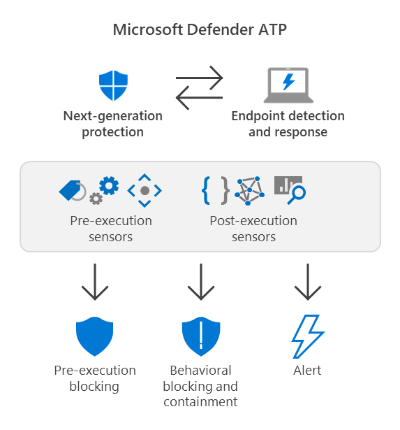

Security on client Windows computers has often been guaranteed using antivirus scanning software, which detects malware by comparing file signatures. Many modern attacks don't really on executable files or code in scripts or documents and so can evade this defense.

Suppose you're responsible for security in your organization. You're worried that rapidly evolving attacks that don't use executable files may be able to compromise your client computers. You want to find out how Microsoft Defender for Endpoint can detect and mitigate such attacks.

Here, you'll learn how behavioral blocking and containment can block attacks both before they start and also while they execute by examining their behavior.

## What is behavioral blocking and containment?

Traditional antivirus software scans files, such as executable files, scripts, and documents that may contain macro code, and compares those files against virus signatures to identify malware. Two more sophisticated kinds of threat would not be mitigated by this approach:

- **Fileless malware.** This term has a broad meaning, and includes both those attacks that don't store or use files on your filesystem at all and also those attacks that may use a file in one or more stages of the complete exploit. Fileless malware is categorized into three types:
  - Type 1: Fully fileless malware, which never needs to write a file to your disk. Malware may infect memory, firmware, or a peripheral USB device. Most antivirus products can't scan these locations.
  - Type 2: Indirect file activity. Malware of this type installs files on your filesystem indirectly, for example by using the command line or PowerShell.
  - Type 3: Files required to operate. Malware of this type has fileless persistence, but requires files to operate successfully.
- **Human-operated attacks.** This term describes attacks initiated and continued by a malicious user, which may not use files at all and so cannot be scanned and intercepted by standard virus software. Human-operated attacks also change depending on what vulnerabilities an attacker discovers on the target system.

Behavioral blocking and containment in Microsoft Defender for Endpoint and Microsoft Defender Antivirus identifies threats by their behaviors and process trees both before an attack has started and while it is going on. These capabilities include:

- Next generation protection in Microsoft Defender Antivirus.
- Endpoint Detection and Response (EDR). This capability of Microsoft Defender for Endpoint receives alerts from all over your network and collates them for clear and rapid analysis. 

<!-- Image from: https://docs.microsoft.com/microsoft-365/security/defender-endpoint/behavioral-blocking-containment -->

## Use client behavioral blocking

Client behavioral blocking is the portion of behavioral blocking and containment that occurs on the endpoint computer or device and is built into Microsoft Defender Antivirus. As suspicious behaviors and process trees are detected on client computers, their artifacts are blocked, checked, and remediated automatically. Information about suspicious actions is returned to EDR in Microsoft Defender for Endpoint for analysis and to help detect similar attacks on other clients. In the cloud, machine learning can differentiate between malicious sequences of actions and legitimate operations in milliseconds. Bad actors are blocked almost instantaneously.

Attacks are stopped both before they begin and after they have started.

Client behavioral blocking is enabled by default but, for the highest level of protection, make sure these features of Microsoft Defender for Endpoint are enabled:

- Defender for Endpoint baselines
- Devices are onboarded to Defender for Endpoint
- EDR is configured in block mode
- Attack surface reduction rules are in place

## Use feedback-loop blocking

Feedback loop blocking is the component of behavioral blocking and containment that occurs in the cloud and is part of Microsoft Defender for Endpoint. On the client, Microsoft Defender Antivirus detects threats with client behavioral blocking and sends their artifacts to the rapid protection loop engine in the cloud. This engine examines the information and correlates it with signals about suspicious activity from other clients. Based on this collated information, the rapid protection loop engine decides whether to block the action and treat it as an attack.

Feedback-loop blocking happens fast and automatically and blocks attacks across your enterprise.

Feedback-looping is enabled by default in Microsoft Defender for Endpoint, but you should ensure that these features are enabled:

- Defender for Endpoint baselines
- Devices are onboarded to Defender for Endpoint
- EDR is configured in block mode
- Attack surface reduction rules are in place

## Use EDR in block mode

In Microsoft Defender for Endpoint, EDR in block mode protects client devices from malicious artifacts, even when those clients are running Microsoft Defender Antivirus in passive mode. 

In passive mode, Defender Antivirus scans all files and reports threat detections to the Defender for Endpoint service but Defender Antivirus doesn't block or remediate any viruses or malware that it detects. When EDR in block mode is turned on and Microsoft Defender Antivirus is not the primary antivirus solution, it will detect and remediate malicious items.

To enable EDR in block mode:

1. Sign in to the Microsoft Defender Security Center.
1. Select **Settings** and then select **Advanced features**.
1. Select **EDR in block mode**.