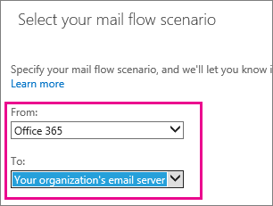
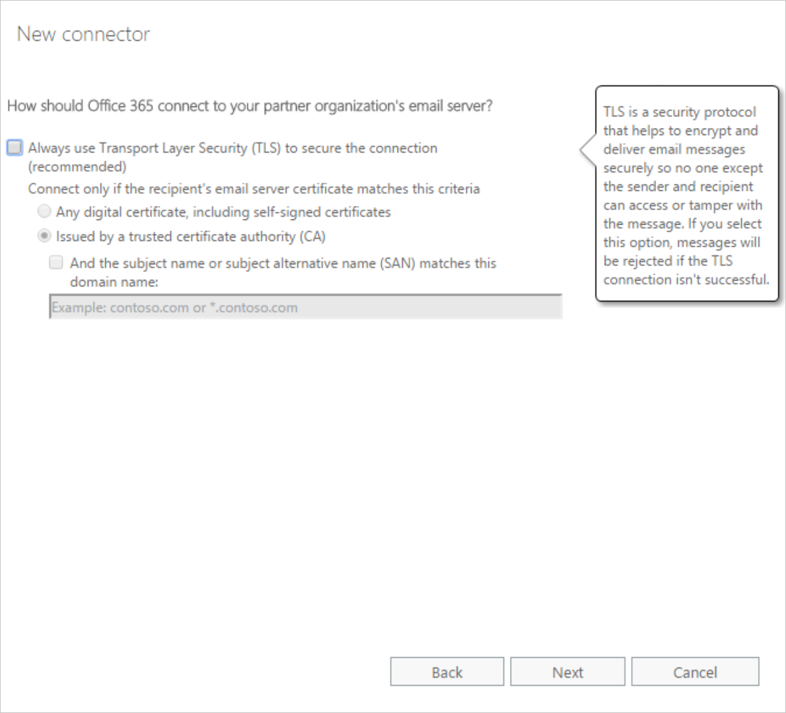

You've seen that connectors are needed to route emails from on-premises Exchange servers to and from Exchange Online and the internet. Let's examine how to set up those connectors.

## Prerequisites for your on-premises email environment

You have a combination of Office 365 mailboxes and on-premises email servers. To enable mail to flow in both directions, you will need to set up connectors.

> [!div class="centered"]
> :::image type="content" source="../media/3-connector-office-365-email-server.png" alt-text="A workflow diagram shows how connectors enable mail flow to and from online and on-premises mail servers." lightbox="../media/3-connector-office-365-email-server.png" border="false":::

To ensure the integration is seamless for your users, you'll need two connectors to route email between Microsoft 365 and your on-premises email servers:

- A connector from Microsoft 365 to your on-premises mail server 
- A connector from your on-premises mail server to Microsoft 365

Before you can connect both mail servers, it's important to check that the on-premises email servers are ready. There are seven key items to check before you create and configure the connectors:

- The on-premises email server can send and receive external mail.
- Your on-premises email server has Transport Layer Security (TLS) enabled, with a valid certification authority-signed (CA-signed) certificate. It's good practice to include the primary on-premises email server's name in the certificate subject name.
- If you want to improve the communication security between your on-premises email server and Microsoft 365, use certificates. In that case, you'll need to update the connector used by your on-premises email server to receive email. This connector must recognize the right certificate when Microsoft 365 attempts to connect with your server.
- Make a note of the name or IP address of your external-facing email server. If you're using Exchange, this value is the Fully Qualified Domain Name (FQDN) of your Edge Transport server or CAS that will receive email from Microsoft 365.
- Open port 25 on your firewall so that Microsoft 365 can connect to your email servers.
- Make sure that your firewall accepts connections from all Microsoft 365 IP addresses.
- Make a note of an email address for each domain in your organization. You'll need this address later to test that your connector is working correctly.

## Create a connector from Microsoft 365 to your on-premises email server

It's time to create the first connector. It establishes the connection from Microsoft 365 to your on-premises email server. There are three steps:

- Configure Microsoft 365
- Create the connector
- Redirect email to Microsoft 365

### Configure your Microsoft 365 environment

Before you set up the connector, you need to set up your Microsoft 365 environment. There is a short checklist of activities you'll need to carry out:

- Make sure the account you're using has Organization Management permission.
- If you want Exchange Online Protection (EOP) or Exchange Online to relay emails from your on-premises email servers to the internet, you'll need to choose between:
  - Using a security certificate (as mentioned in the prerequisites)
  - Configure all of your organization sender domains and subdomains as accepted domains in Microsoft 365
- Decide whether you want to use mail flow rules (also known as transport rules) or domain names to deliver mail from Microsoft 365 to your email servers.

### Create and configure the connector from Microsoft 365 to your email server

1. Sign in to your Microsoft 365 instance.  
1. In the Exchange admin center, select **mail flow** and then open the **connectors** tab.

   If you have any existing connectors, they will be listed here.  
    

1. Select the plus sign (**+**).
1. Because this connector routes mail from Microsoft 365 to your on-premises email servers:

   - Set **From** to **Office 365**.
   - Set **To** to your on-premises Exchange mail server.

     

1. Select **Next**.
1. Enter a name and description for the new connector.
1. Under **What do you want to do after the connector is saved?**, select **Turn it on** and **Retain internal Exchange mail headers**.
1. Specify when you want to use this connector. Select **Only when I have a transport rule set up that redirects messages to this connector**, and then click **Next**.
1. Now, define how you want to route email messages. Add the on-premises SMTP host, and then select **Save**. Select **Next**.
1. Specify how Microsoft 365 will connect to the on-premises email server. Set these properties and then select **Next**.

    |Property|Value|
    |-|-|
    |Always use Transport Layer Security (TLS) to secure the connection |Selected|
    |Connect only if the recipient's email server certificate matches this criteria |Issued by a trusted certificate authority (CA) |
    |And the subject name or subject alternative name (SAN) matches the domain name|Enter in the on-premises domain |

    

1. Finally, validate the outbound connector. Enter an external email address, select **Validate**. When the validation is successful, select **Save**.

### Redirect your mail flow from the internet to Microsoft 365 by changing your MX record

Finally, modify your MX record to redirect email flow to Microsoft 365. Access the DNS records held by your domain hosting service. Add or update the MX record, so that messages sent to your domain will come to Microsoft 365.  

The MX record you'll add includes a value (the **Points to address** value) that looks something like this: \<MX token/>.mail.protection.outlook.com, where \<MX token/> is a value like "MSxxxxxxx."

1. To get the information for the MX record from Microsoft 365, in the Microsoft 365 admin center, go to ****Setup > Domains**, and then select your domain.  
1. Under **Required DNS settings**, you'll see the DNS records. Copy the **Points to address** value. You'll use this value in the record you create or update on your DNS host's site.
1. In the MX record on your DNS host's site, make sure that the fields are set to the following values:

    |Property|Value|
    |-|-|
    |Record Type|MX|
    | Priority|Set the priority of the MX record to the highest value available, which is typically **0**.|
    |Host Name|@|
    |Points to address|Paste the **Points to address** value that you just copied from Microsoft 365 here. |
    |TTL|Set this value to **1 hour**.|

1. Save the record and remove any other MX records.

## Create a connector from your on-premises email server to Microsoft 365

Now, you're ready to make the connection from your on-premises email server to Microsoft 365.  

### Create and configure the connector

1. Sign in to your Microsoft 365 instance.  
1. In the Exchange admin center, select **mail flow** and then open the **connectors** tab.
   If you have any existing connectors, they will be listed here. If you already have a connector from Microsoft 365 to your on-premises mail server, you don't need to create another connector.
1. Select the plus sign (**+**).
1. Because this connector routes mail from the on-premises email server to Microsoft 365:

   - Set **From** to your on-premises Exchange mail server.
   - Set **To** to **Office 365**.

     

1. Select **Next**.
1. Enter a name and description for the new connector.
1. Under **What do you want to do after the connector is saved?**, select **Turn it on** and **Retain internal Exchange mail headers**.
1. Now, specify how Microsoft 365 identifies email from the on-premises email server. Select **By verifying that the subject name on the certificate that the sending server uses to authenticate with Office 365 matches this domain**, and then select **Next**.
1. Select **Save**.

### Set up your email server to relay mail to the internet through Office 365

Next, you must prepare your email server to send mail to Microsoft 365. This step enables mail flow from your email servers to the internet through Microsoft 365.

If your on-premises email environment is Microsoft Exchange, you'll create a **Send** connector that uses smart host routing to send messages to Microsoft 365.

To create the Send connector in Exchange Server, run the **New-SendConnector** cmdlet with the following syntax in the Exchange Management Shell.

```powershell
New-SendConnector -Name <DescriptiveName>  
-AddressSpaces *  
-CloudServicesMailEnabled $true  
-Fqdn <CertificateHostNameValue>  
-RequireTLS $true  
-DNSRoutingEnabled $false  
-SmartHosts <YourDomain>-com.mail.protection.outlook.com  
-TlsAuthLevel CertificateValidation 
```
