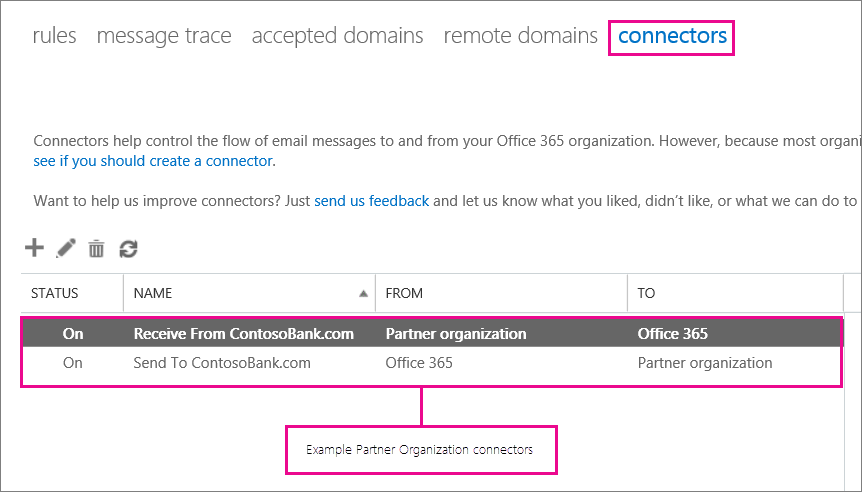

Connectors are essential for on-premises Exchange deployments or when you have specific needs, such as security requirements. 

## What is a connector? 

In Exchange Online and Exchange Server, a connector is an object that stores a set of instructions for sending and receiving email to and from your organization. By configuring connectors, you can: 

- Control how mail is sent from Exchange Online to any email servers that you host on-premises. These servers can include Exchange Servers, SMTP servers, or other types of mail servers. 
- Add security requirements to mail delivery. For example, you might want to ensure that emails sent to a particular destination are encrypted with Transport Layer Security (TLS). 
- Enable non-mailboxes, such as printers and other devices, to send email to recipients in Exchange Online. 
- Prevent email servers from inadvertently identifying each other as spam when they exchange a large volume of mail. 

## When should I create a new connector? 

You don't need to use connectors if you have an Exchange Online organization in multiple Office 365 regions (Exchange Multi-Geo). The default configuration delivers mail to all destinations without modification. 

If you have some mailboxes in Exchange Online and some mailboxes in Exchange Server on-premises, then you do need a connector. However, if you used the Hybrid Configuration Wizard, then it created the connector for you. 

> [!NOTE]
> You can check what connectors exist in the Exchange admin center (EAC) under **mail flow**, on the **connectors** tab:

 

Here are some scenarios where you'll need to create your own connectors: 

- You have on-premises Exchange servers that run Exchange 2007 or earlier. In some circumstances, the Hybrid Connection Wizard cannot create connectors to these servers. You might need to create a connector manually. 
- You have non-Microsoft SMTP email servers on-premises. 
- You have security requirements for email exchanged with specific business partners. For example, you might want to require encryption or to check the domain name on the encryption certificate. 
- You want to send and receive internet email through a service provider, such as organizations that provide antivirus or anti-spam filtering. 
- You have email-enabled devices or line-of-business applications on-premises, and you want to enable them to send email to your Exchange Online mailboxes. 

## Use connectors with on-premises Exchange servers 

If your on-premises servers are Exchange 2010 or later, and you used the Hybrid Configuration Wizard to integrate them, then the necessary connectors may already exist. Otherwise you'll need to create them. You learn how to create a connector in the next unit. 

:::image type="content" source="../media/2-connectors-on-premises-servers.png" alt-text="A diagram shows how mail flows from the on-premises environment to the internet." border="true":::

This diagram shows the role of connectors in a hybrid system. Notice that: 

- All email from on-premises servers to Exchange Online users or internet mailboxes is sent through a connector to Exchange Online and, if necessary, on to the internet. 
- All email from Exchange Online or internet mailboxes is routed through a connector to the on-premises servers. 
- You must open port 25 on your on-premises firewalls to enable SMTP communications from Exchange Online. 
- When an Exchange Online user sends an email to an internet destination, or receives an email from the internet, no connector is involved. 

## Use connectors to route email to partner organizations 

If you want to place extra security restrictions on email sent to one of your close business partners, you can do so by creating and configuring a connector.  

Another reason to use a connector for internet mail, is to route all email through a service provider, who can scan and filter nuisance traffic. 

:::image type="content" source="../media/2-connectors-partner-organizations.png" alt-text="A diagram shows how mail flows change when you want to protect mail sent to a partner organization." border="true":::

The diagram shows that, in this configuration, connectors are used to route mail to and from your partner organization. Notice that if you want to require TLS encryption, you must have a suitable TLS certificate issued by a certificate authority that both organizations trust. 