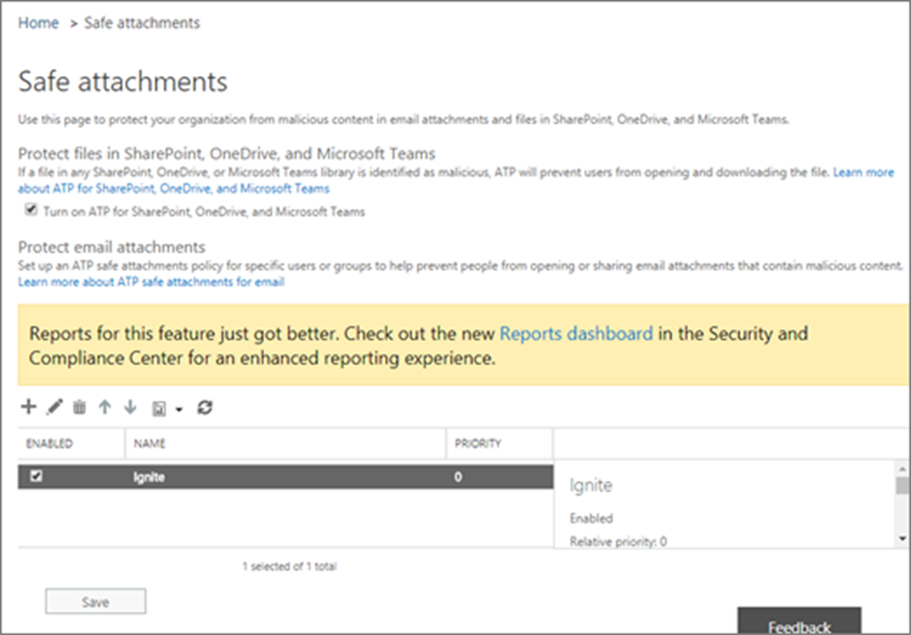

People regularly send, receive, and share attachments, and it's not always easy to tell whether an attachment is safe or malicious just by looking at the email message. Microsoft Defender for Office 365 helps prevent malicious attachments from infiltrating your organization.

### Set up (or edit) a Safe Attachments policy
1.	Go to https://protection.office.com and sign in with your work or school account.
2.	In the Security & Compliance Center, in the left navigation pane, under **Threat management**, choose **Policy > ATP safe attachments**.
3.	If you see **Turn on ATP for SharePoint, OneDrive, and Microsoft Teams**, select this option. This will enable Microsoft Defender for SharePoint, OneDrive, and Microsoft Teams for your Microsoft 365 environment.
   
4.	Select **New +** to start creating your policy.
5.	Specify the name, description, and settings for the policy, and then select **Save**.

## Configure and manage Safe Links
Safe Links, a feature of Microsoft Defender for Endpoint, helps protect your organization from malicious links used in phishing and other attacks. If you have the necessary permissions for the Security & Compliance Center, you can set up Safe Links policies to help ensure that, when people click URLs, they’re taken to a warning page, and your organization is protected. 

>[!NOTE]
> The Safe Links web page contains a link to allow the user to continue to the website if they choose to ignore the warning. 

### Define (or review) the Safe Links policy that applies to everyone
1.	Go to https://protection.office.com and sign in with your work or school account.
2.	In the left navigation, under **Threat management**, select **Policy > Safe Links**.
3.	In the **Policies that apply to the entire organization** section, select **Default**, and then select **Edit**.

### Add (or edit) Safe Links policies that apply to specific email recipients

1.	In the **Policies that apply to specific recipients** section, select **New**.
5.	Specify the name, description, and settings for your policy.

## Learn more

- [Set up Safe Attachments policies](/microsoft-365/security/office-365-security/set-up-atp-safe-attachments-policies?azure-portal=true)
- [Set up Safe Links policies](/microsoft-365/security/office-365-security/set-up-atp-safe-links-policies?azure-portal=true)

