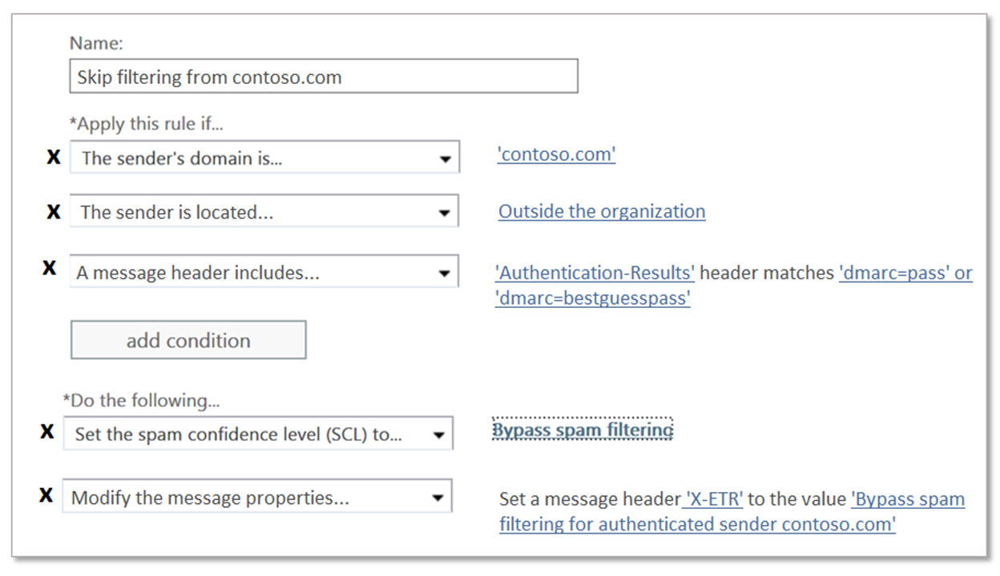

When Microsoft 365 receives an inbound email message, it goes through spam filtering, and is assigned a spam score. That score is mapped to an individual spam confidence level (SCL) that's added in an email message header, called an X-header. A higher SCL indicates a message is more likely to be spam

Messages with an SCL of -1, 0, or 1  are delivered to the recipient's inbox (an SCL of -1 means the message skipped filtering). Messages with an SCL of 5 or higher are delivered to the recipient's **Junk Email** folder.

Use mail flow rules to stamp an SCL on messages, using SCL values of 5 and 6 for **Spam** and SCL values of 7, 8, or 9 for **High confidence spam**. 

To create a mail flow rule, open the Exchange admin center, go to **Mail flow > Rules**, select **Add**, and then select **Create a new rule**.
 

## Learn more
- [Spam confidence level](/microsoft-365/security/office-365-security/spam-confidence-levels?view=o365-worldwide?azure-portal=true)
- [Use mail flow rules to set the spam confidence level in messages](/microsoft-365/security/office-365-security/use-mail-flow-rules-to-set-the-spam-confidence-level-scl-in-messages?view=o365-worldwide?azure-portal=true)
