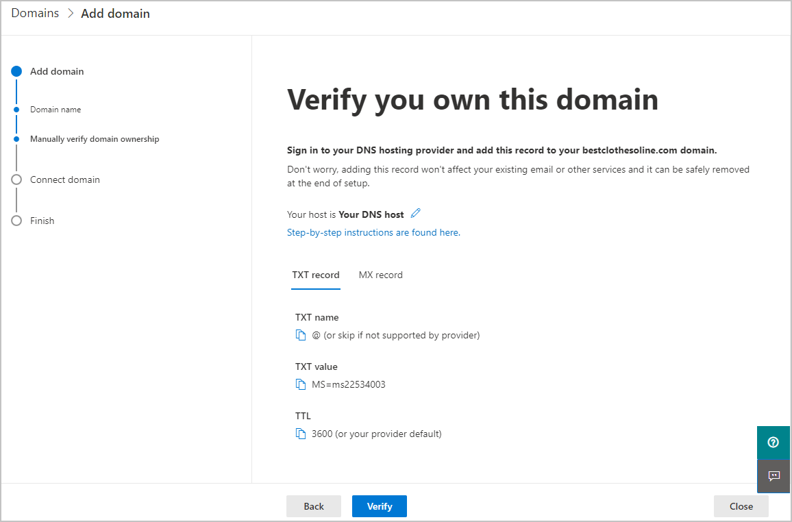
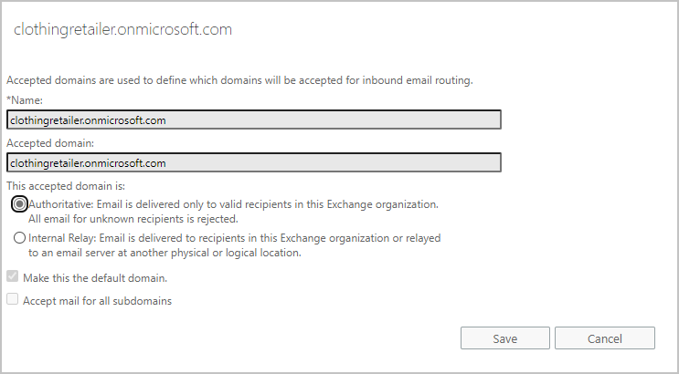
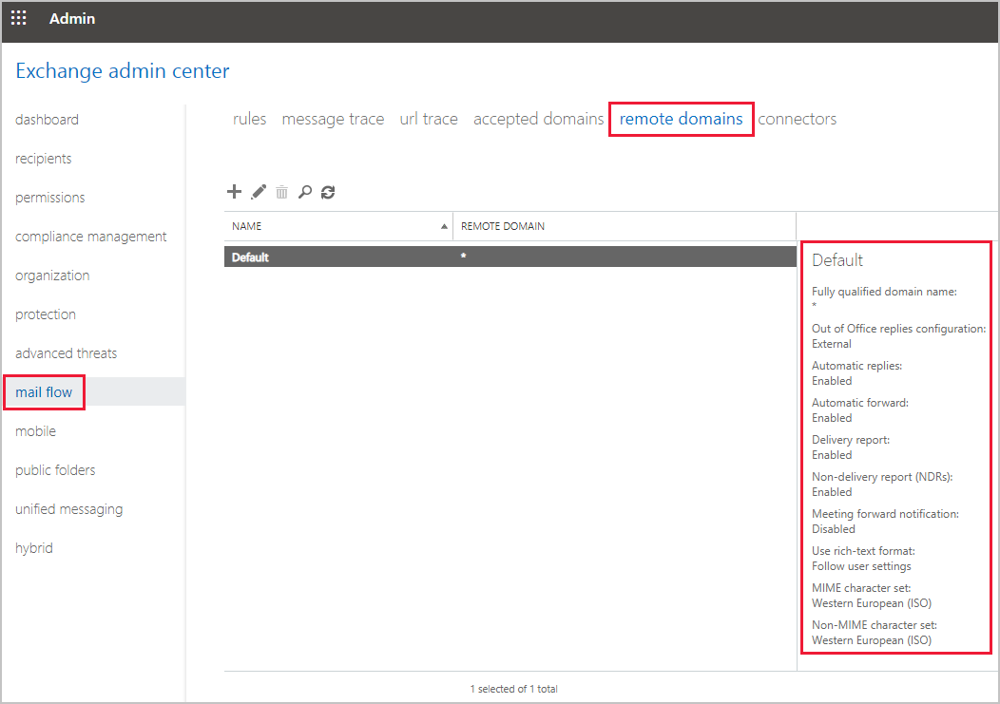
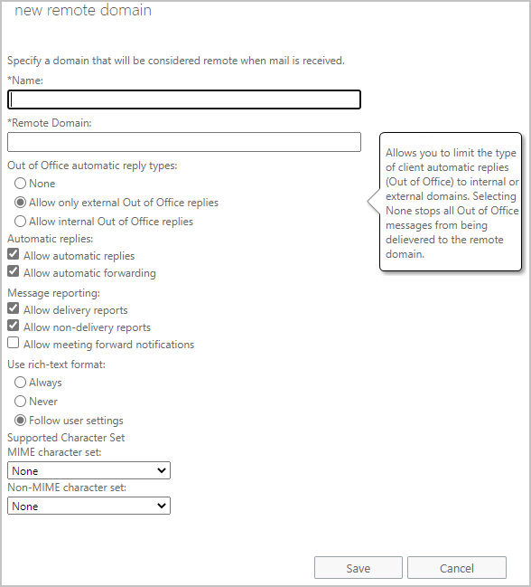

Domains that your organization uses with Microsoft 365 are called *accepted domains*. When you first set up a Microsoft 365 account, you might have added your company's custom domain. Or you might have used an **onmicrosoft.com domain** as a placeholder before purchasing one.

These are the domains that your employees use to send and receive emails. After your domains have been associated with your Microsoft 365 account, you use the Exchange admin center to manage their use in your organization.  

## Add a domain to Microsoft 365

1. Sign in to the Microsoft 365 admin center.
2. Under **Settings**, select **Domains**. This is where you add domains you've already purchased or buy new ones directly from Microsoft.
   
3. Select **Add domain**. Enter the domain's information, then and verify that you own it by adding DNS records.  
   

4. After verification, the new domain will appear in the list of domains for your account.

## Manage accepted domains

Now that you've added your domains to Microsoft 365, you can now manage them in the Exchange admin center.  

1. In the Exchange admin center, select **mail flow**, and then select **accepted domains**. The domains you've added on the Microsoft 365 admin center will be listed and editable here.
2. Select the domain you want to manage, then select **edit**.  
   

You can set a domain to one of two types: authoritative or internal relay (also known as non-authoritative).  

Authoritative domains reject any emails to users who don't exist in Active Directory. Directory-Based Edge Blocking (DBEB) rejects the messages at the service network perimeter.

Don't use internal relay domains if all your users are in the Microsoft 365 Active Directory. Use this kind of domain where you host your internal email server, and need to relay emails through Exchange Online to them.  

You can also view this information in Exchange Online PowerShell. Use the `Get-AcceptedDomain` command to list all the domains. If you want specific information on a single domain, you qualify it with these parameters:

```powershell
Get-AcceptedDomain -Identity <Name> | Format-List 
```

To edit the properties of an accepted domain, use this command:

```powershell
Set-AcceptedDomain -Identity <Name> -Domainype <Authoritative | InternalRelay> 
```

## Enable mail flow for subdomains

If your organization has an on-premises Exchange server with subdomains that are accepted domains in Exchange Online, you can enable the flow of email to them by setting up connectors. First, change the domain type from authoritative to internal relay, and select **Accept mail for all subdomains** in the Exchange admin center.  

With the domain correctly set up, the last step is to add an outbound connector. Set the scope to **Route all accepted domains through this connector**. The recipient domain will use a wildcard, such as *.clothingretailer.com, in front of your domain.

## Manage remote domains

Remote domains allow you to control how Exchange responds to people who contact your organization from external domains. You can control whether you send Out of Office notifications, or if external users can see delivery receipts.  

You control these options in the **mail flow** section of the Exchange admin center.



You can add new remote domains, or edit existing domains listed here. Use the default * remote domain to control the default response from Exchange. On the right, for example, you'll see that Out of Office responses are allowed by default.



After you add a remote domain, you can confirm how you'd like Exchange to respond to users from external domains. For example, you can choose to have Exchange always send plain text with a specific MIME character set.

## Learn more

- [Microsoft 365 admin center](https://admin.microsoft.com?azure-portal=true)  
- [Use Directory Based Edge Blocking to reject messages sent to invalid recipients](/Exchange/mail-flow-best-practices/use-directory-based-edge-blocking?azure-portal=true)
- [Add and configure additional domains](/office365/admin/setup/add-domain?azure-portal=true)
- [Design domain name configuration](/office365/admin/setup/domains-faq?azure-portal=true)
- [Set primary domain name](/office365/admin/setup/domains-faq?azure-portal=true)
- [Verify custom domain](/office365/admin/setup/add-domain?azure-portal=true)
- [Manage remote domains in Exchange Online](/Exchange/mail-flow-best-practices/remote-domains/manage-remote-domains?azure-portal=true)
