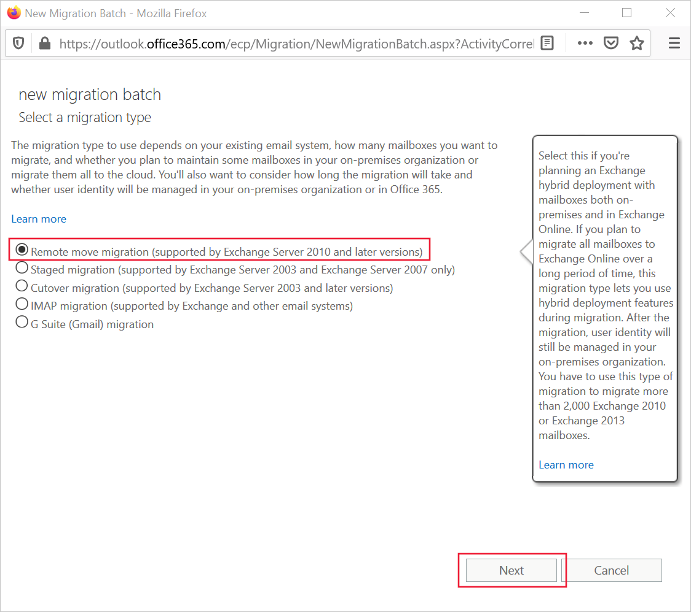

You can start importing mailboxes into Exchange Online by using the Exchange admin center to create migration batches.

## Enable the Mail Replication Service (MRS) Proxy service

When you migrate mailboxes from Exchange on-premises to Exchange Online in a hybrid environment, you must enable the MRS Proxy service in the on-premises Exchange system, because Exchange Online uses the MRS to locate mailboxes and access their content.

You can use this Exchange PowerShell command to set up the MRS Proxy endpoint in Exchange server. In this example, the service is located on a server named OnPremExchServer:

```PowerShell
Set-WebServicesVirtualDirectory 
   -Identity "OnPremExchServer\EWS (Default Web Site)"
   -MRSProxyEnabled $true
```

## Move mailboxes

Everything is now in place, including the migration endpoint and the MRS Proxy service, to enable you to execute a migration. In this example, the steps show how to migrate a set of mailboxes from Exchange Server on-premises when you have a hybrid environment set up.

To create and start a migration batch, follow these steps in the Microsoft 365 admin center:

1. In the Exchange admin center, in the dashboard under Recipients, select **Migration**.
2. Select **+**, and then click **Migrate to Exchange Online**.
3. On the **Select a migration type** page, select **Remote move migration**, and then click **Next**.

   

4. In the **Select the users** page, click **+** and then search for and add the mailbox users that you want to migrate in this batch. When you’ve configured the list of mailboxes, select **Next**.

   

5. In the Enter the Windows user account credential page, enter the username and password for an account with administrative permissions in the on-premises system, and then click Next.
6. In the **Confirm the migration endpoint** page, check that the server name is correct, and then click **Next**.
7. In the **Move configuration** page, set a name for the migration batch, and then select **Next**.
8. In the **Start the batch** page, select a mailbox to receive a report when the batch is completed, and then click **New**.

## Check migration operations

Migration operations can take a long time, depending on the size of the mailboxes and their number. To find out about the current status of a migration batch, use the migration page in the Exchange admin center in Exchange Online.

1. In the Exchange admin center, in the dashboard under Recipients, click **Migration**.
2. For each migration batch, the following values are shown:

   - **Status**. This value shows Synced when the batch is completed.
   - **Total**. This value shows the number of mailboxes that you included in the batch.
   - **Synced**. This value shows the number of mailboxes that have had their content synchronized with the on-premises servers.
   - **Finalized**. This value shows the number of mailboxes that are now ready for users to access them in Exchange Online.
   - **Failed**. This value shows the number of mailboxes that did not synchronize successfully.

You can also use PowerShell to diagnose the status of a migration and its mailboxes. For example, this command displays the status of a batch named **SalesDeptMigration**:

```powershell
$Get-MigrationBatch -Identity SalesDeptMigration
```
## Learn more

- [Move mailboxes between on-premises and Exchange Online organizations in hybrid deployments](/Exchange/hybrid-deployment/move-mailboxes?azure-portal=true)
- [Get-MigrationBatch](/powershell/module/exchange/move-and-migration/get-migrationbatch?azure-portal=true)
