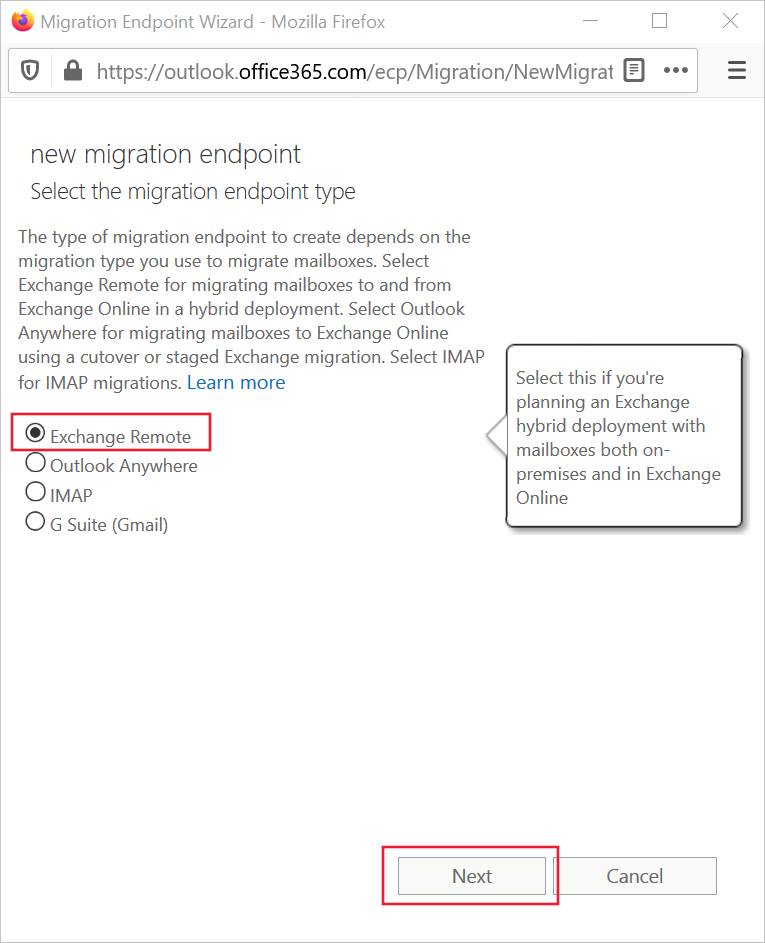
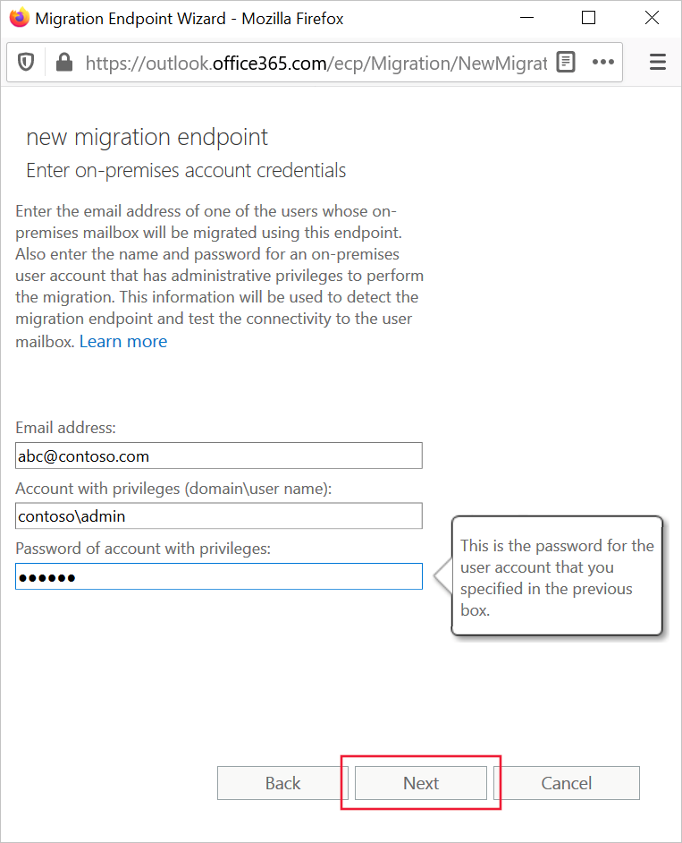

To import a set of mailboxes into Exchange Online, you must start by telling the system how to connect to those mailboxes and retrieve their content. This information is stored in an object called a migration endpoint.

## What is a migration endpoint?

Migration endpoints store all the information that Exchange Online needs to connect to the email system from where you want to import mailboxes. Endpoints always include the following information:

- Connection settings that point to the source server. For example, this might be the fully-qualified domain name (FQDN) of an on-premises Exchange server. If the source server is Exchange, you can use the Autodiscover service to get this information by including the address of a mailbox in your Exchange organization.
- Credentials for an administrative account. This should be an account with the organization management or recipient management permissions in the Exchange Server organization.

Migration endpoints come in different types. Choose the type based on the source of the mailboxes:

- **Exchange Remote**. Use Exchange Remote endpoints to migrate mailboxes from on-premises Exchange Servers when you have set up a hybrid environment. 
- **Outlook Anywhere**. Use Outlook Anywhere endpoints for cutover and staged migrations, where you have no hybrid environment set up with your on-premises Exchange servers.
- **IMAP**. Use IMAP endpoints to migrate from non-Exchange email systems that support IMAP or to import from Exchange Server 2000 or earlier.

## Creating a migration endpoint

You can use the tools in the Exchange admin center to create a migration endpoint. In this example, you create an Exchange Remote endpoint that would move mailboxes in a hybrid environment:

1. In the Exchange admin center, in the dashboard under Recipients, select **Migration**.
2. Next to the refresh button, click **…** and then select **Migration endpoints**.

   

3. In the migration endpoints list, select **+**, select **Exchange Remote**, and then click **Next**.

   

4. In the **Enter on-premises account credentials** page, enter these values and then click **Next**:

   | Property  |  Value |
   |---|---|
   | Email address  | Enter the address of one of the mailboxes you want to migrate. Exchange Online uses Autodiscover to locate your on-premises servers from this address.  |
   | Account with privileges  | Enter the domain and username of an account with administrative privileges in the on-premises system. This is the account used to perform the migration.  |
   | Password of account with privileges  | Enter the correct password for the administrative account.  |

   

5. Exchange Online attempts to connect to the on-premises Exchange server. If the connection is not successful, enter the **FQDN** of the server manually, and then select **Next**.
6. Enter a **Name** for the endpoint, and then select **New**.

Alternatively, you can use the Exchange Online PowerShell to create migration endpoints. In this example, the **Get-Credential cmdlet** is used to gather the administrative username and password. These credentials are used to create an Outlook Anywhere endpoint suitable for a cutover or staged migration:

```powershell
powershell
$Credentials = Get-Credential 
New-MigrationEndpoint -ExchangeOutlookAnywhere 
   -Name EndpointForCutover 
   -Autodiscover 
   -EmailAddress administrator@contoso.com 
   -Credentials $Credentials
```

## Verify the connection by using Azure PowerShell

It’s good practice to test a migration endpoint before you initiate a migration batch. The test checks to see if the remote server is available and communicative. You can perform such a test by using the **Test-MigrationServerAvailability** cmdlet in the Exchange Online PowerShell. In this example, the command tests an endpoint named endpoint.contoso.com: 

```powershell
powershell
Test-MigrationServerAvailability -Endpoint endpoint.contoso.com
```

## Learn more

- [Move mailboxes between on-premises and Exchange Online organizations in hybrid deployments](https://docs.microsoft.com/Exchange/hybrid-deployment/move-mailboxes?azure-portal=true)
- [New-MigrationEndpoint](https://docs.microsoft.com/powershell/module/exchange/move-and-migration/new-migrationendpoint?view=exchange-ps&azure-portal=true)
- [Test-MigrationServerAvailability](https://docs.microsoft.com/powershell/module/exchange/move-and-migration/test-migrationserveravailability?view=exchange-ps&azure-portal=true)
