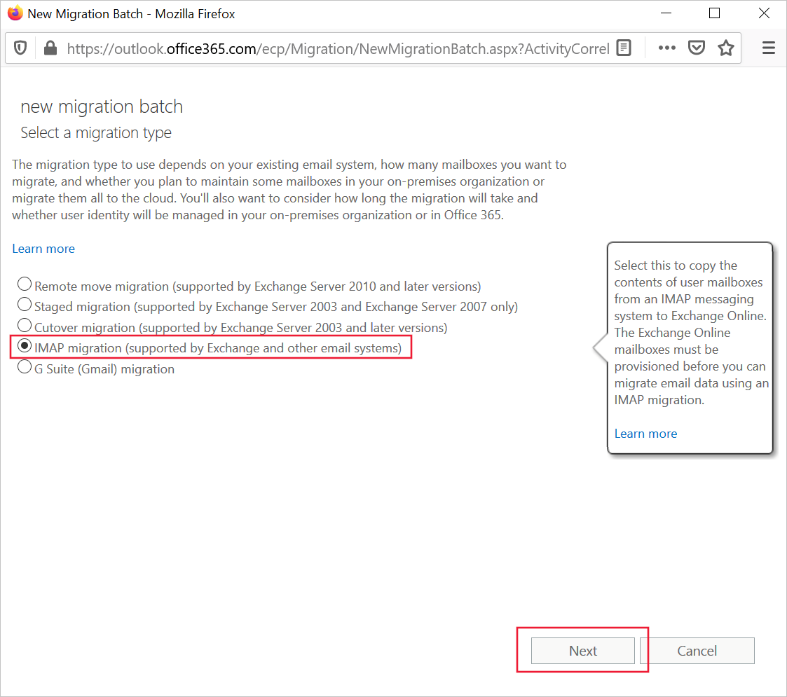
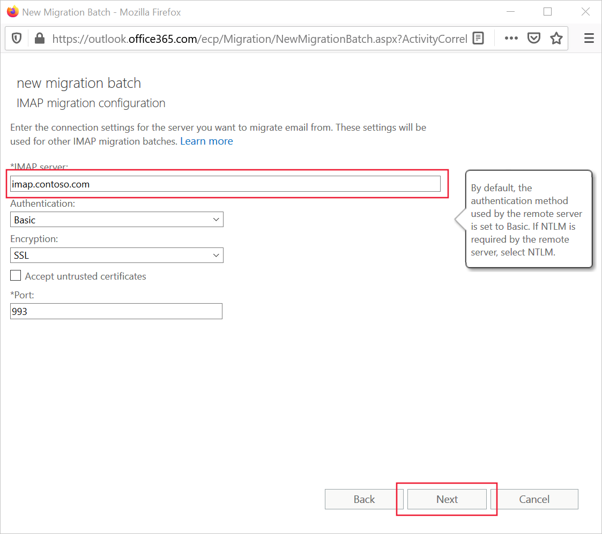

Because IMAP4 is so widely supported, it’s often an option you can use to import mailboxes from non-Exchange on-premises systems. You should also consider IMAP4 migrations if you have Exchange Server 2000 or earlier. You must prepare a list of mailboxes that you can then import from the source system by using either the Exchange admin center (EAC) or PowerShell.

## Preparing for the migration

Before you can perform the migration, complete the following tasks:

- Make sure that the DNS domain for your on-premises system is an accepted domain in Office 365.
- Add mailboxes in Exchange Online for all the users you want to migrate.
- Configure your on-premises firewall to accept IMAP4 connections on TCP port 143 or port 993 for SSL-protected connections.
- Create a migration endpoint in Microsoft 365, as described in the previous **Configure migration endpoints** unit. For the endpoint type, choose IMAP, and then enter the name of the on-premises IMAP server.

You must also create a comma-separated text file, which lists a mailbox to import on each line and has three columns:

1. **EmailAddress**. In this column, enter the user ID for the mailbox in Exchange Online.
2. **UserName**. In this column, enter the username for the mailbox in the on-premises email system.
3. **Password**. In this column, enter the password for the mailbox in the on-premises email system.

You can use Microsoft Excel or any text editor to create these files:


In Excel, to save the list as a .csv file, select **File** > **Export** > **Change File Type**. Under Other File Types, select **CSV (Comma delimited) (*.csv)**, and then select **Save As**.

## Executing the migration in the EAC

To create and run a migration batch that uses the IMAP protocol, follow these steps:

1. In the EAC, in the dashboard under **Recipients**, select **Migration**.
2. Select **+**, and then click **Migrate to Exchange Online**.
3. On the **Select a migration type** page, select **IMAP migration**, and then click **Next**.

   

4. On the **Select the users** page, click **Browse**, select the .csv file you created, and then select **Next**.

   

5. On the **IMAP migration configuration** page, enter the name of the IMAP server, select the authentication and encryption option that the IMAP server supports, and then select **Next**. Exchange Online attempts to connect to the IMAP server.

   

6. Select the migration endpoint that you created for the IMAP server.
7. On the **Move configuration** page, in the **Name** text box, type a descriptive name for this migration batch, and then click **Next**.
8. On the **Start the batch** page, click **Automatically start the batch**. Exchange Online creates the migration batch and starts to import mailboxes.

## Executing the migration in PowerShell

If you prefer to use a command-line interface, or you want to include the migration in a script, you can execute a migration batch by using PowerShell. Before you start, make sure you’ve completed the tasks in the **Preparing for the migration** section above.

To create and start a migration batch, use this command:

```powershell
New-MigrationBatch -Name IMAPImport 
   -SourceEndpoint IMAPonpremises 
   -CSVData ([System.IO.File]::ReadAllBytes("C:\mailboxes.csv")) 
   -AutoStart
```
While the batch is running, you can check its progress by using this command:

``` PowerShell
Get-MigrationBatch -Identity IMAPImport | Format-List Status
```

## Learn more

- [Migrate other types of IMAP mailboxes to Office 365](/exchange/mailbox-migration/migrating-imap-mailboxes/migrate-other-types-of-imap-mailboxes?azure-portal=true)
- [CSV files for IMAP migration batches](/exchange/mailbox-migration/migrating-imap-mailboxes/csv-files-for-imap-migrations?azure-portal=true)
- [Use PowerShell to perform an IMAP migration to Office 365](/office365/enterprise/powershell/use-powershell-to-perform-an-imap-migration-to-office-365?azure-portal=true)
