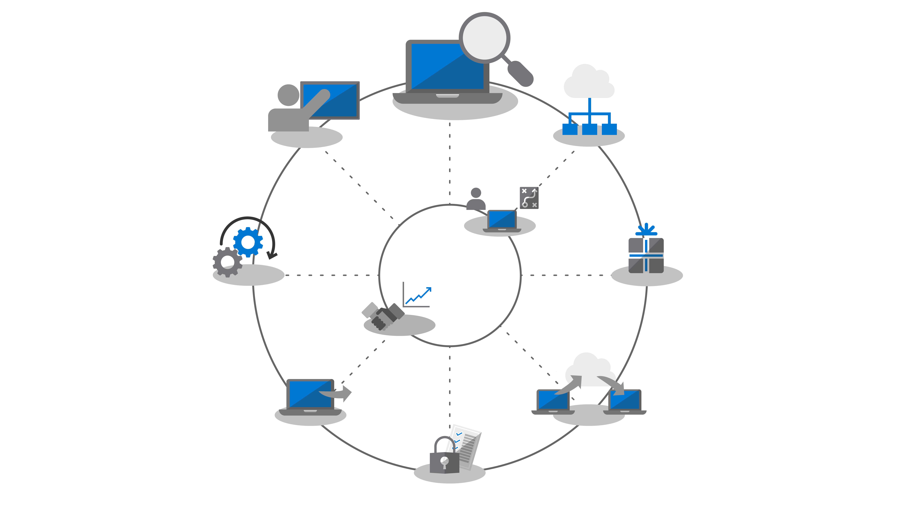
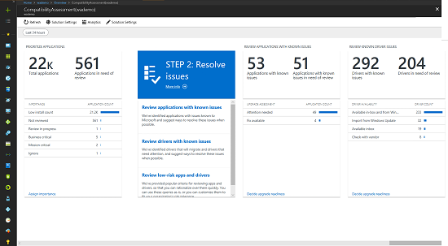

Microsoft provides several readiness assessment tools that will streamline your tasks in assessing your device and app readiness.

## Windows Analytics Upgrade Readiness 

**Windows Analytics Upgrade Readiness** is a powerful inventory tool that uses an agent-less process to inventory the computers, applications, and Office add-ins across your desktop estate. It’s our recommended tool for assessing your organization’s readiness.

Once Upgrade Readiness is running, you can then enroll any Internet-connected Windows 7 SP1 or newer device via Group Policy settings to start collecting diagnostic data. The tool’s visual workflow guides you from pilot to production deployment. If you wish, you can export data to software deployment tools such as Configuration Manager to target PCs directly and build device collections as they become ready for deployment.

> [!NOTE]
> To set up Window Analytics Upgrade Readiness you’ll first need to set up an Azure Active Directory subscription, including an Azure Log Analytics workspace. 

## Readiness Toolkit for Office add-ins and Microsoft Visual Basic for Applications (VBA)

The **Readiness Toolkit** can help you identify compatibility issues with your VBA macros and add-ins that you use with Office. The Readiness Toolkit includes the Readiness Report Creator, which creates an Excel report with VBA macro compatibility and add-in readiness information. The Readiness Report Creator can scan for VBA macros in Word, Excel, PowerPoint, Outlook, Access, Project, Visio, and Publisher files for Office versions as far back as Office 2003. It can also scan for certain types of add-ins used with Office. However, it doesn't include web add-ins.
 
The Readiness Toolkit for Office is free from the Microsoft Download Center. The download is an MSI file that after installation allows you to run the Readiness Report Creator on a device by completing a UI wizard.  For organizational usage there’s also a standalone executable that can be run from the command line or used with scripts. This is useful to collect readiness information from users throughout your organization in a more wide-scale and automated manner.
