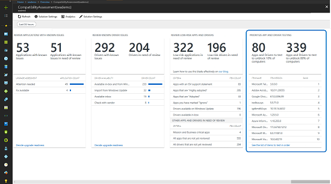
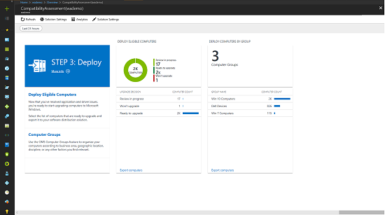

There are four steps to prepare for device and application readiness:
 
1. Take an inventory 
2. Prioritize apps and hardware
3. Test updates for compatibility
4. Remediate issues

## 1. Take an inventory

You can use **Windows Analytics Upgrade Readiness,** a powerful inventory tool, to guide you through any necessary preparation tasks, making use of application and driver compatibility information gathered through the upgrade of hundreds of millions of consumer PCs. This information gives you a detailed assessment, identifies compatibility issues that might block your upgrade, and is supported with links to suggested fixes known to Microsoft.

The upgrade readiness tool workflow reports application and driver inventory, shows you which applications have known issues, which applications have no known issues, and which drivers have issues. Using this tool, you’ll:
 
- Review applications with known issues
- Review known driver issues
- Review low-risk apps and drivers
- Prioritize app and driver testing

## 2. Prioritize apps and hardware

With inventory taken, you can use Upgrade Readiness to prioritize the most common apps and hardware used in your organization, as well as what to focus on to unblock as many PCs as possible for deployment.  By prioritizing the most impactful remediation items in your organization, you can build a deployment plan that allows devices to begin migrating to Windows 10 or Microsoft 365 Apps while those needing additional support can be addressed. The inventory also provides guidance to help you assess the updates necessary to resolve issues during the next step: testing.

## 3. Test updates for compatibility

You'll find that most of the applications, drivers, and add-ins inventoried will work as-is. Both Upgrade Readiness and the Readiness Toolkit help assess items in your org that might have compatibility issues. They also provide you with known information about compatibility, including where to find version updates to resolve them. You'll want to test these updates before you roll them out.

As a supplement to the upgrade readiness tools, you can download information about supporting apps in Windows and optimized strategies for testing your apps in the [Windows 10 Compatibility Cookbook](https://download.microsoft.com/download/3/D/3/3D36E358-A7E4-4DA3-9FC4-6E85C850A6C6/Windows%2010%20Compatibility%20Cookbook.docx).

In some instances, particularly non-critical, sparsely deployed applications and older devices, you might consider retiring or replacing apps and devices, rather than devoting time and resources to solving their complex issues.

## 4. Remediate issues

The final phase of device and app readiness is to *remediate*. Here you’ll want to collect the required software or driver packages and use them to supersede or update older versions as part of the deployment process. As you work through the list remediating issues, you’ll see that more and more PCs become *Ready for Deployment.*  This means that both the drivers and apps on the PCs are noted as compatible with the version of Windows 10 you are targeting.

