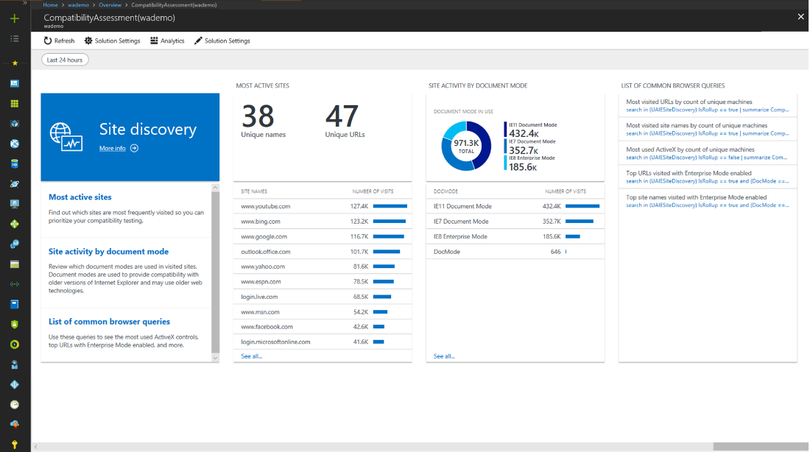

## Device and app readiness process
Device and app readiness is comprised of four steps:
 
1. Take an inventory 
2. Prioritize apps and hardware
3. Test updates for compatibility issues
4. Remediate issues

### 1. Take an inventory
There are two inventory tools available in Microsoft 365: an upgrade readiness service and a readiness toolkit to identify compatibility issues for moving to Office 365 ProPlus.

The **Windows Analytics Upgrade Readiness** service uses an agent-less process to inventory the computers, applications, and Office add-ins across your desktop estate.

 It also provides reports on highly visited internet sites, apps, and intranet locations to help you with compatibility testing later. 

The **Readiness Toolkit for Office add-ins and VBA** provides VBA macro compatibility and add-in readiness information to help your organization assess its readiness to move to Office 365 ProPlus. The Readiness Toolkit also provides inventory data on the most commonly used add-ins and macros in your organization.

### 2. Prioritize apps and hardware
With inventory taken, you can use Upgrade Readiness to identify and prioritize the most common apps and hardware used in your organization, as well as what to focus on to unblock as many PCs as possible for deployment. 

 By prioritizing the most impactful remediation items in your organization you can build a deployment plan that allows devices to begin migrating to Windows 10 or Office 365 ProPlus while those needing additional support can be addressed. The inventory also provides guidance to help you assess the updates necessary to resolve issues during the next step: testing.

### 3. Test updates for compatibility issues
You'll find that most of the applications, drivers, and add-ins inventoried will work as-is. Upgrade Readiness and the Readiness Toolkit help assess items in your org that might have compatibility issues. They also provide you with known information about compatibility issues, including where to find version updates to resolve them. You'll want to test these updates before you roll them out.

In some instances, particularly non-critical, sparsely deployed applications, and older devices, you might consider retiring or replacing apps and devices, rather than devoting time and resources to solving their complex issues.

Upgrade Readiness assesses browser-based compatibility issues too, identifying websites and web apps that still use ActiveX controls, browser helper objects, VBScript, or other legacy technology not supported by the Microsoft Edge browser. Your users will need to use Internet Explorer 11 for these sites, and you can add them to the Enterprise Mode site list, using the Enterprise Mode Site List Manager.

### 4. Remediate issues
The final phase of device and app readiness is to *remediate*.

 Here you’ll want to collect the required software or driver packages and use them to supersede or update older versions as part of the deployment process. As you work through the list remediating issues, you’ll see that more and more PCs become “Ready for Deployment.”  This means that both the drivers and apps on the PCs are noted as compatible with the version of Windows 10 you are targeting for deployment.
