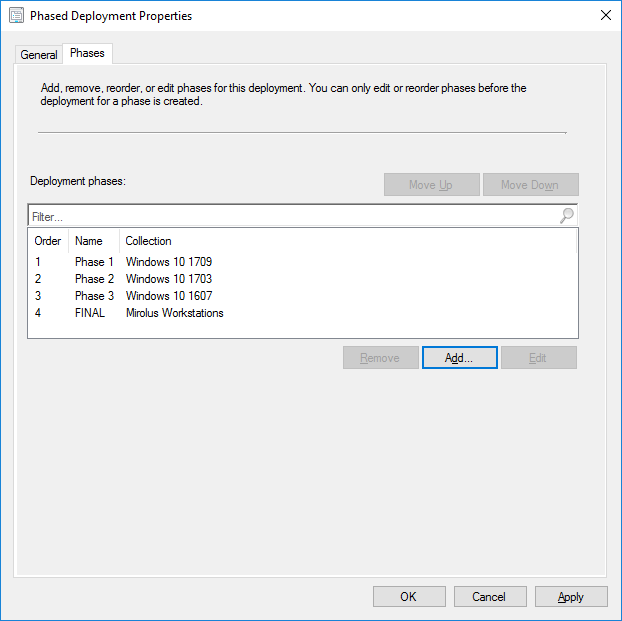
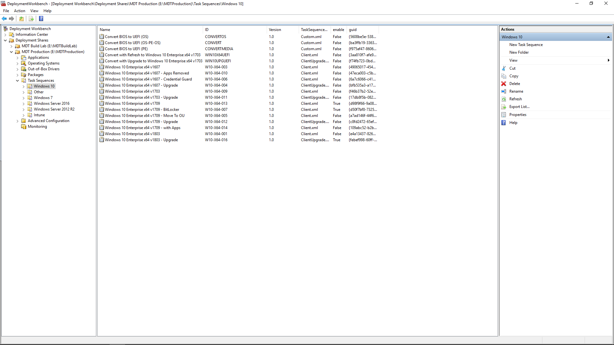

> [!VIDEO https://www.microsoft.com/videoplayer/embed/RE2SxiJ]

## Overview of the imaging process

Most organizations use the process of PC imaging to configure and capture a clone of a Windows system, including a base set of a few standard installed apps, or an even thinner image with only application runtimes and updates. The best way to do this is to use a virtual machine for automation purposes and to avoid any unexpected driver-related compatibility issues.

When using the image capture method, it is best to automate as much as possible to ensure a repeatable process that results in the best quality image. For most deployments, we also recommend using a Windows image with as little customization and as few pre-installed apps as possible.  This is called a *thin image* approach, which saves overall bandwidth on the network. By starting with a thin base image, you can layer on required apps, languages, and configurations dynamically tailored to end user requirements.

During the build and capture process, tools like System Center Configuration Manager and the Microsoft Deployment Toolkit use the System Preparation Tool – or Sysprep – along with the *generalize* command to reseal the image before capturing the Windows 10 installation as an image.

The captured image will have the Windows image as in standard Windows installation media. With a custom WIM file, IT admins can use another task sequence as part of the OS deployment in System Center Configuration Manager or Microsoft Deployment Toolkit to perform deployment-related tasks, to apply the image, and run tasks before and after the Windows image is applied.

## Traditional deployment types

With a custom image ready, the installation or migration type will fall into one of the following categories:

- **Bare metal deployment.** This is the scenario used to deploy an image to a clean disk, or to reimage a computer where you don’t intend to keep any of the data on the disk.
- **Computer refresh.** This is similar to bare metal, with the key difference that user state remains on the disk or will be restored after the install is complete.
- **Computer replacement.** As the name implies, this involves replacing a PC with another PC. In this case, there is often a backup of end user files from the first PC to a central location, then a restore of those files to the second PC.

All three of these deployment types use a task sequence to run, and a custom image can be applied each time.

## Phased deployment

During deployment planning, you’ll target computers for bare metal, refresh, and replacement, as well as upgrade paths. The recommended approach is to use phased deployment on collections of similar machines. This way, IT admins can validate compatibility, delivery and automation, user acceptance, network bandwidth consumption, and other factors before increasing the scale of the deployment.

Regardless of the deployment type selected, automation provides predictability and repeatability. Microsoft offers two solutions to automate OS deployment using automated task sequences:

- **System Center Configuration Manager,** which in addition to software distribution and software update management, provides built-in operating system deployment capabilities. When integrated with Microsoft Intune, you can add the capacity for device management.  It is widely used by organizations of all sizes and supports all  Windows deployment types.

- **Microsoft Deployment Toolkit (MDT)** is the other popular and free option which is typically used by small- and medium-sized organizations for OS deployment. This requires very little infrastructure and MDT integrates with Windows Deployment Services (WDS) for network boots. It supports all deployment types as well as installation of applications, drivers, and settings. Additionally, MDT can be integrated with Configuration Manager.

