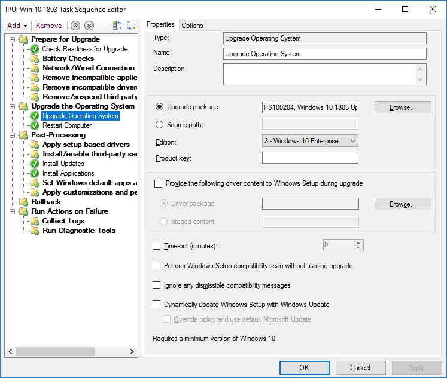

## In-place upgrades

For existing PCs running Windows 7, Windows 8, or Windows 8.1, the recommended path for organizations deploying Windows 10 leverages the Windows installation program (setup.exe) to perform an in-place upgrade automatically preserving all data, settings, applications, and drivers from the existing operating system version. In-place upgrades run several small pre-installation checks looking for known compatibility issues and preserves the user state and applications while only removing what isn’t compatible with the version of Windows 10 being installed. 

The in-place upgrade process supports the ability to manually or automatically roll back to the previous OS if you encounter any issues either during or after the deployment. These upgrades are typically faster than traditional deployments because applications do not need to be reinstalled as part of the process.

There are some situations where you cannot execute an in-place upgrade. In these situations, traditional deployments such as wipe-and-load can be used instead. Examples of these situations include:

- Upgrading from Windows 7, Windows 8, or Windows 8.1 x86 to Windows 10 x64
- Windows To Go and Boot from VHD installations
- Updating existing images (preparing an upgraded OS for imaging (using sysprep.exe) is not supported and will not work when it detects the upgraded OS)
- Dual-boot and multi-boot systems

## In-place upgrades using task sequence automation

You can have more control over the upgrade process by using tools like System Center Configuration Manager or the Microsoft Deployment Toolkit to completely automate the upgrade process through simple task sequences. A new option, System Center Configuration Manager task sequence with Windows 10, allows you to complete an in-place upgrade using the upgrade task sequence. Previous versions of Windows do not require a task sequence for in-place upgrades, but we do recommend it when deploying Windows 10 at enterprise scale. And while an in-place upgrade does not allow you to apply a custom image with applications, you can update the default install.wim by, for example, installing the latest Windows updates in your task sequence prior to performing the upgrade.

The in-place upgrade scenario can be used to migrate to Windows 10 from legacy versions of Windows, as well as to upgrade from previous versions of Windows 10. After Windows Setup completes the upgrade, the task sequence can continue to run and upgrade applications like Office, replace drivers, and apply personalization settings. Likewise, the upgrade task sequence can be used to perform pre-installation tasks or checks prior to carrying out the upgrade.

## Windows Autopilot

A new option with Windows 10 is to configure new PCs as part of a hardware refresh cycle using Windows Autopilot. IT admins can work with supporting hardware vendors to customize the default Windows Out of Box Experience (OOBE), for example by eliminating options presented to users, such as licensing agreements or telemetry settings. There are no images to deploy, no drivers to inject, and no infrastructure to manage. 

When an end user signs in to the PC during setup using their Azure AD credentials, Microsoft Intune then takes over the deployment process and applies applications, software update configurations, and compliance policies. Windows Autopilot can also optionally prevent the user from accessing the first session until provisioning is complete.

Windows Autopilot enables IT admins to:
- Automatically join devices to Azure Active Directory (Azure AD) or Active Directory (via Hybrid Azure AD Join)
- Auto-enroll devices into MDM services, such as Microsoft Intune *(Requires an Azure AD Premium subscription)*
- Restrict the administrator account creation
- Create and auto-assign devices to configuration groups based on a device's profile
- Customize OOBE content specific to the organization

## Windows Update for Business for feature updates

Windows Update for Business is a free service that enables IT admins to keep Windows 10 devices always up-to-date by directly connecting the devices to the Windows Update service. Windows Update for Business can be configured via Group Policy or through MDM solutions, such as Microsoft Intune, and allows IT admins to create deployment rings to validate new builds. It is integrated into existing management tools such as Windows Server Update Services (WSUS), System Center Configuration Manager (current branch), and Microsoft Intune. Additionally, Windows Update for Business supports peer-to-peer delivery to help optimize bandwidth efficiency and reduce network congestion.
