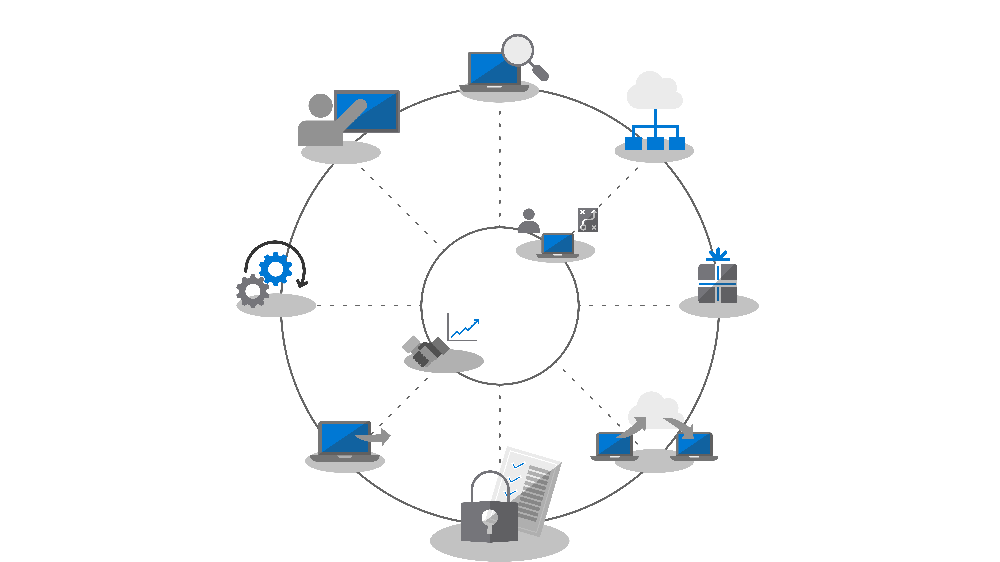
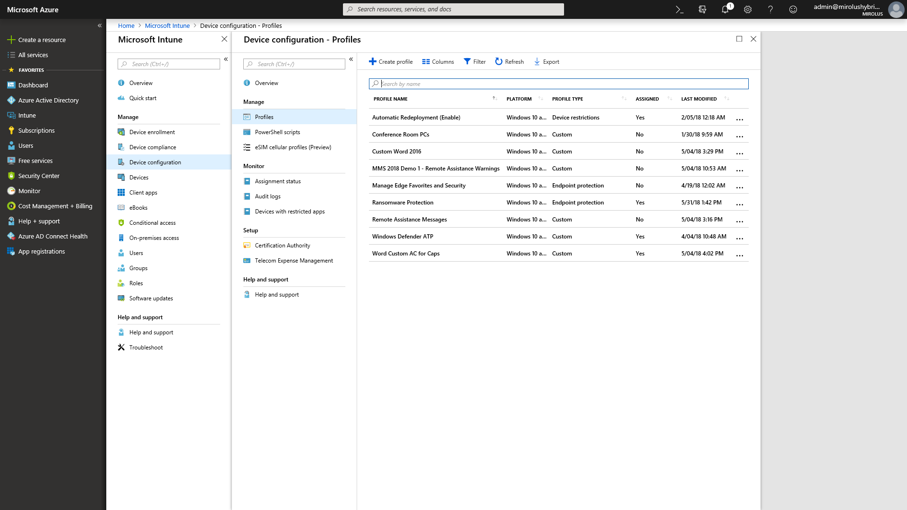

Let's look at new capabilities you can take advantage of with Windows 10, Microsoft 365 Apps, and cloud-based options from Enterprise Mobility + Security and beyond.

## Identity and access management

Azure Active Directory (Azure AD) is the identity control plane for apps, devices, and cloud services while connecting to cloud services. Conditional access lets you define different authentication requirements based on where your user is logging in from and which device they’re using, as well as responses to anomalous behaviors.

At the device level, you can use biometrics as unique identifiers for simpler and more secure access to devices and apps, moving toward the goal of eliminating passwords. Windows Hello offers device-based, multi-factor authentication that relies on the device itself, your PIN, or a unique biometric identifier like a face or fingerprint that can be enforced via policy.

## Virtualization-based security

Beyond identity, it’s important to consider continuous protection against both known and unknown threats. Windows 10 uses virtualization-based security at the core, with Secure Boot to ensure boot and code integrity. You can also help protect against credential theft with **Credential Guard** by maintaining user secrets in isolation from Windows. **Application Guard** can isolate and mitigate browser-based threats by running the browser in an isolated container. All these technologies use virtualization-based security in Windows 10 and are foundational changes that cannot be replicated on a Windows 7 system. Note that these also require UEFI, 64-bit Windows, and virtualization extension support with SLAT – at the hardware level.

## Security enhancements from cloud services

Cloud services provide another layer of optional protection to improve Windows and Office security. These provide a new level of near real-time control that can instantly detect, resist, and respond to new attacks and attack types – especially compared to traditional software updating and AV signature files – where response and update deployment times are inherently slower.

Along with the Microsoft Intelligent Security Graph, you have faster access to both information and protections from emerging threats. Here are a few examples of security enhancements you can take advantage of:

- **Data Loss Prevention,** built into Microsoft 365 Apps, helps inform users of security policies when high risk content like credit card or identification numbers are detected. Policies can inform or block sending and sharing after notifying users.

- **Azure Information Protection** is a complementary service that can be used with Office, allowing users to easily classify and label their Office files. It can trigger automatic action on labeled files, such as encryption or locking down sharing.

- **Safe Links** supplies protection across Office apps to protect against a dynamic list of known malicious websites.

- **Safe Attachments** in Outlook and as part of Exchange Online goes beyond email filtering to inspect attachments. If a high-risk attachment is identified, Safe Attachments will inform the user of known malicious attachments and remove them from email.

- **Message Encryption (OME)** safeguards sent email and attachments, ensuring only intended recipients can view email content. OME works seamlessly with Google, Yahoo, and Microsoft consumer account authentication,and one-time passcodes allow users of other email services to securely receive email as well.

- **Windows Defender Application Control** in Windows 10 operates from an approved allow and deny list of applications that Microsoft has checked for safety. It is managed by endpoint protection policies using Microsoft Intune.

- **Microsoft Defender for Endpoint** is a unified platform for preventative protection, post-breach detection, automated investigation, and response. It protects endpoints from cyber threats; detects advanced attacks and data breaches, automates security incidents, and improves security posture.

- **Exploit Guard** helps reduce the attack surface for running applications by preventing malware from getting into Windows and blocking untrusted processes from accessing protected folders.

## Microsoft Intune

[Microsoft Intune](/intune/introduction-intune) serves as a cloud-based management service for mobile scenarios, including iOS, Android, and Windows devices. You can configure Intune for co-management to complement and extend controls for specific workloads managed by Microsoft Endpoint Configuration Manager. You can require devices that access protected resources to enroll in device management, even non-managed, non-domain-joined, or non-Azure AD-joined devices. You can also take advantage of granular configuration and compliance policy enforcement at the operating system and application level. Finally, you can configure application policies and settings centrally and enforce them for Microsoft 365 Apps and store apps in Windows 10 using Microsoft Intune.

## Learn more
- [Microsoft Defender for Endpoint ](/windows/security/threat-protection/?azure-portal=true)
- [Identity and access management fundamentals](/azure/security/fundamentals/overview#identity-and-access-management?azure-portal=true)
