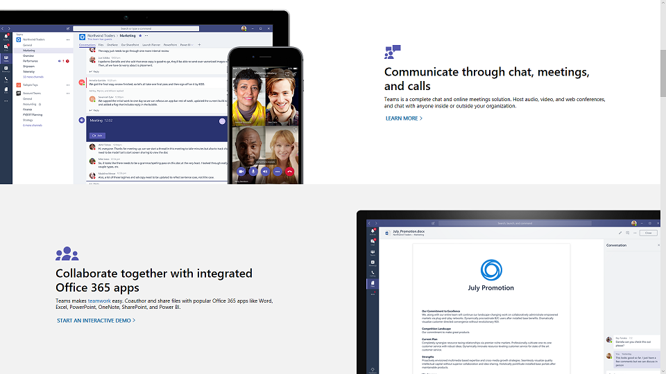

If you’re deploying Microsoft 365 Apps for the first time, you can communicate the positive impacts the new features will have for users. For example, you might tell them how they’ll be able to more easily share files with OneDrive or SharePoint, reducing file branching and allowing for real-time co-authoring. You can provide guidance and training on new in-app capabilities, like attaching OneDrive linked files in Outlook or using the new Morph slide transitions and Designer features in PowerPoint. For Windows 10, you can show your users new capabilities like Windows Hello biometric login, personalization of the start menu, and Timeline to easily return to what they were working on.
 

You can also introduce end users to some of the more visible security and compliance controls. For example, if you’re using Enterprise Mobility + Security, and if you enable multi-factor authentication, you need to train your users on how to set it up and what the sign-in experience is like. Azure Information Protection makes it easy for users to classify and label documents, but they’ll need training on how to properly use the classifications.

These are just some of the features that users will encounter, and others may catch them by surprise if you haven’t prepared them. These surprises, especially if they alter your users’ normal workflows, can result in more calls and tickets for you or your helpdesk. 