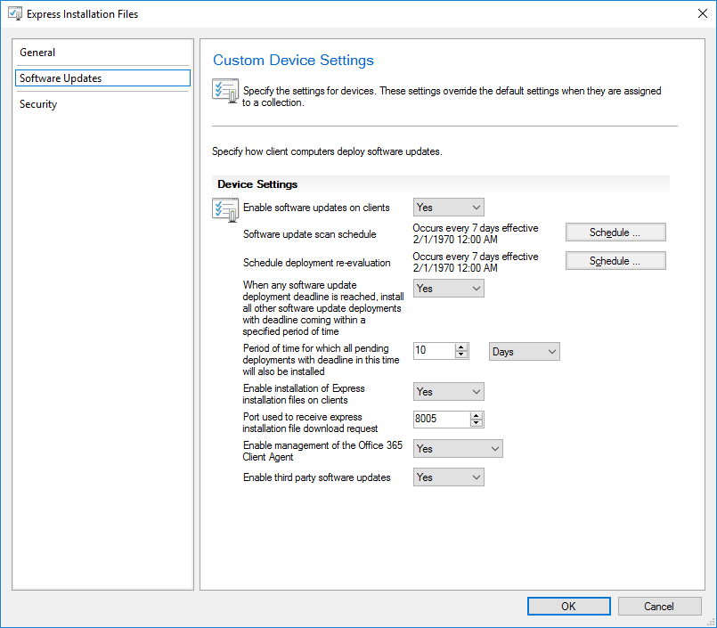
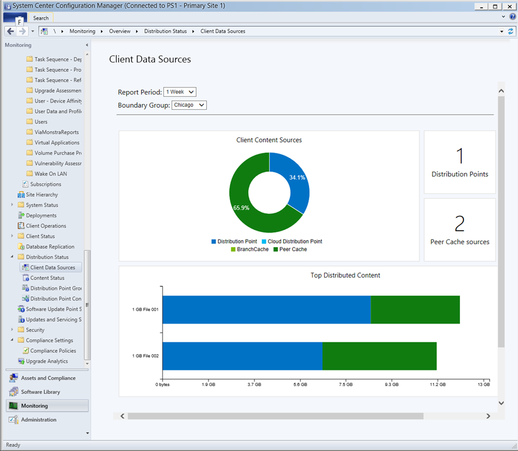
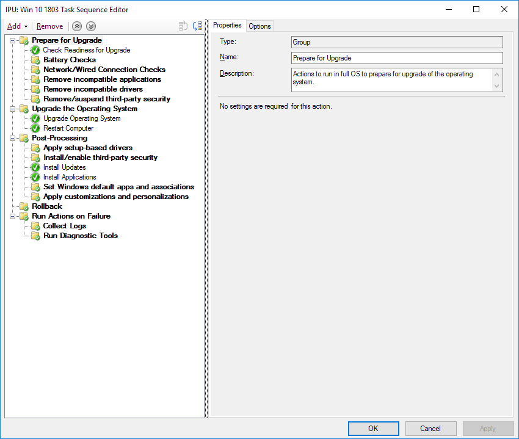

## Introduction to phased deployments
For any release, Microsoft recommends at least three deployment phases for IT: validation, piloting, and broad production deployment. Monthly servicing provides critical security and quality updates to stay current while semi-annual servicing provides new features.

## Monthly updates
The monthly update servicing model is designed to give IT admins flexibility to limit the roll-out of new features to twice per year, and if needed to even skip a semi-annual update, while still receiving quality and security updates. It is important to keep in mind though, that the cumulative nature of monthly updates means each will increase in size per month.

Using technologies such as **Express Updates** in Windows and **Binary Delta Compression** in Office, the download size can be reduced significantly. In both approaches, the update engines compare the PC’s current status and find only the differentials needed to update it. Windows Update for Business and Windows Server Update Services have supported express updates for a long time, but Microsoft has now extended that support to System Center Configuration Manager so that it can also use express updates. 

**Binary Delta Compression** in Office is only used when updating from the most recent version of Office 365 ProPlus, so to use this approach clients need to be updating from the previous build and can’t skip updates. Windows and Office update channels can be managed via System Center Configuration Manager using the standard approval and targeting process. Additionally, IT admins can use policy settings in Office and Windows to enforce update channels used.

## Semi-annual updates
In order to manage larger and semi-annual updates, IT admins can use policy settings with Windows Update for Business, software update management via System Center Configuration Manager, Windows Server Update Services (WSUS), or policies set by Microsoft Intune. For organizations concerned about network bandwidth, Microsoft recommends options to reduce network traffic such as delivery optimization and other peer-to-peer caching technologies.

As announced in September 2018, the support timeline for semi-annual channel updates will use the following model:

- All currently supported feature updates of Windows 10 Enterprise and Education, starting with version 1607, will be supported for 30 months from their original release date.

- All future feature updates, targeting September and starting with 1809, will be supported for 30 months from their release date.

- Future feature updates targeting March and starting with 1903 will continue to be supported for 18 months from their release date.

- Office 365 ProPlus semi-annual updates continue to be supported for 18 months

## Upgrade task sequence
You can install larger feature updates via standard software update management routines, but you may opt to use an upgrade task sequence with System Center Configuration Manager or the Microsoft Deployment Toolkit. A task sequence allows custom checks or tasks to be implemented before installing the feature update and after the update installation itself has completed. Post-update tasks might include temporarily suspending services if needed during the update, driver installation and replacement, application upgrades, or taskbar and Windows 10 Start personalization settings.

If you already use task sequences to migrate Windows 7 machines to Windows 10 and are well-versed with those tools, the experience is similar. While a single task sequence can be used for the entire upgrade, it is quite common for organizations to use two task sequences. One task sequence makes sure the machines are ready for the upgrade, silently pre-staging all the required setup files on target computers and the other task sequence does the actual upgrade. This approach ensures that your user productivity is less impacted.
