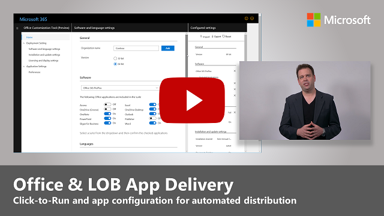

Office 365 ProPlus and Office 2019 are both installed using Click-to-Run which replaces MSI-based packaging in previous legacy Office deployments. It brings with it a number of advantages, including faster installations, faster and more efficient updating, and cleaner uninstallation. Programs delivered via Click-to-Run execute in a virtual application environment on your computer and co-exist with other applications without conflict. They also utilize about half the disk space of an MSI-based package.

### About Office 365 ProPlus

Office 365 ProPlus is a full version of Office available through Office 365 that includes the Office apps you’re familiar with. It allows connections to Office 365 services such as SharePoint Online, Exchange Online, and Teams. Office 365 ProPlus is similar to other versions of Office in that:

- It installs and runs on the user’s local computer. It’s not a web-based version of Office or the same as Office Online which provides the apps in a web browser. Users don’t need to be connected to the Internet all the time to use it.
- You can leverage many of the same tools to deploy and configure Office 365 ProPlus that you’re already using for Office and app delivery, such as System Center Configuration Manager or Microsoft Intune.
- Many of the same Group Policy settings used with other versions of Office can be applied to Office 365 ProPlus.

Even though Office 365 ProPlus is a lot like other versions of Office, there are key deployment and licensing differences. The most significant one is that Office 365 ProPlus is updated regularly with new features unlike non-subscription versions of Office. Here are some of the key differences:

- Office 365 ProPlus uses subscription-based activation that leverages the Office Licensing Service, and allows users to activate on up to five different computers with a single Office 365 license. If a user is not appropriately licensed or has their license removed, Office apps will go into reduced functionality mode.
- While users don’t need to be connected to the Internet all the time to use Office 365 ProPlus, they must connect at least once every 30 days to verify their subscription status. If unverified, Office 365 ProPlus will go into reduced functionality mode until the subscription status can be verified.
- By default, Office 365 ProPlus installs as one package and all applications are installed on the user’s computer. However, admins can configure the deployment to exclude or remove specific applications.
- Office 365 ProPlus leverages Click-to-Run software updates from the Office Content Delivery Network (CDN), not Windows Server Update Services (WSUS). As an admin, you can also configure Office 365 ProPlus to update from an internal location within your network or use System Center Configuration Manager.
- Office 365 ProPlus supports enabling shared computer activation for computers accessed by multiple users without counting against one of five license activations. Each user must log in with their own account and be assigned an applicable Office 365 ProPlus license.
