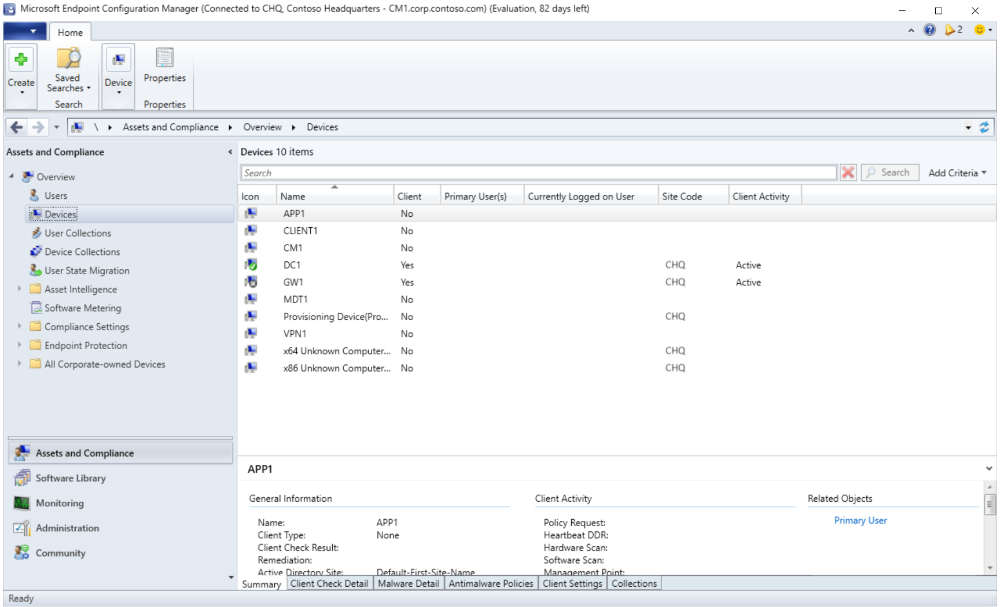
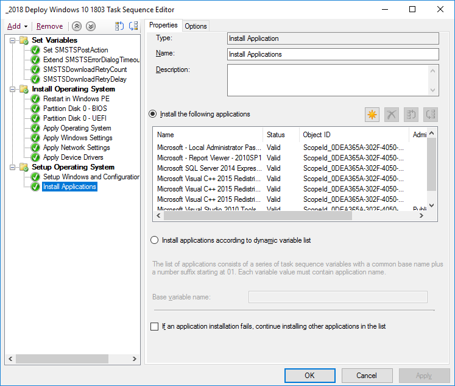

Several methods of delivering business apps are available.

## MSI-based app packages

For business apps, Windows 10 works with MSI-based packages and installs apps as part of an OS deployment task sequence. Software deployment tools like SCCM and Microsoft Intune are also optimized to deliver MSI-packaged apps. Once you validate your apps on Windows 10, you can implement SCCM for app delivery. The company portal in Microsoft Intune can extend the choice of IT sanctioned apps available to include the latest applications, and you can self-select what you need.

## PC imaging

Another popular method of app delivery is **PC imaging** - applications are either installed with a task sequence or manually on a sample PC. Then you capture a system image with the required applications installed. The imaging approach to build and capture can save time when provisioning new PCs, but remember operating systems and apps within the image can become stale quickly. The cumulative update model in Windows 10 and Office 365 ProPlus helps with this problem but doesn’t eliminate it completely. That’s why Microsoft recommends a thin image approach, where your applications are installed from outside the image at deployment time.

If you want to include Office 365 ProPlus in your image, remember that Office employs a user-based activation and can’t be pre-activated by the system admin. Use the Office Deployment Tool to pre-install Office on the device you're imaging and skip the user login. Once the image is deployed, end users can sign in using their Office 365 credentials and activate Office 365 ProPlus.

## Sideloading business apps

When you sideload an app, you deploy a signed app package to a device. You maintain the signing, hosting, and deployment of these apps. Although sideloading was also available in earlier Windows versions, it's a little different in Windows 10:

- You can unlock a device for sideloading using an enterprise policy, or through Settings.
- License keys aren't required.
- Devices don't have to be joined to a domain.

## Browser-based apps

If you’re using browser-based apps, you’ll want to make sure that they continue to work as expected after the upgrade. As you learned in **Analyze your device and app readiness,** if you have specific websites and apps that have compatibility problems with Microsoft Edge, you can add those apps and sites to the Enterprise Mode site list in the Enterprise Mode Site List Manager. That will ensure that websites will automatically open using Internet Explorer 11. 

If you know that your intranet sites aren’t going to work properly with Microsoft Edge, you can set all intranet sites to open using Internet Explorer 11 automatically, using the same functionality.
