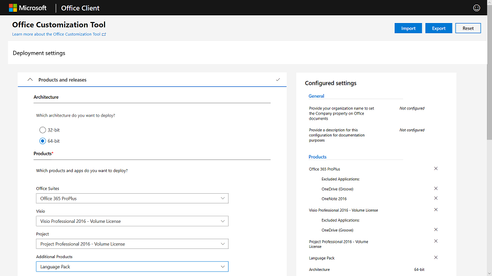

## Deployment tooling

Office applications are delivered and managed via the Office Deployment Tool which is the Office setup engine needed to download, configure, and customize your Office apps. Through this Microsoft-recommended tool, you can set the applications and languages to be installed, the method for updating the applications, application preferences, and installation experience settings.

If you use System Center Configuration Manager, you can still use it for broad deployment of Office 365 ProPlus. System Center Configuration Manager has native support for the updated Office Customization Tool, package customization for Click-to-Run at install time, and native support for software update management after installation. 

For organizations using Microsoft Intune, admins can also assign Office 365 ProPlus applications to Windows 10 devices. Intune supports both 32-bit and 64-bit versions of Office 365 ProPlus, as well as the ability to leverage the RemoveMSI element, which removes legacy Office installations from a computer.

## Upgrading from legacy Office to Office 365 ProPlus

We recommend you uninstall any previous versions of Office before installing Office 365 ProPlus. The Office Deployment Tool supports the ability to remove previous Office installations (Office 2010, 2013, or 2016 versions of Office, Visio, or Project) that were installed using MSI by utilizing the RemoveMSI element.

The RemoveMSI element lets you:

- Uninstall all Office MSI products on the computer.
- Identify any existing language resources, such as language packs, and install the same languages for Office 365 ProPlus.
- Keep some Office products, such as Project or Visio, and uninstall all other Office products on the computer.

When utilizing the RemoveMSI element it is important to note that user settings, preferences, and documents are retained even if all Office products are uninstalled. While a reboot will not be enforced, it is required to finish the uninstallation of the MSI versions of Office from the computer.  To remove Click-to-Run versions of Office from computers, you can leverage the Office Deployment Tool or manage the uninstallation through the Control Panel.
