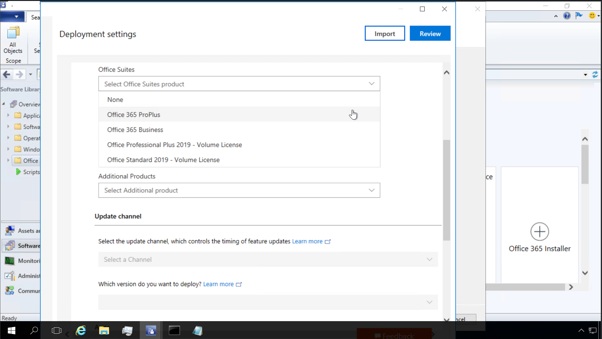
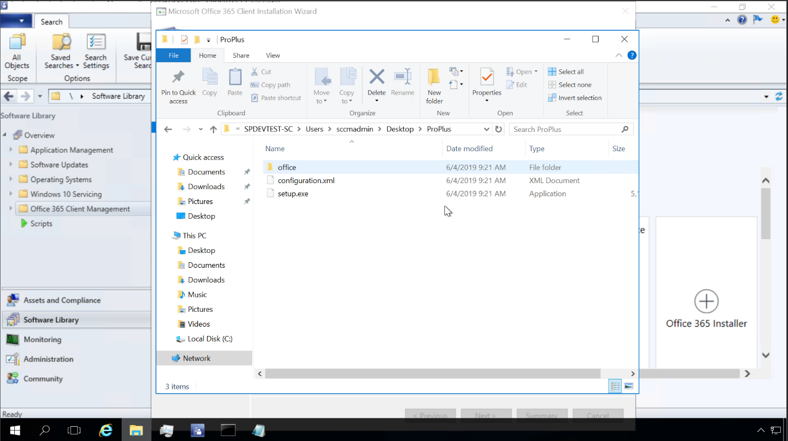

In this unit, we’ll build an Office 365 ProPlus package using the Office 365 Installer application packaging process in Configuration Manager. This process is similar to the standalone web tool found in the Office 365 Client Configuration Service.

You can use the standard application package creation process in Configuration Manager, but you’ll have to create the configuration XML files manually, as well as download an updated version of the Office Deployment Tool and the Office installation files. Because of this and to avoid making mistakes along the way, we recommend you use the Office 365 Installer process, following these steps.

To get started in Configuration Manager, access the Office 365 Installer through Office 365 Client Management. (Despite the name and location, this process also works for Office 2019 desktop apps.)

1. Click Office 365 Installer.
2. Give it a name, description and content location – an empty folder.
3. Open the integrated Office Customization Tool.

4. In the Office Customization Tool in Configuration Manager:

    1. In **Architecture**, choose the Office architecture.
    2. In **Products**, select the Office suites and apps you want to deploy.
    3. In **Update channel**, choose your update channel and version.
    4. In **Apps**, include or exclude specific Office apps.
    5. In **Language**, choose languages and language settings.
    6. In **Installation**, you can specify a path for any log files.
    7. In **Update and upgrade**, you can choose to uninstall any previously installed MSI-based versions of Office or to keep Visio, Project, SharePoint Designer, and InfoPath.
    8. (Optional) In **General**, when you enter your organization name it will automatically mark all of your Office documents with that information.
    9. In **Application preferences**, you can configure granular install-time preferences. You can disable macros or set default file formats, for example. Select **Review**. Review the settings, and then select **Submit**.
    10. Select whether to deploy the apps now or later. If you choose to deploy now, the wizard will walk you through the standard device selection and deployment process.
    11. When finished, you’ll see a summary for your Office application package.
    12. Now the process downloads the Office installation files from the Office 365 Content Delivery Network (CDN) and puts them into the folder you specified in the first step.

If you haven’t already chosen to deploy in the earlier step, you’re ready to deploy as you normally would using other application packages.

## Learn more

When you're done with a link, use the **Back** arrow in your browser to come back to this page.

- [Office 365 Client Configuration Service and Client Management](https://config.office.com)
