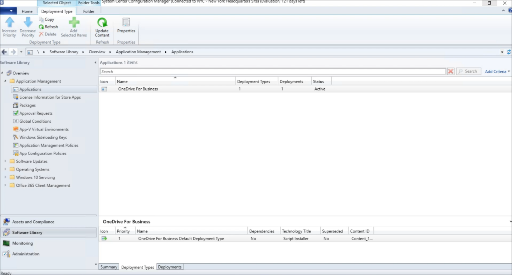
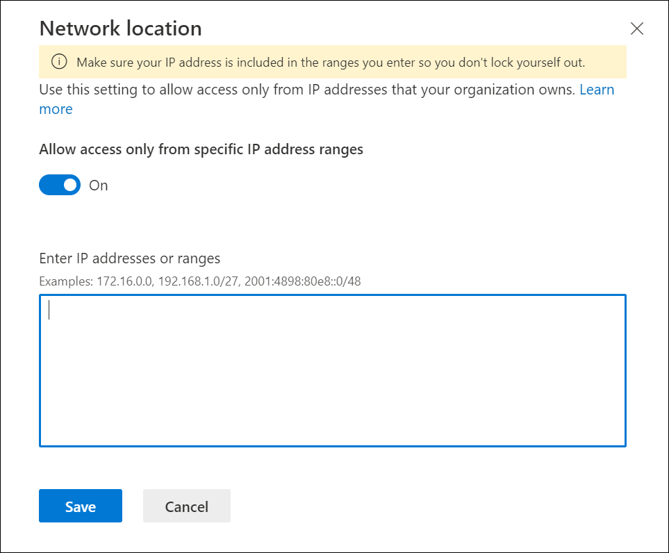
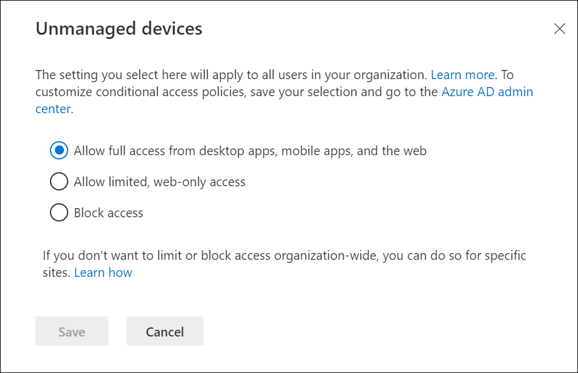

Even though you can work with OneDrive files from a web browser, the ideal OneDrive experience comes from the Windows and Mac sync apps and the iOS and Android mobile apps. OneDrive is available for most operating systems and browsers and requires minimal hardware. 

You don't have to manage all your users' connected devices for them to use OneDrive, but securing and managing their interaction with the data does require some management. Start by determining which types of devices—iOS, Android, Windows 10—require access to OneDrive and whether they're owned by the business or the employee. Some management options are more suitable for devices that the company owns and manages. Regardless of the platform and who owns it, the following management options are available to you:
- OneDrive admin center
- Microsoft 365 MDM
- Intune MDM or MAM

For Windows 10 client devices that are joined to a domain, you can use Windows group policy for management. And, for devices that are company owned and managed, you can deploy OneDrive **with Microsoft Endpoint Configuration Manager**. 

Each technology has different deployment, update, and management options, so your first consideration should be whether you need to upgrade existing devices.

The built-in **Mobile Device Management (MDM)** for Microsoft 365 helps you secure and manage user mobile devices. With MDM, you can create and manage device security policies, remotely wipe a device, and view detailed device reports.

The ability to manage mobile applications with policies regardless of the device is **Mobile Application Management (MAM)**. MAM policies allow a work or school-related app to be managed on almost any device, including personal devices in bring-your-own-device (BYOD) scenarios. Many productivity apps, such as OneDrive, SharePoint, and the Office apps, can be managed through Intune MAM policies.

## Conditional access for OneDrive
Controlling access to OneDrive is not just about devices but also where and how you are connecting to OneDrive. Conditional access control capabilities in Azure Active Directory offer simple ways for you to secure resources in the cloud. The OneDrive sync app works with the conditional access control policies to ensure syncing is only done with compliant devices. For example, you might require sync to be available only on domain-joined devices or devices that meet compliance requirements as defined by the Mobile Device Management system (like Intune). 

Conditional access controls access to SharePoint, OneDrive, and their admin centers. The built-in conditional access policies in the OneDrive and SharePoint admin center included in the access control page are:
- Control access based on network location. You can control access to SharePoint and OneDrive resources based on defined network locations that you trust. This is also known as location-based policy.

   

- Control access from unmanaged devices
    - You can block or limit access to SharePoint and OneDrive content from unmanaged devices (those not hybrid Active Directory-joined or compliant in Intune). 
    - Blocking or limiting access on unmanaged devices relies on Azure AD conditional access policies. 

   

Limiting access allows users to remain productive while addressing the risk of accidental data loss on unmanaged devices. When you limit access, users on unmanaged devices will have browser-only access with no ability to download, print, or sync files. They also won't be able to access content through apps, including the Microsoft Office desktop apps. When you limit access, you can choose to allow or block editing files in the browser.

You can also block or limit access to a specific user's OneDrive. **Anyone** links do not adhere to conditional access policies so if you need to add an access policy to a site, **Anyone** links should be disabled. 
Blocking access and blocking downloads may impact the user experience in some apps, including some Office apps. Microsoft recommends that the policy is enabled for some users and test the experience with the apps used in your organization.

## Learn more
- [Control access to features in the OneDrive and SharePoint mobile apps](/onedrive/control-access-to-mobile-app-features?azure-portal=true)
- [Enable conditional access support in the OneDrive sync app for Windows](/onedrive/enable-conditional-access?azure-portal=true)
- [Control access from unmanaged devices](/sharepoint/control-access-from-unmanaged-devices?azure-portal=true)

