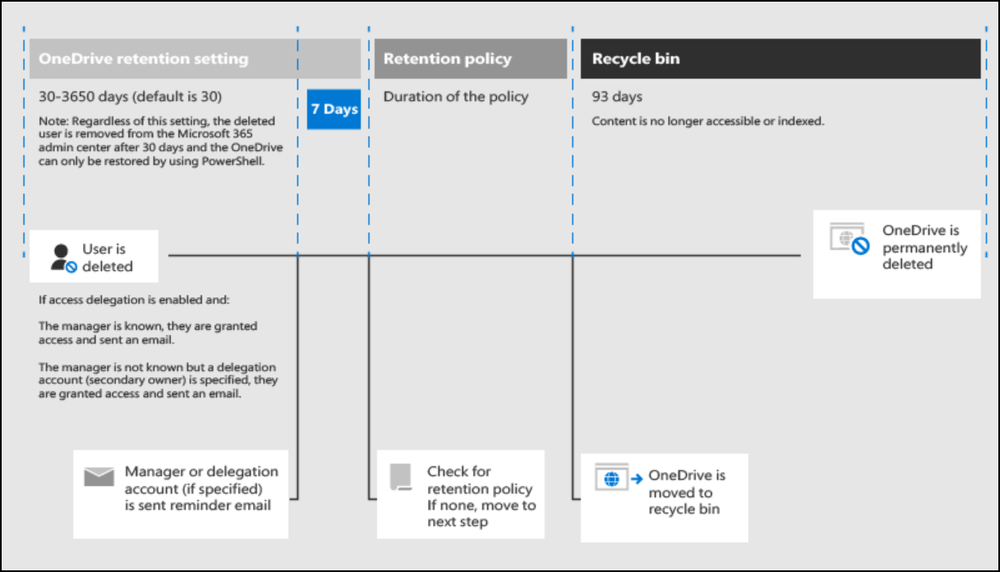
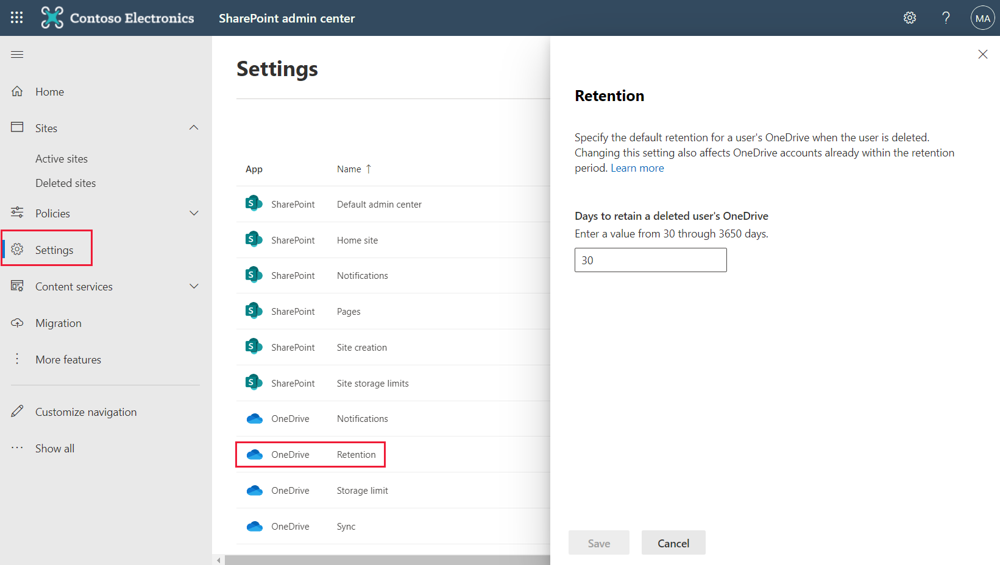

OneDrive storage is provisioned on a per user basis and is designed to serve the needs of individual users. Storage of data other than an individual user's work files, including system back-ups and departmental and organizational level data, is not supported, nor is the assignment of a per user license to a bot, department, or other non-human entity. 

## Default storage for OneDrive users
The default storage for most subscriptions for each user is 1 TB. The default storage space is set in the OneDrive admin center. To change storage from the default setting for specific user’s OneDrive, you need to use PowerShell. The default storage space setting applies to all new and existing users who are licensed for a qualifying plan and for whom you haven't set specific storage limits. To see how much storage users across your organization are using, use the OneDrive usage reports in the Microsoft 365 admin center.

If you decrease a user’s storage limit to the point that that user is over their new limit, their OneDrive will become read-only.

You can configure the default storage limit for all users in the OneDrive admin center. However, you must use PowerShell to set it for an individual user’s OneDrive.

## OneDrive retention and deletion
When a user is deleted, their OneDrive files are preserved for 30 days by default or for a period that you specify. At the end of the retention period, the files are moved to the recycle bin for 93 days before being permanently deleted. By default, when a user is deleted, their manager is automatically given access to the contents of their OneDrive. If access delegation is disabled or a manager or secondary owner hasn’t been specified for that user, no one will have automatic access or be warned the OneDrive content will be deleted when that user is deleted. 

 

You can set the retention time for OneDrive accounts in the OneDrive admin center. The minimum value is 30 days and the maximum value is 3650 days (10 years).

 

No other action besides user deletion causes the cleanup process to occur, including blocking the user from signing in or removing the user's license.

## Microsoft 365 retention and OneDrive
There are other options for retaining content in OneDrive that are administered at the Microsoft 365 level and affect applications such as Exchange, SharePoint, OneDrive, and Teams. Using the Microsoft 365 compliance center, you can create retention policies for OneDrive sites and create retention labels to apply to files in OneDrive.

Retention policies allow you to proactively just retain, just delete, or retain then delete content in OneDrive. A single policy can be applied to the entire organization’s applications like Exchange, SharePoint, and OneDrive, or just OneDrive, or individual OneDrive sites. Policies can also be applied to content that contains specific keywords or is a specific sensitive information type. If the content is edited or deleted, a copy is saved to a secure location so all versions of a document are retained. 

To add retention settings to specific files in OneDrive vs the entire OneDrive site, you use retention labels rather than retention policies. Retention labels allow you to classify data in OneDrive for governance and enforce retention rules based on that classification. Retention labels can be applied by users manually in OneDrive or applied automatically if files match specific conditions. 

 

If a user leaves your organization, any files subject to a retention policy or containing retention labels will remain for the duration of the policy or label. During that period, all sharing access continues to work. When the retention period expires, files move into the site collection recycle bin.

## Learn more
- [Set the default storage space for OneDrive users](https://docs.microsoft.com/onedrive/set-default-storage-space?azure-portal=true)
- [Change a specific user’s OneDrive storage space](https://docs.microsoft.com/onedrive/change-user-storage?azure-portal=true)
- [Learn about retention policies](https://docs.microsoft.com/microsoft-365/compliance/retention-policies?view=o365-worldwide?azure-portal=true)
- [Learn about retention labels](https://docs.microsoft.com/microsoft-365/compliance/labels?view=o365-worldwide?azure-portal=true)
