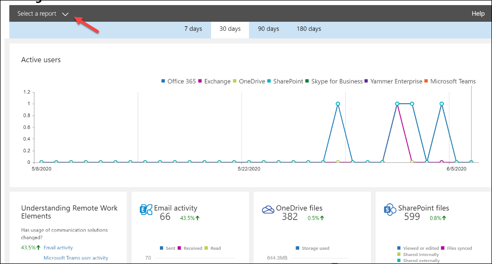
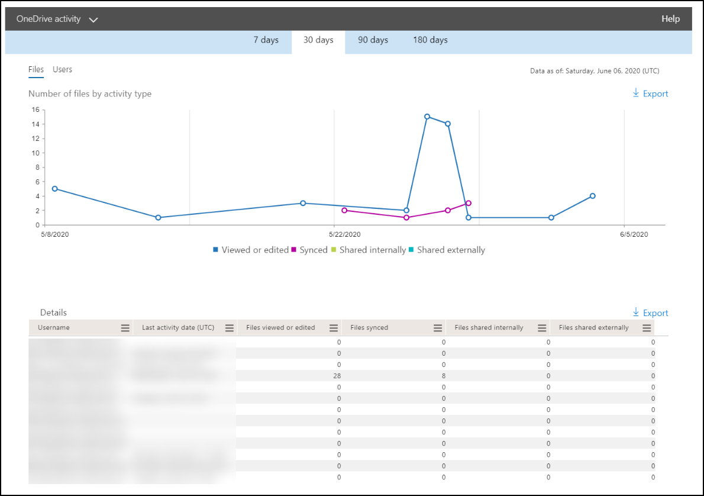
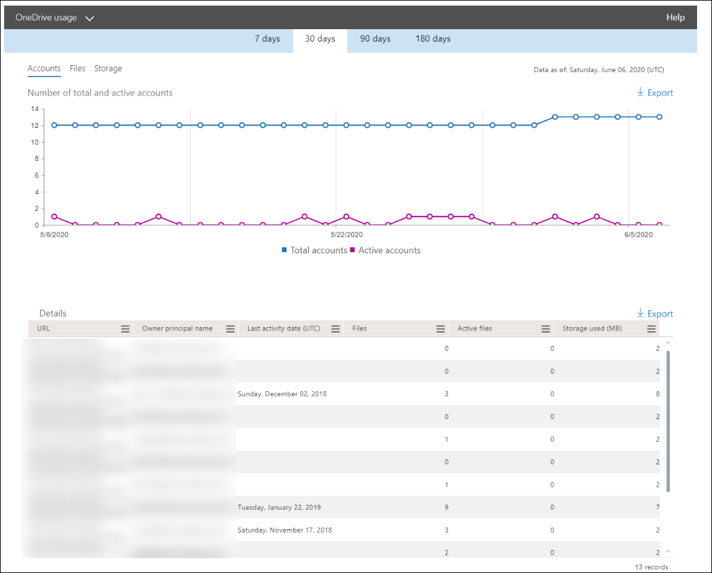

Microsoft 365 includes built in reports to see who is using OneDrive and how. Reports are available for periods of the most recent 7, 30, 90, and 180 days, and become available within 48 hours. To see reports, you must have one of the following permissions: global admin, SharePoint admin, global reader, or report reader. 

The Microsoft 365 Reports dashboard shows the activity overview across products and allows you to drill down into the OneDrive reports.  

  

## OneDrive activity reports
The OneDrive activity reports allow you to understand the activity of every licensed OneDrive user by looking at their interactions with files on OneDrive. You can also evaluate the level of collaboration going on by looking at the number of files shared.

You get a view into OneDrive activity by looking at the Files and Users views.

  

The **Files** view helps you understand the unique number of licensed users that performed file interactions against any OneDrive account.

The **Users** view helps you understand trends for the number of active OneDrive users. A user is considered active if he or she has executed a file activity (save, sync, modify, or share) within the specified time period.

You can also export the report data into an Excel .csv file. This enables you to do further analysis, and is useful if you have more than the view limit of 2000 users.

## OneDrive usage reports
The OneDrive usage reports give you a high-level view of the value you are getting from OneDrive in terms of the total number of files and storage used across your organization. You can then investigate further to better understand the trends of active OneDrive accounts, how many files users are interacting with, as well as the amount of storage used. You can also view details for each user's OneDrive.

  
   
The following views are available:

The **Accounts** view shows the trend in the number of total and active OneDrive accounts. "Active accounts" are any in which users view, modify, upload, download, share, or sync files.

The **Files** view shows the number of total and active files. A file is considered active if it has been saved, synced, modified, or shared within the specified time period.

The **Storage** view shows the amount of OneDrive storage you're using.

You can also export the report data into an Excel .csv file.

## Learn more
- [Microsoft 365 Reports in the admin center](https://docs.microsoft.com/microsoft-365/admin/activity-reports/activity-reports?view=o365-worldwide?azure-portal=true)
- [Microsoft 365 Reports in the admin center – OneDrive for Business usage](https://docs.microsoft.com/microsoft-365/admin/activity-reports/onedrive-for-business-usage?view=o365-worldwide?azure-portal=true)
- [Microsoft 365 Reports in the admin center – OneDrive for Business activity](https://docs.microsoft.com/microsoft-365/admin/activity-reports/onedrive-for-business-activity?view=o365-worldwide?azure-portal=true)
- [OneDrive usage reports through Microsoft Graph](https://docs.microsoft.com/graph/api/resources/onedrive-usage-reports?view=graph-rest-1.0?azure-portal=true)
- [OneDrive activity reports through Microsoft Graph](https://docs.microsoft.com/graph/api/resources/onedrive-activity-reports?view=graph-rest-1.0?azure-portal=true)
