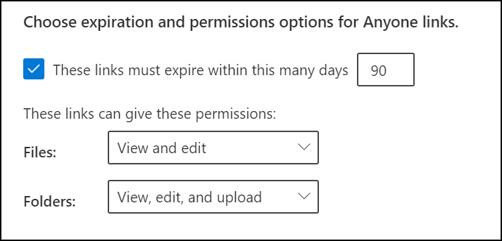

If “Anyone” (anonymous) links are enabled, there are more controls that can be applied to those links. These controls exist because Anyone links have the potential to be distributed to someone that should not have access to that file. The sharing of files like this is comparable to files within email that will work to whomever it is forwarded to, but unlike email, when using Anyone links the permissions can be revoked at any time. 

 

## Link expiration
You can specify the number of days after which an Anyone link expires. Once a link expires, it cannot be renewed so users will need to create a new link if they need to continue sharing past the expiration. The default setting is off with no expiration. We recommend you enable a default link expiration if enabling Anyone links. 

## Link permissions
You can specify the file and folder permissions available to recipients of Anyone links. Files permissions can allow editing or can be restricted to view only. Folder permissions can allow editing and uploading or can be restricted to view only.

## Learn more
- [Manage sharing settings](/sharepoint/turn-external-sharing-on-or-off?azure-portal=true)
