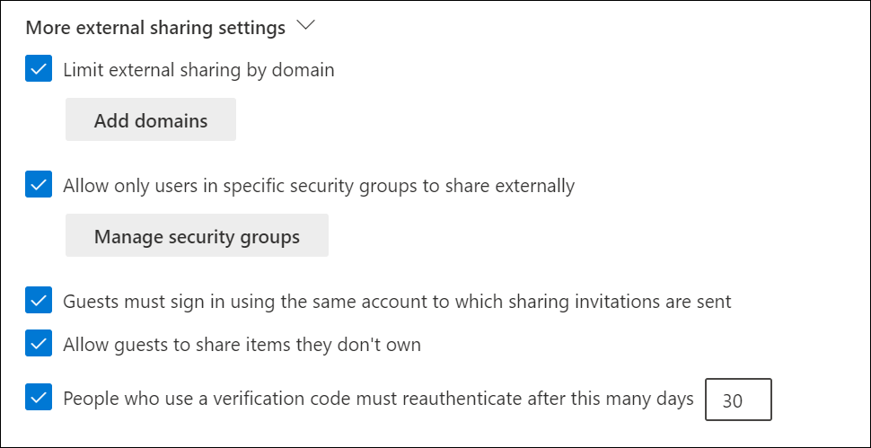
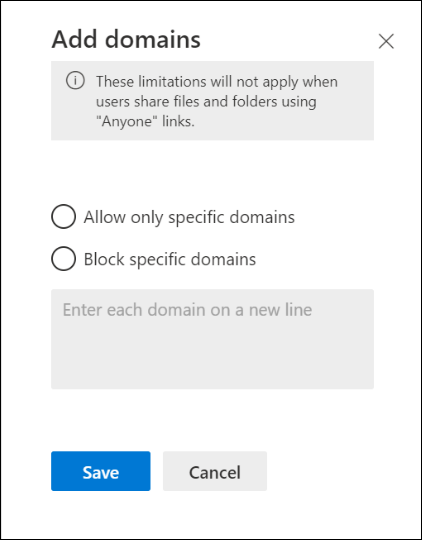
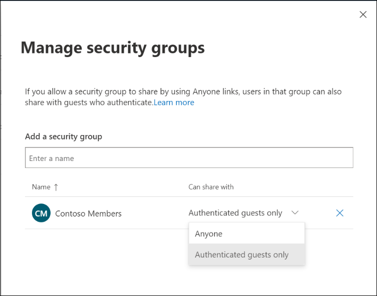

## Limit external sharing by domain
You can specify a list of allowed or blocked domains for external sharing. When specified, sharing invitations can only be sent to allowed domains. Denied domains cannot be sent sharing invitations. 

 

You can also limit domains for an individual OneDrive. 

 
 
## Allow only users in specific security groups to share externally
To limit who can share with guests in SharePoint and OneDrive, you can limit sharing to people in specified security groups. These sharing settings affect files and folders stored in OneDrive and SharePoint and not adding members to SharePoint sites, Microsoft Teams, and other Microsoft 365 group resources. 

People in the security group can be given the ability to share with unauthenticated users only or with both unauthenticated and authenticated users.

 
 
## Allow guests to share items they don't own
This setting is turned on by default and guests must have full control permission to share items externally. This allows a guest to share a file with other people once shared with them.

## Sharing notifications
External sharing notifications allow users to monitor through email and mobile devices which external users have access to their files and what they are doing with them 
 
File and folder owners will be emailed when:
- Another user invites external users to shared files.
- An external user accepts an invitation to access their files.
- An anonymous link is created or changed.

If external sharing is enabled in your organization, these notifications are enabled by default.

## Learn more
- [Restrict sharing of SharePoint and OneDrive content by domain](https://docs.microsoft.com/sharepoint/restricted-domains-sharing?azure-portal=true)
- [Allow/Block guest access to Microsoft 365 groups](https://docs.microsoft.com/exchange/recipients-in-exchange-online/manage-group-access-to-office-365-groups?azure-portal=true)
