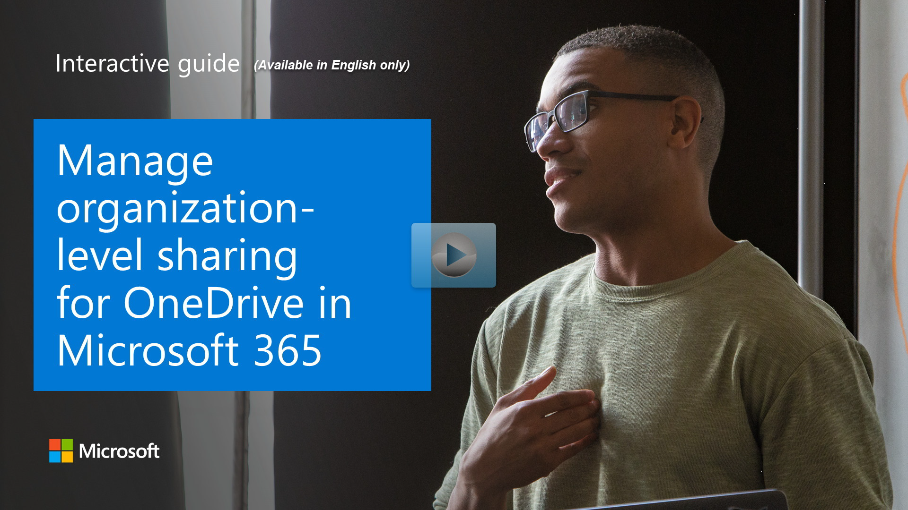

You configure OneDrive sharing in the SharePoint admin center. There, you specify sharing options such as the default sharing type for users, who users can share with, and how long sharing links remain active. Files in OneDrive are private by default, and only shared files are accessible by other users. 

OneDrive sharing settings are a subset of SharePoint sharing settings so you should use the sharing page in the SharePoint admin center vs. the OneDrive admin center.  To allow external sharing in OneDrive, you must enable it for SharePoint first since each OneDrive is a site (previously called a “site collection”) within SharePoint.

Key OneDrive sharing decisions:
- **External sharing**. If you enable external sharing, users will be able to share files and folders with people outside your organization.
- **External user authentication**. If you enable sharing with **Anyone**, users can create sharable links that don't require sign-in.
- **Default sharing links**. Users can choose the type of link to send, but you can set the default option that is presented to users.
- **Manage sharing per user**. After you set organization-wide sharing settings for SharePoint and OneDrive, you can further restrict external sharing for specific OneDrive users.
- **Advanced sharing options**. You can control external sharing to specific domains and other advanced scenarios for managing sharing.

Your OneDrive sharing strategy affects your entire organization. All teams in your organization should be involved in determining that strategy. Any sharing strategy should be as open for external sharing as possible and locked down only if needed.

## Admin centers
Only global and SharePoint admins can change sharing permissions. There are also settings in the Microsoft 365 admin center that control sharing and affect SharePoint and OneDrive. When you change them in one place, the changes will be automatically reflected in other admin centers. If you have multiple admins in your organization, make sure you communicate the changes you're making. 

## External sharing settings
Administrators determine sharing settings for their users and thus determine the end-user sharing experience as seen through the sharing dialog.
 

Navigate to the admin center sharing page to control your organizations sharing settings.
 
 

The sliders control the settings for your entire organization. Each OneDrive and SharePoint site has its own sharing setting which you can set independently, though each must be at least as restrictive as the settings for the overall organization. For example, to allow anonymous sharing in OneDrive (by setting sharing to Anyone), sharing in SharePoint must also be set to **Anyone**. If SharePoint has anonymous enabled, OneDrive could be set to be less permissive to block external sharing. 

When sharing files and folders in OneDrive, external recipients will typically be added to your directory as guests; permissions and groups work the same for these guests as they do for internal users. To ensure that all guests are added to your directory, use the SharePoint and OneDrive integration with Azure AD B2B preview. Because guests do not have licenses in your organization, they are limited to basic collaboration tasks. 

External sharing options include:

- **Anyone**. Setting sharing to **Anyone** allows users to share files and folders with anyone who has the link without any authentication.  You can restrict Anyone links so that they expire within a specific number of days or so that they allow only View permission. When sharing is set to Anyone, this also allows users to share files or folders with more restrictive sharing options such as sharing to existing guests.
This setting for OneDrive also enables the file request feature. With this feature, your users can choose a folder and allow people to upload files. People who upload files can’t see what's in the folder - they can only upload files to it.

- **New and existing guests**. Setting sharing to **new and existing guests** allows users to send invitations to guests outside the organization.  These guests must sign in with their Office 365 or Microsoft accounts or be emailed a code to verify their identities. 
 
- **Existing guests**. Setting sharing to **existing guests** allows users to share only with guests who are already in their organization’s directory because they previously accepted sharing invitations or because they were manually added, such as through Azure B2B collaboration. 

-**Only people in your organization**. Setting sharing to **only people in your organization** turns off external sharing. 

When you turn external sharing off for your organization, guests typically lose access within one hour. If you later turn it back on, those guests who previously had access will regain it. 

## Explore how to manage organizational level sharing for OneDrive

View a [video version](https://www.microsoft.com/videoplayer/embed/placeholder?azure-portal=true) of the interactive guide (captions available in more languages).

  

Be sure to click the full-screen option in the video player. 

## Learn more
- [External sharing overview](https://docs.microsoft.com/sharepoint/external-sharing-overview?azure-portal=true)
- [Microsoft 365 guest sharing settings reference](https://docs.microsoft.com/microsoft-365/solutions/microsoft-365-guest-settings?view=o365-worldwide?azure-portal=true)
- [Manage sharing settings](https://docs.microsoft.com/sharepoint/turn-external-sharing-on-or-off?azure-portal=true)
- [Best practices for sharing files and folders with unauthenticated users](https://docs.microsoft.com/microsoft-365/solutions/best-practices-anonymous-sharing?view=o365-worldwide?azure-portal=true)
- [Manage sharing in OneDrive and SharePoint](https://docs.microsoft.com/onedrive/manage-sharing?azure-portal=true)
