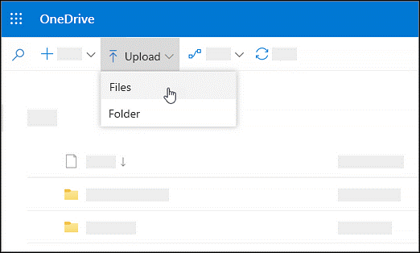
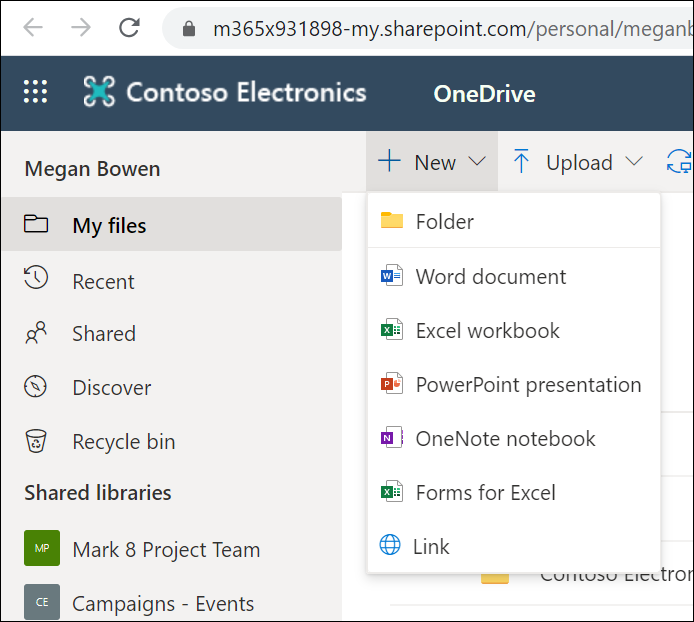
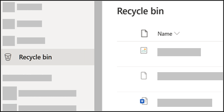
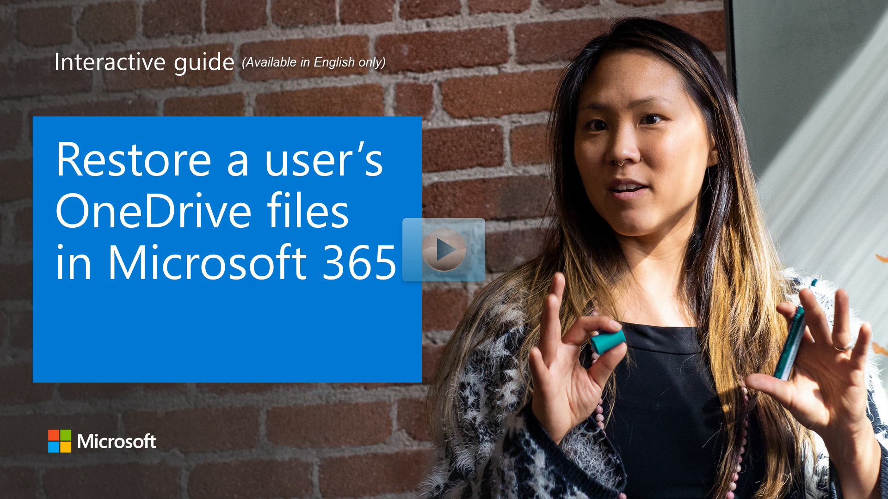

All new files that are created through Office.com are automatically saved to a user’s OneDrive. Users can store over 320+ different file types in OneDrive and upload files up to 100 GB in size. Files and folders can be uploaded directly in the browser once signed into OneDrive:
 

New files and folders can be created directly from the toolbar:

 
You can also save and open files in your Office apps:

## Copying and moving files between OneDrive and SharePoint sites
When users want to change the ownership of files, they move or copy them between OneDrive and SharePoint. They can also copy and move files via File Explorer or Finder on Mac if they are synced to their computer.

   
They can move or copy up to 500 MB of files and folders at a time using a browser. When they move or copy a document, only the latest version is copied. To move earlier versions, they need to restore and move each one. 

## Restoring deleted files, folders, or previous versions of a file in OneDrive
If a user accidentally deletes a file or folder in OneDrive, they may be able to recover it later from the OneDrive recycle bin. Once in OneDrive, the Recycle bin will show up in the left navigation pane:  

Once selected, the files or folders can be restored. You can configure how long the files remain in users’ recycle bins before permanently deleted. The default is 93 days. 
You can also restore an earlier version of a file through the file version history.

If many files get deleted, overwritten, corrupted, or infected by malware, users can restore their entire OneDrive to a previous time. Files restore enables your users to undo all the actions that occurred on both files and folders within the last 30 days. **Files restore** uses version history and the recycle bin to restore, so it’s subject to the same restrictions as those features. Deleted files can’t be restored after they’ve been removed from the recycle bin. If files or folders cannot be restored, a log file will be generated. You can take control of a user’s OneDrive and perform single file or full restores if it is necessary.

## Explore how to restore a user's OneDrive files in Microsoft 365

View a [video version](https://www.microsoft.com/videoplayer/embed/RE4yYuk?azure-portal=true) of the interactive guide (captions available in more languages).

  

Be sure to click the full-screen option in the video player. 

## Invalid file names and file types
There are characters, names, and other limits to be aware of.  The list of these can be found within the article for [Invalid file names and file types in OneDrive and SharePoint](https://support.office.com/article/invalid-file-names-and-file-types-in-onedrive-onedrive-for-business-and-sharepoint-64883a5d-228e-48f5-b3d2-eb39e07630fa?azure-portal=true). 

## Learn more
- [Manage files and folders](https://support.office.com/article/manage-files-and-folders-in-onedrive-for-business-94c8a731-c774-468e-97a1-5f038bdf330d?azure-portal=true)
- [Move files and folders between OneDrive and SharePoint](https://support.office.com/article/move-files-and-folders-between-onedrive-and-sharepoint-5916f90d-f58a-4bf9-b135-10853f516d0b?azure-portal=true)
- [Copy files and folders between OneDrive and SharePoint](https://support.office.com/article/copy-files-and-folders-between-onedrive-and-sharepoint-sites-67a6323e-7fd4-4254-99a8-35613492a82f?azure-portal=true)

