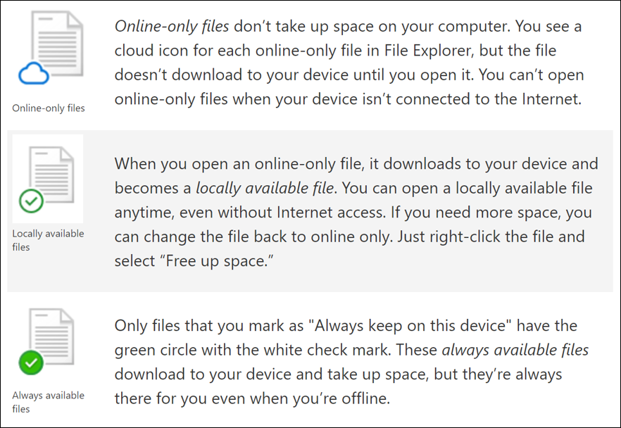

The OneDrive sync app allows users to sync files between their computer and Microsoft 365. That means they can sync files in OneDrive, in a SharePoint library, and in Microsoft Team libraries using the OneDrive sync app. Files can also easily be saved to OneDrive through the Office apps they use. They can then continue to work with the files with File Explorer (in Windows) or Finder (on Mac).

For users with Windows 10, the OneDrive sync app is already installed. Users without Windows 10 can install the Windows version of the new OneDrive sync app. Administrators can control the deployment of the sync app across devices.

Once a user is signed in, they will see the OneDrive cloud icon in the Windows taskbar notification area:

Once a user has signed in to their work or school account and synced your files, the files will appear in File Explorer in the OneDrive folder with **OneDrive – CompanyName**.

When users add, change, and delete files and folders from the OneDrive mobile app or access them from a web browser, the files and folders are automatically added, changed, or deleted on their computer and vice versa. To upload files to OneDrive, simply copy or move them to OneDrive in File Explorer or Finder. Users can also use File Explorer to organize their OneDrive by organizing, creating, moving, restoring, and renaming files and folders. OneDrive syncs all these changes automatically. Once the files are synced, they can work with them offline if necessary. Whenever they’re online, any changes that they or others make will sync automatically.

If a user doesn’t want to sync all of their folders in OneDrive to their computer, they can specify the folders they’d like to sync by unchecking the folders they don’t want to sync in the **Sync your OneDrive files PC** dialog box. The sync settings are unique to each computer.

## Syncing other files

Users can start syncing a SharePoint or Microsoft Teams library by using the Sync button in the toolbar:

## Using Files On-Demand

OneDrive Files On-Demand helps users access all their files in OneDrive without having to download them and consume storage space. When they turn on Files On-Demand, they’ll see all their files in File Explorer and get new information about each file. New files created online or on another device appear as online-only files, which don’t take up space on their device. They can use the files like they would on any other file on their device.

With OneDrive Files On-Demand, users can:

- Save space on their device by making files online only.
- Set files and folders to be always available locally on their device.
- View important information about files, such as whether they are shared.
- See thumbnails of over 300 different file types even if they don’t have the required application to open it.

With Files On-Demand, users will see new icons next to your files synced to their device:

Users can move online-only files within their OneDrive folder and restore those files through their OneDrive recycle bin. When they search for online-only files by name, OneDrive will let them search the name of those files not on their device. The files-on demand settings are unique to each device, so users should make sure to turn it on for each device where they want to use it.

## Learn more

- [Sync files with OneDrive on Windows](https://support.office.com/article/sync-files-with-onedrive-in-windows-615391c4-2bd3-4aae-a42a-858262e42a49?azure-portal=true)
- [Sync SharePoint files with the OneDrive sync app](https://support.office.com/article/sync-sharepoint-files-with-the-onedrive-sync-app-6de9ede8-5b6e-4503-80b2-6190f3354a88?azure-portal=true)
- [OneDrive release notes](https://support.office.com/article/onedrive-release-notes-845dcf18-f921-435e-bf28-4e24b95e5fc0?ui=en-US&rs=en-US&ad=US?azure-portal=true)
- [Choose which OneDrive folders to sync to your computer](https://support.office.com/article/choose-which-onedrive-folders-to-sync-to-your-computer-98b8b011-8b94-419b-aa95-a14ff2415e85?azure-portal=true)
