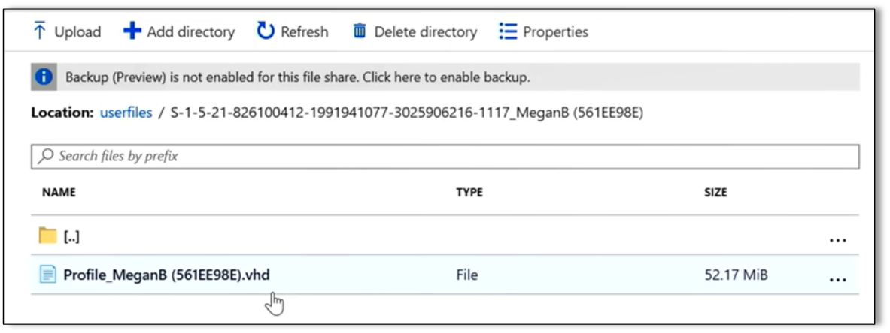

You can use **FSLogix profiles** to separate user profiles from virtual machines, persist these profiles as user-assigned virtual disks in Azure storage, Azure NetApp Files, and Storage Spaces Direct, and then dynamically attach them to a user. Each time the user signs in to a remote resource, their profile is attached to the resource, and they're able to access all of their data.  

Compared to classic roaming user profiles in Windows, separating the user profiles and data enables a seamless roaming experience for apps that rely on %localappdata% locations, like Outlook and OneDrive. It's fast and stateful - as far as users can tell, their data loads as fast as locally stored data. FSLogix profiles let you use cached mailboxes for local-like access to email and OneDrive Files on Demand. 

## Set up storage space for dynamic user profiles

1. Create a storage account in the Azure portal to store the user-assigned virtual disk files generated by the FSLogix profiles. The process works by containerizing the user profile into a VHD or VHDX file the first time a user signs in. The VHD or VHDX files are stored to this location and attached to users in subsequent logins.  

   To create the **Storage account**, search for or select "Storage Accounts" in the Azure portal. Select the **+** sign, and then select a **Resource Group**. Give it a name, and then configure any additional fields as necessary. Select **Next**, then **Review**, and finally **Create**. 
2. Enable Azure Active Directory authentication for Azure Files for the new storage account. To do this, go to **Configuration** and enable the **Azure Active Directory Authentication** option. 
3. Assign a contributor role to your Windows Virtual Desktop users that gives them for permissions reading and writing file data in the SMB file share where the user profile virtual disks are stored:

   1. Go to the storage account you are using for Windows Virtual Desktop, select **Access Control (IAM)**,  then **Add a new role assignment**.
   2. For the Azure Active Directory domain administrators, select **Storage file data SMB share for Elevated Contributor**. This gives them the ability to modify NTFS permissions. 
   3. For non-administrator Windows Virtual Desktop users, select **Storage file data SMB share for Contributor** for each user.    
   
4. Now in your new storage account, create a file share to store the user profile virtual disks. Go to **Files**, add a **File Share**, give it a **Name** and a **Storage Quota** in Gibibytes (GiB), up to 5120 GiB. Click **Create**. This file share will use SMB 3.0 protocol with your session hosts. 
5. Any VM you create using a gallery image has the FSLogix software preinstalled. If you used an image NOT from the gallery, you need to install FSLogix:
   1. Start by adding two registry keys to the VM for FSLogix. Create a key for them first called **Profiles**.  
   2. Within that new key, add a **DWORD** called "Enabled" and set its value to "1."  
   3. Add a **Multi-String value** called "VHDLocations" and add the file share location from Azure Files, in SMB path format. You can find the location in your storage account properties. Find the Service Endpoint and convert it from an HTTP path to an SMB path. 
   4. Finally, from an elevated command prompt, run the following commands. (You can find the required access keys in **Azure Storage Account > Settings > Access Keys**.)  
      ```
      net use Z: [converted SMB path used in VHDLocations in the registry] [Access Key]

      Icacls Z: /grant [End user UPN]:(f)
      ```
   
      >[!NOTE]
      > To create the FSLogix profile, the VM can't already have a user profile established for the user. 

7. Now, go to [https://aka.ms/wvdweb](https://aka.ms/wvdweb) and sign in to a VM you haven't signed into yet. The initial sign-in will take a little longer than usual. This is a one-time delay while the process creates the virtual disk file in the background. This is the file that will be used each time you sign in.  

   Go back to your **Storage Account** in Azure, and navigate to the **File Share**. You’ll see the new virtual disk. 

   >

The next time the user signs in, the VM will connect to their virtual disk. For the user, it will feel like any apps that use %localappdata% are using a locally stored profile.