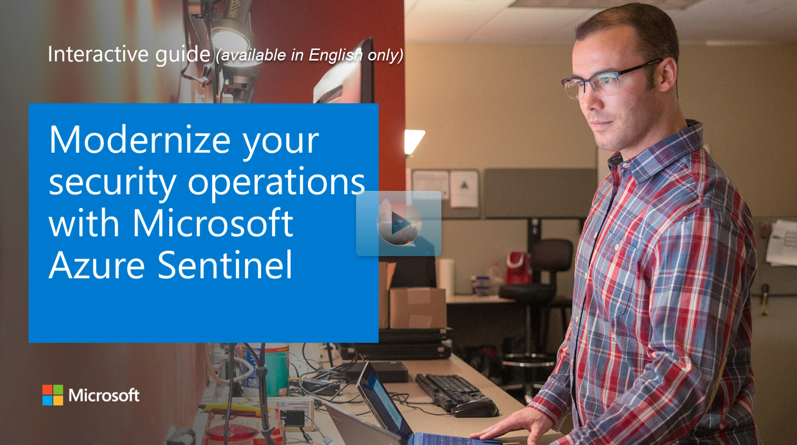

Azure Sentinel is a service you can use to get a clear perspective of the security of your whole estate. It enables you to deal with issues across your estate through features like proactive hunting, intelligent security analytics, and data correlation from different data sources.

Suppose you work for a large organization that has a large estate. You’ll need to make sure you don’t miss anything when it comes to threats and risks across all the systems in your organization. You want to make sure that all threats are addressed, wherever they arise.

Here, you’ll learn how to connect Azure Sentinel with Azure Security Center.

## Connect Azure Sentinel with Azure Security Center

By integrating Azure Sentinel with Azure Security Center, you’ll have detailed end-to-end visibility of the security of your estate. This is because you’ll link together all the information available on threats from multiple sources. For example, by correlating information from separate data sources, including Azure Security Center and Microsoft Cloud App, you can use it to trace a suspicious event from its origins, along with the impact it has had at various stages.

:::image type="content" source="../media/5-sentinel-integration.png" alt-text="Integration with Azure Sentinel":::

You complete the following steps to integrate Azure Sentinel with Azure Security Center:

> [!NOTE]
> For successful integration, make sure that you're on Azure Security Center standard tier. Also ensure you have the Security Reader role in the subscription that your logs are coming from.

1. Go to Azure Sentinel in the Azure portal. You can do this by entering **Azure Sentinel** in the search field at the top, and selecting **Azure Sentinel**.

    :::image type="content" source="../media/5-find-sentinel.png" alt-text="Find Azure Sentinel in the Azure portal":::

1. When the **Azure Sentinel workspaces** pane appears, select a workspace. If you don’t have a workspace to use, you can create a new one by selecting **Add** at the top of the list.
1. In the left pane, select **Data connectors**, under **Configuration**.

    :::image type="content" source="../media/5-open-connector-page-inline.png" lightbox="../media/5-open-connector-page-expanded.png" alt-text="Open the Security Center connector":::

1. Select **Azure Security Center** in the connector gallery, then select **Open connector page** in the pane that appears on the right.

1. Select **Connect** on the subscription for which you want to stream alerts into Azure Sentinel.

    :::image type="content" source="../media/5-connect-subscription-inline.png" lightbox="../media/5-connect-subscription-expanded.png" alt-text="Connect a subscription":::

1. If you also want to automatically create incidents for alerts from Azure Security Center, select **Enable**, under **Create incidents**. Incidents enable you to gather related information on alerts and do detailed investigations in Azure Sentinel.

    :::image type="content" source="../media/5-enable-incidents-inline.png" lightbox="../media/5-enable-incidents-expanded.png" alt-text="Create incidents":::

### Explore how to modernize your security operations with Microsoft Azure Sentinel

View a [video version](https://www.microsoft.com/videoplayer/embed/RE4GnLf) of the interactive guide (captions available in more languages).

  

Be sure to click the full-screen option in the video player. When you're done, use the **Back** arrow in your browser to come back to this page. 