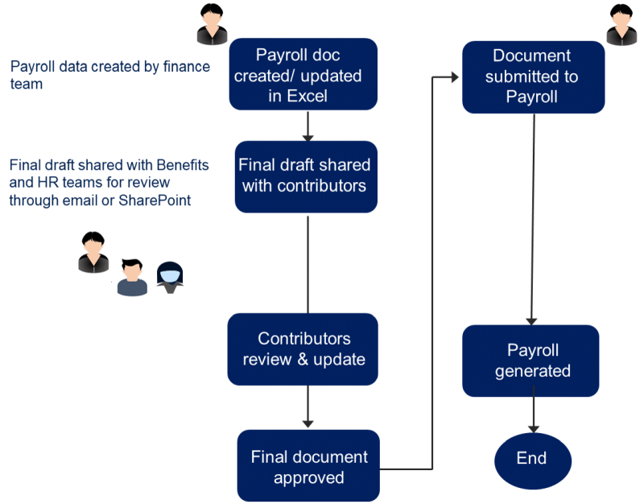

You should create use cases, scenarios, and end-user personas about all the different types of data in your organization. Interview other departments to understand what data they consider important and how they currently protect it.

When creating use cases, consider providing examples for each of these questions.

- What type of data needs protection?
    - Credit card numbers
    - Social security numbers
    - Addresses
    - Merger and acquisition negotiations

- What format?
    - Office documents (.docx, .xlsx) 
    - PDF documents
    - Custom-created file format

- Where is the file located? 
    - SharePoint
    - Cloud services
    - OneDrive for Business
    - Removable storage
    - Email

- How is it currently produced, maintained, and archived?
    - Generated via an automatically scheduled report
    - Data in transit via a workflow ticketing process
    - Maintained in cloud or on-premises storage
    - Past-project data archived in file or server storage

The following use case illustrates the lifecycle of a document.

1.	The finance team creates a document in Excel that contains payroll data. 
2.	The finance team shares the final draft with the HR team via SharePoint.
3.	Contributors review and update the document.
4.	The finance and HR teams approve the final document and email it to the payroll team. 
5.	Payroll opens the document in a third-party tool for payout.

Where could you use Data Loss Prevention (DLP) in this scenario?

- Use Office 365 DLP policies to block the sending of emails that contains bank account information or Social Security numbers, or optionally apply encryption automatically to the messages.
- Use Microsoft Cloud App Security to block the upload, download or sharing of sensitive information that resides in a cloud repository
- Consider applying RMS on the SharePoint library hosting the documents.
