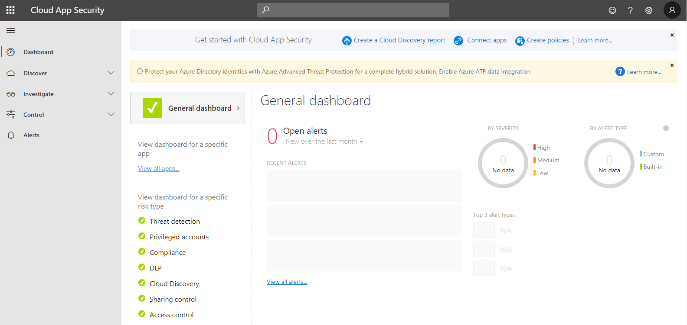

Moving applications to the cloud increases flexibility for employees and IT alike but it also introduces new security challenges. IT must find the right balance of supporting access while maintaining control.

Microsoft Cloud App Security is a Cloud Access Security Broker that supports various deployment modes including log collection, API connectors, and reverse proxy. It provides rich visibility, control over data travel, and sophisticated analytics to identify and combat cyberthreats across all your Microsoft and third-party cloud services.

Microsoft Cloud App Security natively integrates with leading Microsoft solutions and is designed with security professionals in mind. It provides simple deployment, centralized management, and innovative automation capabilities.

## The Cloud App Security framework
- **Discover and control the use of Shadow IT**: Identify   cloud apps, IaaS, and PaaS services used by your organization. Investigate usage patterns, assess the risk levels, and determine the business readiness of more than 16,000 SaaS apps against more than 80 risks while managing them to ensure security and compliance.
- **Protect your sensitive information anywhere in the cloud**: Understand, classify, and protect the exposure of sensitive information at rest. Leverage out-of-the box policies and automated processes to apply controls in real-time across all your cloud apps.
- **Protect against cyberthreats and anomalies**: Detect unusual behavior across cloud apps to identify ransomware, compromised users, or rogue applications. Analyze high-risk usage and remediate automatically to limit the risk to your organization.
- **Assess the compliance of your cloud apps**: Determine if your cloud apps meet relevant compliance requirements (including regulatory compliance) and industry standards. Prevent data leaks to non-compliant apps and limit access to regulated data.

