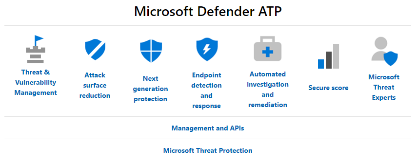

Microsoft Defender Advanced Threat Protection is a platform designed to help enterprise networks prevent, detect, investigate, and respond to advanced threats.
Microsoft Defender ATP builds the following technologies into Windows 10 and Microsoft's robust cloud service:

- **Endpoint behavioral sensors**: Embedded in Windows 10, these sensors collect and process behavioral signals from the operating system and send this data to your private cloud instance of Microsoft Defender ATP.
- **Cloud security analytics**: Leveraging big-data, machine-learning, and unique Microsoft optics across Windows, enterprise cloud products such as Office 365 translate behavioral signals into insights, detections, and recommended responses to advanced threats.
- **Threat intelligence**: Generated by Microsoft security teams and augmented by partners, threat intelligence enables Microsoft Defender ATP to identify attacker behavior and generate alerts when these behaviors are observed in collected sensor data.

## Automated remediation  
Microsoft Defender ATP continually monitors multiple machines for a wide variety of threats. As a result, the service generates a multitude of alerts. The volume of alerts generated can be challenging for a typical security operations team to address individually.

To help, Microsoft Defender ATP uses Automated Investigation and Remediation to significantly reduce the volume of alerts that need to be investigated individually. This feature leverages various inspection algorithms and analyses to examine alerts and automatically remediate, allowing security operations experts to focus on more sophisticated threats.

## Advanced hunting  
Advanced hunting uses a powerful search and query tool to hunt for possible threats across your organization. You create custom detection rules based on your queries and surface alerts in Microsoft Defender Security Center to take advantage of the following capabilities:

- **Powerful query language with IntelliSense** - Built on top of a query language, IntelliSense gives you the flexibility you need to take hunting to the next level.
- **Query the stored telemetry** - Telemetry data is accessible to query. For example, you can query process creation, network communication, and other event types.
- **Links to portal** - Certain query results, such as machine names and file names, are actually direct links to the portal, which consolidates the Advanced hunting query and existing portal investigation experiences.
- **Query examples** - A welcome page provides examples to get you started.

## Threat and Vulnerability Management
Effectively identifying, assessing, and remediating endpoint weaknesses is critical to running a healthy security program and reducing organizational risk. Threat and Vulnerability Management reduces organizational exposure, hardens endpoint surface area, and increases organizational resilience by using sensors to help organizations discover vulnerabilities and misconfigurations in real-time without the need of agents or periodic scans. Then it uses the threat landscape, detections in your organization, sensitive information on vulnerable devices, and business context to prioritize vulnerabilities.

### Next-generation capabilities
Threat and Vulnerability Management is the first solution in the industry to bridge the gap between security and IT administration during the remediation process. It does so by creating a security task or ticket through integration with Microsoft Intune and Microsoft System Center Configuration Manager (SCCM).

Threat and Vulnerability Management also provides the following solutions to frequent gaps between security operations, security administration, and IT administration workflows and communication:
- Real-time endpoint detection and response (EDR) insights correlated with endpoint vulnerabilities
- Linked machine vulnerability and security configuration assessment data in the context of exposure discovery
- Built-in remediation processes through Microsoft Intune and Microsoft System Center Configuration Manager

### Endpoint protection
Microsoft Defender ATP endpoint detection and response capabilities provide advanced attack detections that are near real-time and actionable. Security analysts can prioritize alerts effectively, gain visibility into the full scope of a breach, and take response actions to remediate threats.

When a threat is detected, alerts are created in the system. Alerts with the same attack techniques or attributed to the same attacker are aggregated into an entity called an *incident*. Aggregating alerts in this manner makes it easier for analysts to collectively investigate and respond to threats.

Inspired by the "assume breach" mindset, Microsoft Defender ATP continuously collects behavioral cyber telemetry. This includes process information, network activities, deep optics into the kernel and memory manager, user login activities, registry and file system changes, and others. The information is stored for six months, enabling an analyst to travel back in time to the start of an attack. The analyst can then pivot in various views and approach an investigation through multiple vectors.

The response capabilities give you the power to promptly remediate threats by acting on the affected entities.