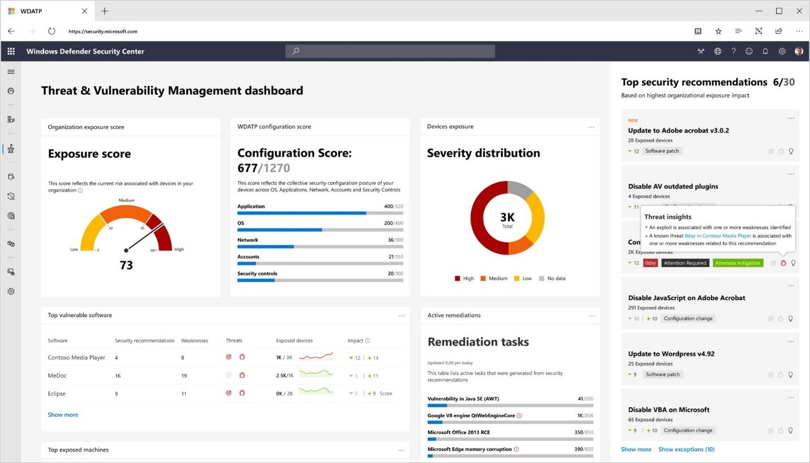
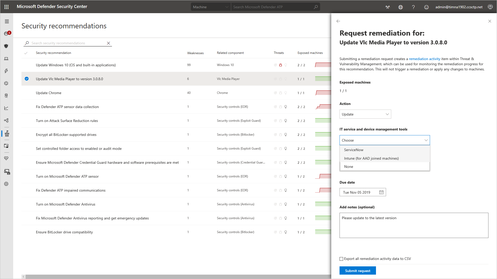
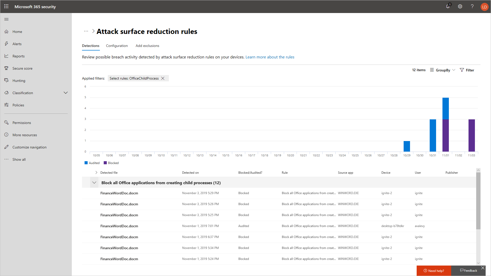
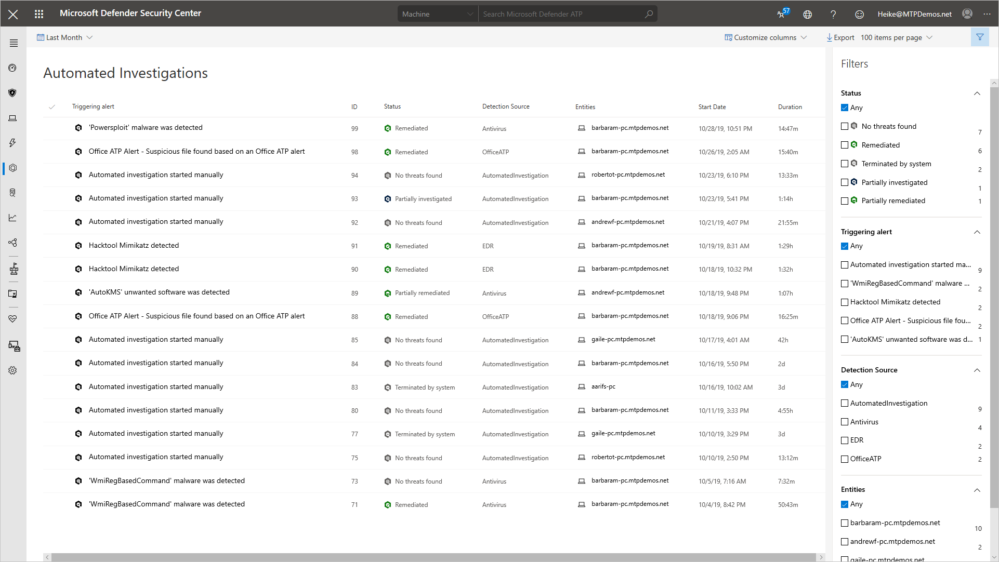

## Threat and vulnerability management

 

Effectively identifying, assessing, and remediating endpoint weaknesses is pivotal to running a healthy security program and reducing organizational risk. Threat and vulnerability management serves as an infrastructure for reducing organizational exposure, hardening endpoint surface area, and increasing organizational resilience.

This infrastructure helps organizations discover vulnerabilities and misconfigurations in real time, based on sensors, without the need of agents or periodic scans. It prioritizes issues based on a number of factors. Those factors include the threat landscape, detections in your organization, sensitive information on vulnerable devices, and business context.

Threat and vulnerability management is built-in, real-time, cloud-powered, fully integrated with the Microsoft endpoint security stack, the Microsoft Intelligent Security Graph, and the application analytics knowledge base. It can create a security task or ticket through integration with Microsoft Intune and Microsoft Endpoint Manager.

It provides the following solutions to gaps across security operations, security administration, and IT administration:

- Real-time endpoint detection and response (EDR) insights correlated with endpoint vulnerabilities
- Linked machine vulnerability and security configuration assessment data in the context of exposure discovery
- Built-in remediation processes through Microsoft Intune and Microsoft Microsoft Endpoint Manager

For example, using the security recommendations present in the portal, an administrator could request that an application be updated, which would then notify the Intune team to remediate the request.

>
> [!VIDEO https://www.microsoft.com/videoplayer/embed/RE4CYw7]

## Attack surface reduction

The attack surface reduction set of capabilities provides the first line of defense in the stack by ensuring configuration settings are properly set and exploit mitigation techniques are applied.

- **Hardware-based isolation** protects and maintains the integrity of the system as it starts and while it's running, and validates system integrity through local and remote attestation. Container isolation for Microsoft Edge helps protect the host operating system from malicious websites.
- **Application control** moves away from the traditional application trust model where all applications are assumed trustworthy by default to one where applications must earn trust in order to run.
- **Exploit protection** applies mitigation techniques to apps your organization uses, both individually and organization-wide. 
- **Network protection** extends the malware and social engineering protection offered by Microsoft Defender SmartScreen in Microsoft Edge to cover network traffic and connectivity on your organization's devices. 
- **Controlled folder access** helps protect files in key system folders from changes made by malicious and suspicious apps, including file-encrypting ransomware malware. 
- **Attack surface reduction** reduces the attack surface of your applications with intelligent rules that stop the vectors used by Office-, script- and mail-based malware. 
- **Network firewall** uses host-based, two-way network traffic filtering that blocks unauthorized network traffic flowing into or out of the local device.

The  below screenshot shows a chart of detections against an attack surface reduction rule that is protecting office applications:

 

>
> [!VIDEO https://www.microsoft.com/videoplayer/embed/RE4COmV]

## Next generation protection

Microsoft Defender Antivirus is a built-in antimalware solution that provides next generation protection for desktops, portable computers, and servers. Microsoft Defender Antivirus includes:

- Cloud-delivered protection for near-instant detection and blocking of new and emerging threats. Along with machine learning and the Intelligent Security Graph, cloud-delivered protection is part of the next-gen technologies that power Microsoft Defender Antivirus. 
- Always-on scanning, using advanced file and process behavior monitoring and other heuristics (also known as "real-time protection").
- Dedicated protection updates based on machine-learning, human and automated big-data analysis, and in-depth threat resistance research.

The following proxy and network settings should be considered:

- The Microsoft Defender ATP sensor requires Microsoft Windows HTTP (WinHTTP) to report sensor data and communicate with the Microsoft Defender ATP service. 
- The embedded Microsoft Defender ATP sensor runs in system context using the LocalSystem account. The sensor uses Microsoft Windows HTTP Services (WinHTTP) to enable communication with the Microsoft Defender ATP cloud service. 
- The WinHTTP configuration setting is independent of the Windows Internet (WinINet) internet browsing proxy settings and can only discover a proxy server by using the following auto discovery methods: 
  - Transparent proxy
  - Web Proxy Auto-discovery Protocol (WPAD)

## Endpoint detection and response

Microsoft Defender ATP endpoint detection and response capabilities provide advanced attack detections that are near real-time and actionable. Security analysts can prioritize alerts effectively, gain visibility into the full scope of a breach, and take response actions to remediate threats.

When a threat is detected, alerts are created in the system for an analyst to investigate. Alerts with the same attack techniques or attributed to the same attacker are aggregated into an entity called an **incident**. Aggregating alerts in this manner makes it easy for analysts to collectively investigate and respond to threats.

Inspired by the "assume breach" mindset, Microsoft Defender ATP continuously collects behavioral cyber telemetry. This includes process information, network activities, deep optics into the kernel and memory manager, user login activities, registry and file system changes, and others. The information is stored for six months, enabling an analyst to travel back in time to the start of an attack. The analyst can then pivot using various views and approach an investigation through multiple vectors.

The Security operations dashboard (below) is where the endpoint detection and response capabilities are surfaced. It provides a high-level overview of where detections were seen and highlights where response actions are needed. 

 

## Automated investigation and remediation

Microsoft Defender ATP offers a wide breadth of visibility on multiple machines. With this kind of optics, the service generates a multitude of alerts. The volume of alerts generated can be challenging for a typical security operations team to individually address. To address this challenge, Microsoft Defender ATP uses automated investigation and remediation capabilities to significantly reduce the volume of alerts that must be investigated individually.

 

The automated investigation feature uses various inspection algorithms, and processes used by analysts (such as playbooks) to examine alerts and take immediate remediation action to resolve breaches. This significantly reduces alert volume, allowing security operations experts to focus on more sophisticated threats and other high value initiatives. In the following investigation screenshot, we can see that malware was detected, as well as automatically remediated:

 

>
> [!VIDEO https://www.microsoft.com/videoplayer/embed/RE4CQAA]
>

### Explore how to reduce organizational risk with Threat and Vulnerability Management

View a [video version](https://www.microsoft.com/en-us/videoplayer/embed/RE4AFt9) of the interactive guide (captions available in more languages).

  

Be sure to click the full-screen option in the video player. When you're done, use the **Back** arrow in your browser to come back to this page. 
