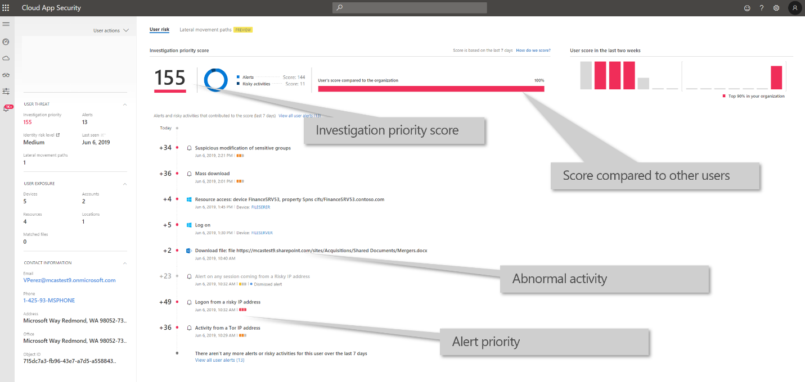
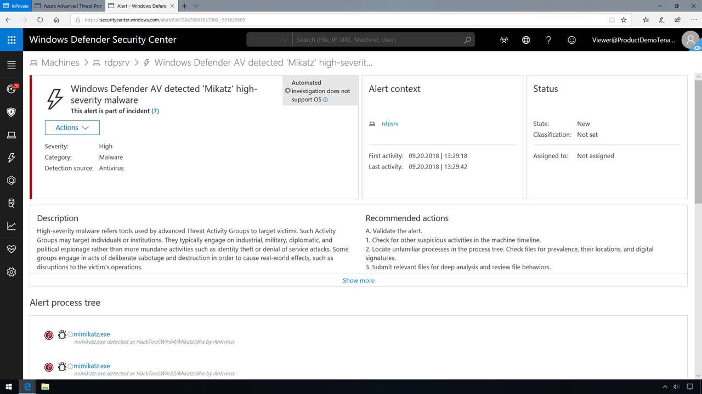

The Azure ATP cloud service runs on Azure infrastructure and is currently deployed in the US, Europe, and Asia. Azure ATP cloud service is connected to Microsoft's intelligent security graph. This enables Azure ATP to integrate with Microsoft Cloud App Security, as part of a Microsoft Threat Protection monitoring strategy.

Once integrated into Microsoft Cloud App Security, you'll be able to see on-premises activities for all the users in your organization. You will also get advanced insights on your users that combine alerts and suspicious activities across your cloud and on-premises environments. Additionally, policies from Azure ATP will appear on the Cloud App Security policies page. The following screenshot shows Azure ATP reporting within Cloud App Security.

Azure Advanced Threat Protection also enables you to integrate Azure ATP with Microsoft Defender ATP, for an even more complete threat protection solution. While Azure ATP monitors the traffic on your domain controllers, Microsoft Defender ATP monitors your endpoints, together providing a single interface from which you can protect your environment.
Once Microsoft Defender ATP and Azure Advanced Threat Protection are integrated, you can click on an endpoint to view Azure ATP alerts in the Microsoft Defender ATP portal.

Having this level of insight into system running processes allows an analyst to locate event sequences leading to a compromise of the network. In the screenshot below, there are high severity alerts pointing to malware being installed on the system.

Clicking into the alert verfies that a Pass-The-Hash (PtH) attack occurred using the tool Mimikatz. Under actions for the alert, we can also review a timeline of events surrounding the credential theft.

