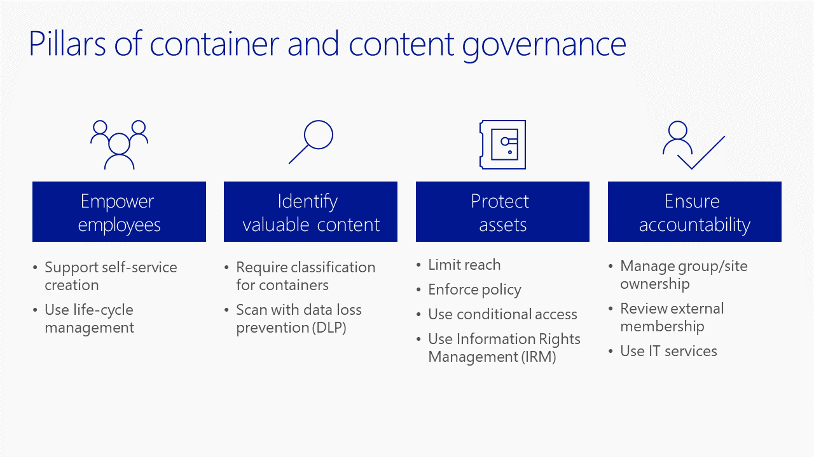

>

There are four strategic pillars to content and container governance in Office 365 that directly affect the experience in Microsoft Teams, SharePoint, and other services that rely on Office 365 Groups for membership management. They are your desire to:
- Fundamentally empower employees
- Identify valuable content
- Protect your corporate assets
- Ensure accountability 

You can achieve these strategic pillars by making governance decisions that prioritize the user experience in balance with the need for security. 

Make the following decisions. (At this point, these decisions apply only to Phase 2).

**Decision 1: Who can create teams?**
In phase 2, you can restrict who can create teams to the early adopter population and your core project team. This lets your early adopters create additional teams if needed. Monitoring this behavior will give you key information for your broad deployment.

**Decision 2: Teams naming conventions**
You'll likely want to implement some naming conventions for your broad deployment of Teams, and check for duplicate names. In Phase 2, we suggest that you use a manual naming convention for your initial projects. As a best practice, you could conduct an interactive onboarding with the early adopter project team and let them choose their own name. This will provide insight into how employees think about their work. That insight will be essential when you create a larger-scale naming convention at a later time. Note that this capability is only available if you have the appropriate P1 Azure Active Directory Premium license. Learn more at [The key to rolling out Microsoft Teams on home turf: Good governance](https://www.microsoft.com/itshowcase/blog/the-key-to-rolling-out-microsoft-teams-on-home-turf-good-governance/). 

**Decision 3: Guest access**
Depending on the scope and type of your project and the nature of your industry, enabling secure collaboration with partners or vendors may be an essential capability you want to test. You can limit who can add guests to your Teams implementation by using the appropriate tenant controls.

**Decision 4: Approved apps**
The best use case for Teams includes the integration of other apps into the experience. At a minimum your technical team should enable first party and featured apps in your Teams experience. Depending on your use case and the other apps used in your organization, you may opt to include additional apps as a part of your controlled experiment. Work with your IT partners in the technical readiness workstream to ensure you can deliver "Better Together" scenarios like Microsoft Teams and Planner or coauthoring in Office ProPlus apps like PowerPoint and Word. 

**Decision 5: Are meetings included in your test?**
The Teams meeting experience supports video chatting and brings your employees together to be more effective. Consult with your technical team to make sure that your environment is ready to include simple VoIP meetings. Enabling audio conferencing or voice services would normally be excluded from this phase of your experimentation; however, that depends on your core project team, your technical readiness, and the state of other voice/meeting services in your organization. We recommend including video chats and VoIP meetings in your experimentation to gain more value from your Teams implementation.

**Decision 6: Data security**
In preparation for your broad deployment, you may opt to use security labels to classify the types of teams in your environment. For the purposes of this experiment, we recommend that you follow the guidance in [Plan for Governance in Teams](https://docs.microsoft.com/microsoftteams/adopt-tools-and-downloads) and ensure that there's a basic retention policy set on Teams data in your Office 365 organization. You may need to coordinate this work with your technical team because Office 365 administrator rights are required to complete this work.

**Decision 7: Length of your experiment**
A successful Teams implementation proceeds at a healthy pace to ensure appropriate momentum, focus, and learnings. We recommend that you run the Experiment phase of your project for 60 days to ensure that your early adopters complete enough business cycles. Extending experimentation for too long increases the risk that your change program will fail. The correct duration varies for every organization.