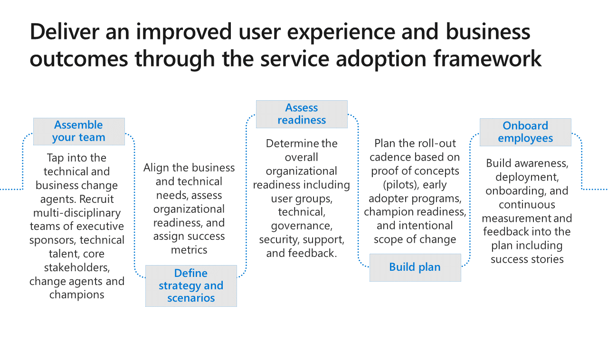

>

This training uses the enhanced adoption framework for teamwork and the modern workplace designed by the Microsoft Teams engineering team in partnership with adoption and marketing partners at Microsoft. This framework represents what we've learned from working with customers, listening to partners, and observing our service adoption programs worldwide. Key enhancements to this framework are:

1. It is broken into three iterative phases: **Start**, **Experiment**, and **Scale**. The phases let organizations adopt services at different rates in different regions or segments of the business. The phases also shorten the time that individual groups of people may be living in the pre- and post-change world.
2. It separates service decisions required for a scale deployment from those required to start experimenting with the new technology or process. This enables hands-on learning in your own environment first. 
3. It emphasizes light business process mapping, identified success measures, and frequent feedback loops to ensure you're on track for success. If you get off-track, you can course correct sooner in the process to deliver a more agile project implementation.  
>

## Meet Contoso
In this training you're the service adoption specialist for Contoso, Inc. You'll create a service adoption plan to improve the product development and customer service. 

1. The improvements are focused on Microsoft Teams and associated Office 365 products.
2. Contoso, Inc. has 5 regional offices - 3 in the United States (Los Angeles, Chicago and New York), 1 in London, England and 1 in Mexico City, Mexico.
3. Contoso has 3,500 employees, is privately held, and has been in business for over 15 years.
4. Contoso has sales staff who are regionally located, work from home, and are usually at customer sites (instead of working on your corporate campus).  
5. Contoso creates a product and delivers services that support that product. Recently Contoso's been under competitive pressure from new start-ups who threaten their market share. 
6. Contoso uses Microsoft technology but also other software and services from a variety of vendors. This includes consumer applications like What's App or simple SMS texting, commonly referred to as "shadow IT." This is especially common with the remote sales staff.
7. Contoso doesn't have a large IT or training staff. Budgets have been under financial pressure. Everyone is asked to "do more with less."