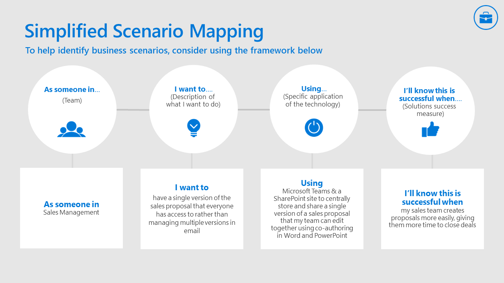
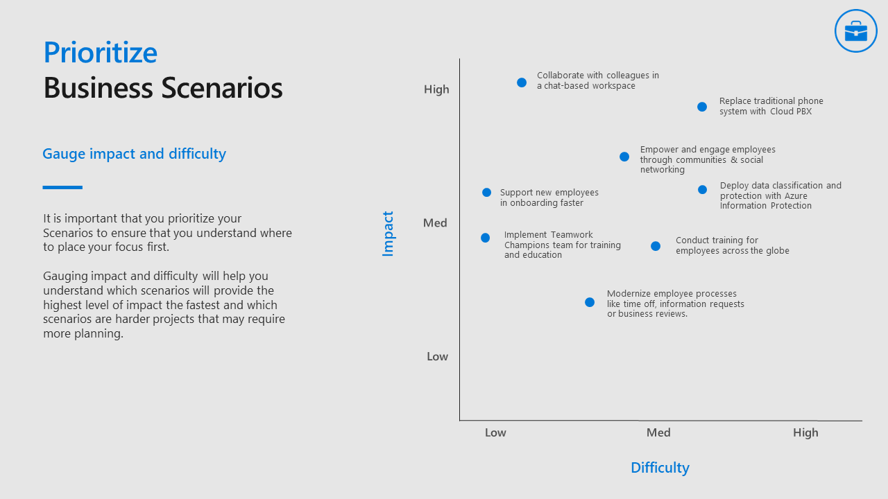

>

**Business scenario mapping at its most simple form is defining a successful process journey for an employee.** While business process mapping can be an extremely detailed and expensive task what we are suggesting here is simplified. The slide above shows a basic format for capturing these scenarios, which can then be charted by impact and difficulty to inform your scale service adoption plan. In your work with stakeholders, end users and champions you will need to answer the following questions for each scenario:

> As someone in \<Team\/Department Name\> I want to \<description of task or outcome\> using \<specific technology\>. I'll know this is successful when \<solution success measure\>. 

In the slide above this reads as follows:

> As someone in *Sales Management* I want to *have a single version of the sales proposal that everyone has access to rather than managing multiple versions in email. Using Microsoft Teams & a SharePoint site to centrally store and share a single version of a sales proposal that my team can edit together using co-authoring in Word and PowerPoint.* I’ll know this is successful when *my sales team creates proposals more easily, giving them more time to close deals*.

**The outcome of this work is to create a library of business scenarios by stakeholder area that can be prioritized by impact and difficulty.** Even as you do broad scale enablement you will want to ramp up your ability to do more complex scenarios. Work with your IT personnel and get support from Microsoft to define a plan that will create healthy service usage. Moving business processes in their entirety to Microsoft Teams keeps people from "experience fragmentation". This occurs when only a part of a process or department is in the new experience. Employees are then forced to work in the old and new ways simultaneously, which increases change fatigue. This is a high risk to your project and should be tolerated for only limited periods of time. 

## Prioritize business scenarios
>

> | Activity|
> |-|  
> |Download the scenario-mapping template and write out some simple scenarios using your simplified persona information.|

> | Example activity for Contoso|  
> |-|
> |Your sales leadership has been very vocal about needing to collaborate on proposals more quickly and escalate customer issues back to regional corporate offices with greater speed. They also want to understand the status of existing customer issues. You have used the provided templates to gain insights from your stakeholders and employees, validated the technical capabilities you can use to solve the issue and designed the solution in partnership with your IT team. You've determined that you can easily help people collaborate on documents and then move to integrating the customer issue ticketing system with Microsoft Teams, Forms and a simple chatbot. This prioritization allows employees to get familiar with the system doing document collaboration before using it for customer issues. |