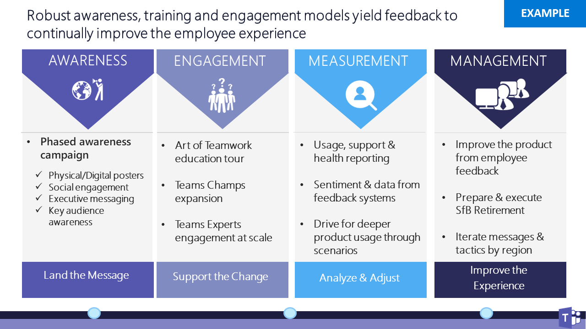
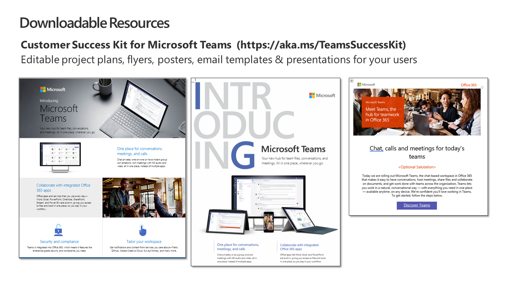

>

Marketing and communications capabilities will enable your employees to be aware of the new services you are delivering and know how to get assistance with using them to their best benefit. Using the methods of omni-directional marketing you will land these core messages in places your employees already are. This includes email announcements, intranet articles, staff meetings, executive events, and other communications methods.

Your awareness campaign should design key messages by audience. It is important to discuss the change from the perspective of the employee not the IT or change management professional. You will use your simplified pain point research to craft these messages. Using the [Microsoft Teams Customer Success Kit](https://download.microsoft.com/download/A/E/9/AE984CD4-CF4B-41E7-9ABD-6735E3F01897/MicrosoftTeamsCustomerSuccessKit.zip), or kits for other services, you can accelerate this messaging by editing the provided templates for use in your company and with your branding.

The four elements of an awareness and engagement plan are:

1. **Awareness - Landing the message:** Digital and physical assets that drive awareness of the change before, during, and after it lands for the employee. Creativity counts. Use your company culture to craft messages that will be meaningful to your employees.
2. **Engagement - Support the change:** Business engagement services that can assist groups and units to use the new technology more broadly and with greater health. This begins with unit champions and may extend to business analysts and IT personnel for more complex engagements.
3. **Measurement - Analyze and adjust:** Usage, support, and health reporting from administrator experiences and feedback tools. Measurements also include training asset use and class attendance; reach or impressions of online articles & videos and activity within internal social networks.
4. **Management - Improve the experience:** Adjustments to the experience, messaging, and training assets to continually improve usage and health. The analysis of your measurements will tell you what is and isn't working. Do not expect everything to work all the time. In Agile project management, work is done in shorter sprints or segments so that you can easily adjust. For instance, looking at the users who engaged with champions or attended training you may find less help desk tickets and deeper usage. You can speak with these individuals for success stories to encourage others to do the same behavior. Or potentially your classes are not getting good satisfaction surveys. This data can help you to adjust them quickly rather than only finding out at the end of a 90-day training program that it was not satisfactory.

>
