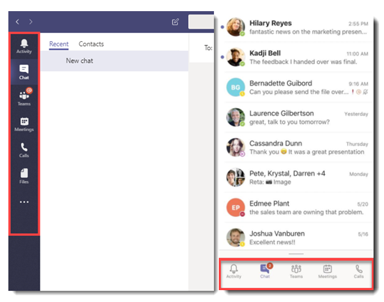
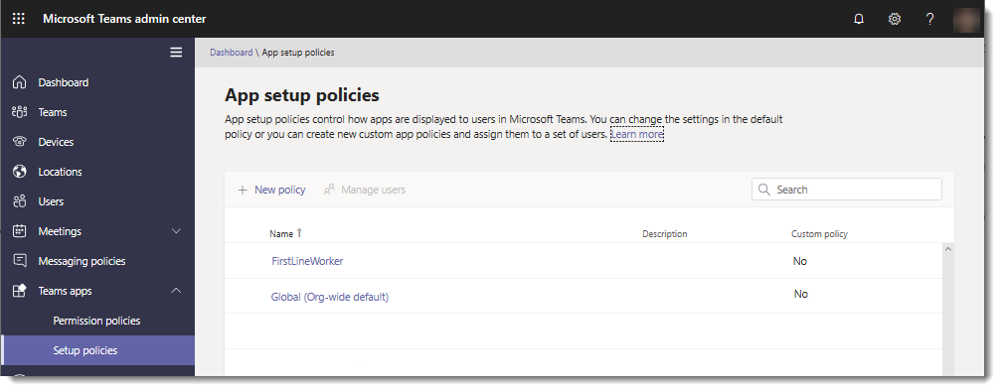

In **Teams apps** in the Microsoft Teams admin center, you can set up app policies to manage apps for your organization. 

Policies can be used to customize Teams by: 

- Pinning apps to the app bar that are most important to your users. Some examples are:
  - Pinning a custom recruiting and talent management app for users on your HR team to help drive their awareness and adoption.
  - Selectively pinning core Teams features, such as Chat, Teams, and Calling. Doing so helps ensure users are aware of specific activities within Teams.
- Showcasing apps that users in your organization need, including those built by third parties or by internal developers.
- Managing how built-in features appear.

> [!NOTE]
> The app bar is the bar on the side of the Teams desktop client and at the bottom of the Teams mobile clients (iOS and Android). You choose the apps you want to pin and the order that they appear. 

## Customize app availability and prominence

You can use the global (org-wide default) app policy or create custom policies and assign them to users. Users will automatically get the global policy unless you create and assign a custom policy.

You can edit the settings in the global policy to include the apps that you want. If you customize Teams for different groups of users, you can create and assign one or more custom policies. When a user is assigned a custom policy, that policy applies to the user. If a user isn't assigned a custom policy, the global policy applies. You can also assign a custom setup policy to multiple users that you’ve already identified, such as all users in a security group.

## Customize tabs

Owners and team members can add custom tabs to a channel, private chat, or group chat to help integrate their cloud services. When you create a channel, the conversations and files tabs are created by default. In a private chat, the conversations, files, organization, and activity tabs are created by default. You can design and add custom tabs to these default tabs to help users access and manage the data they need or use the most.  

