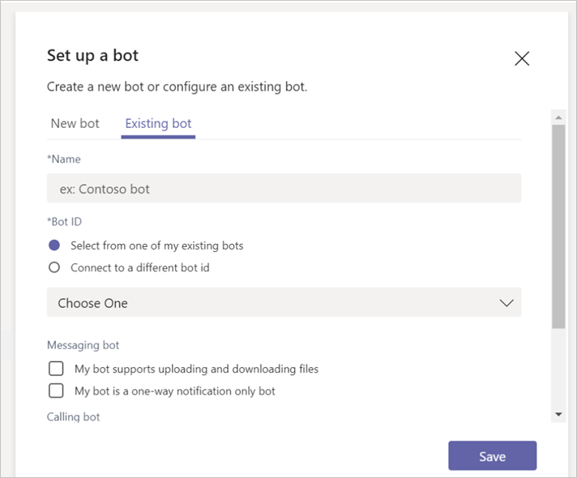

Bots are automated programs that respond to queries or give updates and notifications, for example, a welcome message to a new team member. Bots enable users to interact with cloud services like task management, scheduling, and polling in a Teams chat. Teams supports bots in private chats, group chats, and channels within a team. Administrators can control whether the use of bots is allowed in an Office 365 tenant.

## Create custom bots for Microsoft Teams

Bots developed by the community can be used within Teams. The bot's functionality and the ability to upload custom apps (also known as sideloading) has to be enabled at the tenant level.

You can create a bot that integrates into your business applications, using the **Microsoft Bot Framework.** You should require your users to sign in before using the bot, which makes sure only employees can access it, even if its application ID becomes known.

Here's an example of some options when you create or configure a bot:

## Learn more:

When you're done with a link, use the **Back** arrow in your browser to come back to this page.

- [Add bots for personal chats, group chats, and channels in Microsoft Teams](https://docs.microsoft.com/microsoftteams/add-bots)
- [Create a bot](https://go.microsoft.com/fwlink/?linkid=854371)
