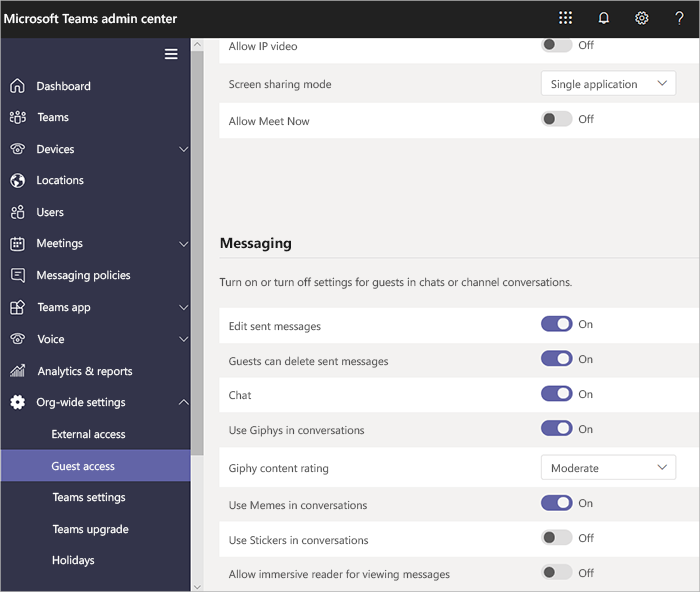
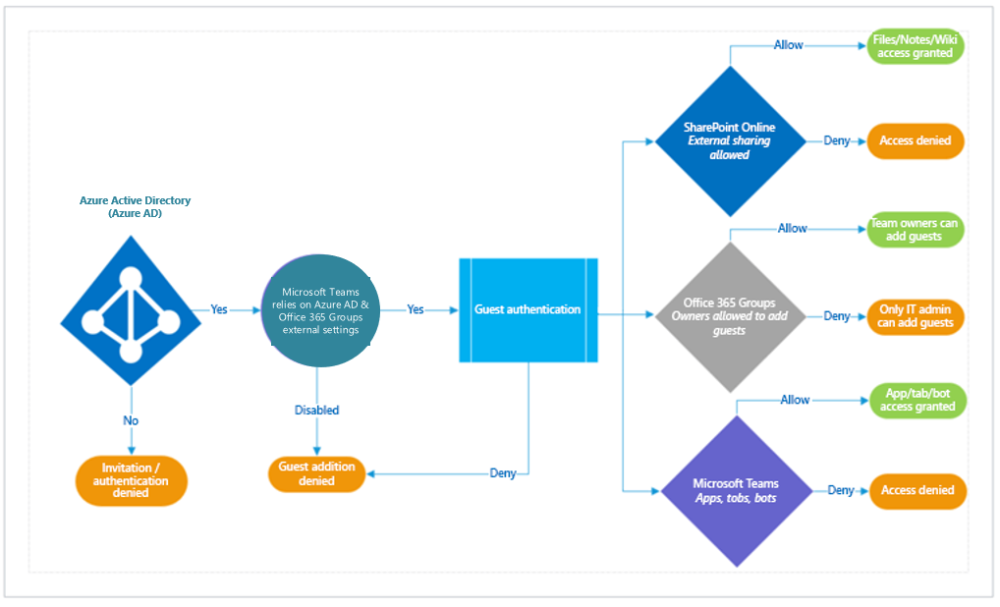

Guest access allows teams in your organization to collaborate with people outside your organization by granting them access to existing teams and channels on one or more of your tenants.

A guest is someone who isn't an employee, student, or member of your organization; for example, partners, vendors, suppliers, or consultants. Anyone who isn't part of your organization can be added as a guest in Teams. This means that anyone with a business account (that is, an Azure AD account) or a consumer email account (with Outlook.com, Gmail.com, or others) can participate as a guest in Teams, with full access to teams and channel experiences.  All guests in Teams are covered by the same compliance and auditing protection as the rest of Office 365 and can be managed securely within Azure AD.

Guest access is a tenant-level setting in Teams that is turned off by default. When guest access is turned on, everyone in your organization can add guest users to an Office 365 Group. The guests will have access to all Office 365 Group features. Guest access is included with many Office 365 subscriptions with no additional licensing requirement. Guest access is subject to Azure AD and Office 365 service limits.

Guest access differs from external access:

- **Guest access** applies to an individual.
- **External access** applies to an entire domain.

External access is discussed in the unit **Manage external access** in this module.

## Manage guest access

You can manage Teams guest access features and capabilities through four different levels of authorization:  Azure Active Directory (Azure AD), Microsoft Teams, Office 365 Groups, and SharePoint Online and OneDrive for Business. All the authorization levels apply to your Office 365 tenant.

Administrators can manage guest access by using the Microsoft Teams admin center, Azure AD, or the Microsoft 365 admin center.

The different authorization levels provided by these tools give you flexibility in how you set up guest access for your organization. For example, if you don’t want to allow guest users in Teams but want to allow it overall in your organization, just turn off guest access in Teams.

### Azure AD

Administrators can also use Azure AD to determine whether external collaborators can be invited into your tenant as guests, and in what ways.

In Azure AD, the settings for invitations apply at the tenant level and control the guest experience at the directory, tenant, and application levels. Administrators can configure settings to limit guest user permissions and grant members and guests the ability to invite additional guests.

### Microsoft Teams admin center

You can use the Teams admin center to add guests at the tenant level, set and manage guest user policies and permissions, and pull reports on guest user activity. Guest user content and activities are under the same compliance and auditing protection as the rest of Office 365.

Team owners can invite new guests and add existing directory guest users to their teams. Team owners can also set channel-related capabilities for guests, including allowing guests to create, update, and delete channels.

### Microsoft 365 admin center

Administrators can use the Microsoft 365 admin center to control guest access to Office 365 Groups for their whole organization or for individual Office 365 Groups. They can also control who can allow guests to be added to groups. Among other management tasks, administrators can use the Microsoft 365 admin center to manage, log, monitor, and remove guest users.

## Learn more

When you're done with a link, use the **Back** arrow in your browser to come back to this page.

- [What the guest experience is like](https://docs.microsoft.com/MicrosoftTeams/guest-experience)
- [Authorize guest access in Microsoft Teams, including SharePoint Online and OneDrive for Business](https://docs.microsoft.com/MicrosoftTeams/teams-dependencies)
