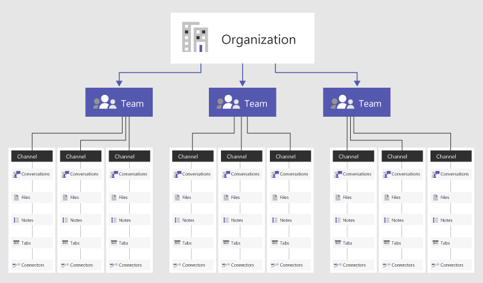

Microsoft Teams lets you quickly pull together a team with people inside and outside your organization, chat with others to drive fast and inclusive conversations, securely share and coauthor documents, and iterate on projects. Let’s look at some of the key elements of the Teams user experience.
 
## What are teams?

A team is a group of people gathered to get something big done in your organization. Sometimes it’s your whole organization.

Owners can create private teams open to only invited users, or public teams open to anyone within the organization (up to 5,000 members). Teams can be scaled to suit a range of scenarios, from a single short-term project to the entire internal structure of your organization. When considering how to implement Teams in your organization, admins can provide guidance on how to structure their teams, but ultimately users have control of how they self-organize.

Creating a new team, or joining an existing team, is as simple as clicking Teams in the left column of the app and then choosing the option you want. Once you've created a new team, you invite people (members) to join it. You can add individual users, groups, and even entire contact groups. You can then designate one or more of these members to be team owners with administrative privileges.

## What are channels?

Teams are made up of channels, which are the conversations you have with your teammates. Each channel is dedicated to a specific topic, department, or project. Channels are where the work actually gets done—where text, audio, and video conversations open to the whole team happen, where files are shared, and where apps are added.

Files shared on the Files tab of a channel are stored in a corresponding SharePoint directory. Conversations and files shared across team channels are only visible to team members. You can increase the value of channels to your team by customizing them with apps that include tabs, connectors, and bots; for example, you can add tabs to a channel (or private or group chat) to help integrate cloud services or help team members access and manage the data they need the most.

## What is chat in Teams?

While channel conversations are public, chats are just between you and someone else (or a group of people). Think of them like instant messages in other messaging apps. Private chats are only visible to the chat participants.
 
You start one-on-one and group chats the same way: by selecting **New chat** at the top of Teams. Once in a chat, you’ll be able to send messages that include files, links, emojis, stickers, and gifs. There are many formatting options for chat messages, including options for highlighting, font size, lists, and more.

Teams saves your whole chat history, all the way back to the first message you sent—this is known as persistent chat. If someone leaves your organization, that person’s chat responses will remain in your chat history.
 
## How are membership, roles, and settings implemented?

Teams uses two main roles: a team owner who creates the team, and team members the owner invites to join their team. These roles are roughly equivalent to administrators and users. By default, a user who creates a new team is granted the owner status. Team owners can make any team member a co-owner at any time. Having multiple team owners enables you to share the responsibilities of managing settings and membership, including invitations to join the team.

When Teams is activated for your entire organization, team owners can invite any coworker to join their team. Depending on your organization’s settings, you can also add guests outside your organization to your teams. Team owners can also create a team based on an existing Office 365 Group.

Team owners can manage team-wide settings directly in the Teams app, including the ability to set team-wide permissions for creating channels and adding tabs and connectors.