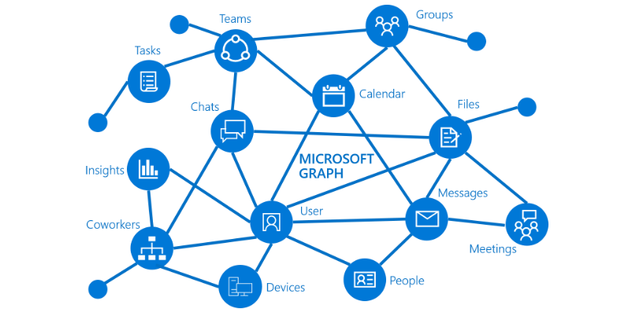

Microsoft Teams gives administrators powerful tools to manage teams and connect users. Two general types of management tools are employed: graphical user interfaces (GUIs) and command-line and automation tools. Be aware that to take advantage of full administration capabilities using these two toolsets, you need to be assigned either the Global or Teams Service Administrator role.

The primary GUI tools for Teams management are:

- Microsoft Teams admin center
- Azure Active Directory admin center
- Microsoft 365 admin center
- Microsoft 365 Defender portal and compliance center

Command-line and automation tools include:

- PowerShell, for configuration and limited lifecycle management
- Graph API, for lifecycle management

## Microsoft Teams admin center

Teams management tools can be accessed in the Microsoft Teams admin center under **Teams > Manage teams**. Each team is backed by a Microsoft 365 group, and this node provides a view of groups that have been enabled for Microsoft Teams in your organization. Administrators can edit group and team-specific settings here.

## Microsoft 365 admin center

You can turn apps off or on for Teams in **Tenant-wide settings** in the Microsoft 365 admin center. You must have Microsoft 365 administrative permissions to access these settings. Under **Apps**, you can turn default apps on and off and configure settings to control external apps.
 
Default apps, such as Planner, Praise, and Weather, are provided by Teams. To turn on an app, select the check box for that app. To turn off an app, clear the check box.

External apps are provided by third parties. You can configure the following settings for external apps:

- Allow external apps in Microsoft Teams
- Allow sideloading of external apps
- Enable new external apps by default

You can also control organization-wide user settings in the Microsoft Teams admin center under **Org-wide settings**.

## Microsoft 365 Defender portal and Microsoft 365 compliance center

The Microsoft 365 security and compliance centers are designed to help you manage compliance features across Microsoft 365 for your organization, including Teams. Links to existing SharePoint and Exchange compliance features bring together compliance capabilities across Microsoft 365. To use the Microsoft 365 Defender portal, you must either be assigned the global administrator role or have been assigned to one or more Microsoft 365 Defender portal role groups by a global administrator.

## PowerShell

PowerShell is a shell and scripting language that helps system administrators and power users rapidly automate management tasks from a command line. Administrators can use PowerShell to manage settings, configuration, and policy in Teams.

The PowerShell controls for managing Teams are found in two different PowerShell modules: the Microsoft Teams PowerShell module, and the Skype for Business PowerShell module. The Teams PowerShell module contains all the cmdlets you need to create and manage teams. The Skype for Business PowerShell module contains the cmdlets to manage policies, configurations, and other Teams tools.

These cmdlets work only on the teams for which you are an owner or a member. Global Administrators or Teams Service Administrators can act on all teams in your organization.

## Microsoft Graph API

Microsoft Graph is the gateway to data and intelligence in Microsoft 365. Graph provides a unified programmability model that you can use to access the tremendous amount of data in Microsoft 365, Windows 10, and Enterprise Mobility + Security. Graph is built on a REST-based API that allows access to Teams and other Microsoft 365 services. 

In Graph, Teams is represented by a group resource, since Teams and Microsoft 365 Groups both work together to facilitate group collaboration. Most of the same group-based features apply to Microsoft Teams and Microsoft 365 groups, the main difference being the way members communicate with each other. Team members communicate by persistent chat in the context of a specific team. Microsoft 365 Group members communicate by group conversations, which are email conversations that occur in the context of a group in Outlook. Microsoft Graph is a very powerful tool for managing actual teams.

## Learn more

When you're done with a link, use the **Back** arrow in your browser to come back to this page.

- [Manage teams in the Microsoft Teams admin center](/microsoftteams/manage-teams-in-modern-portal)
- [Microsoft 365 security and compliance centers](/office365/servicedescriptions/office-365-platform-service-description/office-365-securitycompliance-center)
- [Windows 10 PowerShell reference](/powershell/scripting/developer/windows-powershell-reference)
