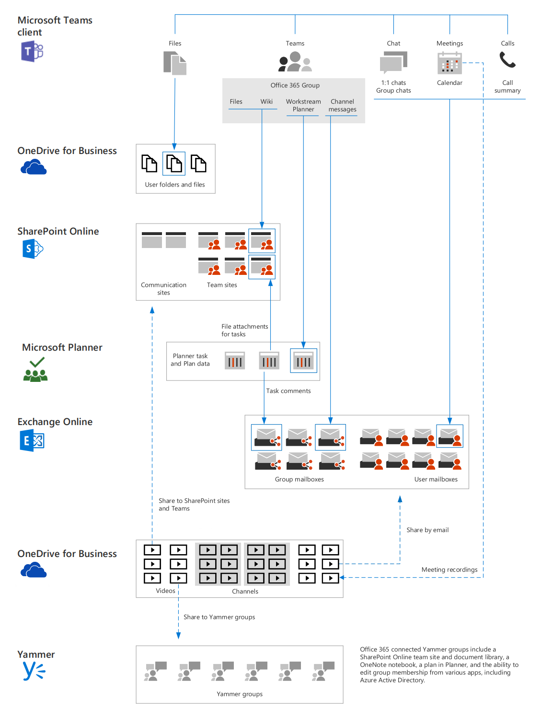
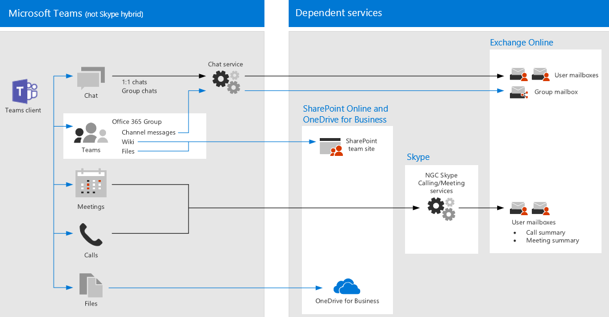

Teams is central to the logical architecture of productivity services in Microsoft 365, including data governance, security, and compliance capabilities. Teams is built on Microsoft 365 groups, Microsoft Graph, and the same enterprise-level security, compliance, and manageability as the rest of Microsoft 365.
 
## How does Teams interact with underlying technologies?

Teams app capabilities depend on underlying communication and collaboration technologies. When you create a team, here’s what gets created:
 
- A new Microsoft 365 Group
- A SharePoint Online site and document library to store team files
- An Exchange Online shared mailbox and calendar
- A OneNote notebook

When you create a team from an existing Office 365 Group, that group’s membership, site, mailbox, and notebook are surfaced in Teams. To customize and extend Teams, you can add other apps such as Planner and Power BI through apps, bots, and connectors using custom tabs.  

## Teams integration with Microsoft 365 Groups

<<<<<<< HEAD
When you create a team in Microsoft Teams, on the back end, you’re creating a Microsoft 365 Group and the associated SharePoint document library and OneNote notebook, along with ties into other cloud applications. You can add or remove group members just as you would any other group-based security object in Active Directory.
=======
When you create a team in Microsoft Teams, on the back end, you’re creating an Office 365 Group and the associated SharePoint document library and OneNote notebook, along with ties into other cloud applications. You can add or remove group members just as you would any other group-based security object in Active Directory.
>>>>>>> 22528f1867c64cb4cc503589e489525544dba98f

Learn more about Teams integration with Microsoft 365 Groups in the module **Manage Teams.**

## How does Teams manage identities?
 
Teams supports all identity models that are available with Microsoft 365. Teams leverages identities stored in Azure Active Directory (Azure AD), which combines core directory services, application access management, and identity protection into a single solution.

Teams uses three identity models:

- With the **Cloud Identity** model, a user is created and managed in Microsoft 365 and stored in Azure AD, and the password is verified by Azure AD.
- With **Synchronized Identity**, the user identity is managed in an on-premises server, and the accounts and password hashes are synchronized to the cloud.
- The **Federated Identity** model requires a synchronized identity where the user password is verified by the on-premises identity provider (such as Active Directory Federation Services (ADFS)).

## Where does Teams store data?
 
Data in Teams resides in the geographic region associated with your tenant. Currently, Teams supports the Australia, Canada, France, India, Japan, South Africa, South Korea, United Kingdom, Americas, APAC, and EMEA regions.

Key data types are stored in various locations when the data is not in active use.

## What are Teams service dependencies?

For the full Teams experience, every user should be enabled for Exchange Online, SharePoint Online, OneDrive for Business, and Microsoft 365 Group creation. Administrators should consider whether they’ll be able to deploy the Teams features that their organization requires with its current Exchange and SharePoint deployments.

> [!IMPORTANT]
> SharePoint Online is a prerequisite for using OneDrive for Business. Without SharePoint Online and/or OneDrive for Business, you can’t store and share files in channels, perform private file sharing, or access the team SharePoint site.

## Learn more

When you're done with a link, use the **Back** arrow in your browser to come back to this page.

- [Microsoft Teams IT architecture and telephony solutions](https://docs.microsoft.com/microsoftteams/teams-architecture-solutions-posters)
