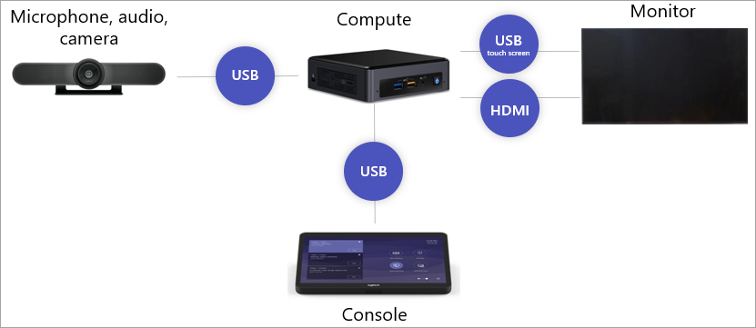
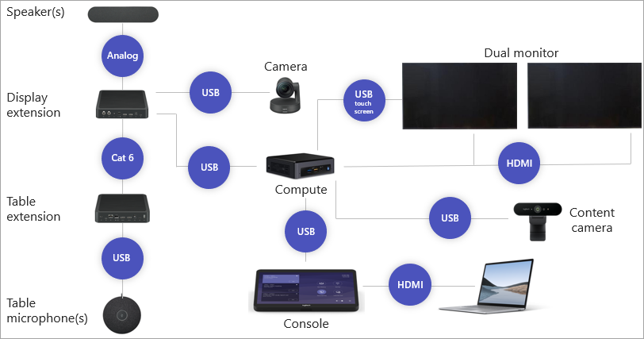

Let’s look at some sample Microsoft Teams Rooms configurations.

Here's an example of a small room configuration. The compute module is the heart of Teams Rooms. Everything will eventually connect to it. The compute module is a computer that runs Window 10 IoT Enterprise.

The middle of table console connects to the compute module via USB. This console is what people will be interacting with. In this example, microphone, audio, and camera are all contained in one unit, and that connects via USB to the compute module.The display connects via HDMI to the compute module. You may also enable touchscreen via USB if the display  supports it.

Let's look at a more complex configuration. Once again, there's a compute module, which is the heart of Teams Rooms.

- There's a center of table console, which still connects via USB to the compute module.
- New to this configuration are display extensions. These are devices that will extend cabling beyond the defined standards. They can also simplify the cabling by aggregating multiple cables down to one. If you look at the table extension, three cables go into it and only one cable extends to the compute module.
- There's a camera, which connects to the display extension and not directly to the compute module.
- There's a speaker that's connected to the display extension. Note that it's using an analog cable and not USB or HDMI.
- There's a table extension, which connects to microphones. The microphones connect to the table extension via USB. The table extension connects to the display extension via category 6 cabling. 
- In this larger room, there are two monitors. There is a single HDMI cable from each of the displays to the compute module. One of the monitors is enabled for touchscreen as well. You can share a laptop screen directly into a meeting via an HDMI cable that's connected to the console. 
- The content camera connects to the compute module via USB.

As you can see, this is a much more complex configuration. Because of the ability to support these types of large, complex configurations, Teams Rooms can scale to the largest rooms that you have to support.

- Your display should support HDMI CEC or PC Mode to automatically switch the screen on from standby. You may need to install CEC injectors to convert the wake signal coming from Teams Rooms to the displays.The displays can be 4K monitors but Teams Rooms only sends a 1920x1080 signal to the screens.
- Only wired network connectivity is supported. Microsoft does not support Wi-Fi for Teams Rooms. Only DHCP is supported for assigning the initial IP address. However, you can sign in as admin and enable a static IP address after you complete the initial configuration.
- Many cables can be extended for long-haul runs. Some Teams Rooms vendors have their own solutions to address this, such as display and table extensions. 
- Always use the correct cables and always update the firmware. Vendors design the systems with specific cables in mind. As was shown in the large meeting room, one of the connections uses category 6 cable. If the vendor wants you to use a category 6 cable, be sure you're using a category 6 cable and not a cable with a different rating. 
- Always use quality cables. The HDMI cable that connects the console to the laptop to share into a meeting should be a high-quality HDMI cable. Most inexpensive HDMI cables are not designed to be plugged and unplugged from a laptop several times a day and over the course of a year will start to fail. Using a quality cable will ensure that the cable will last longer and users will not run into an issue where they can't share from their laptop because the cable is damaged.
- You also want to keep the firmware updated. Updated firmware will make sure that hardware is running optimally. Vendors often add new features via firmware.
- Many of the devices can be locked or secured to help prevent theft. Be sure to securely mount devices and use the security offerings provided by the vendors.
