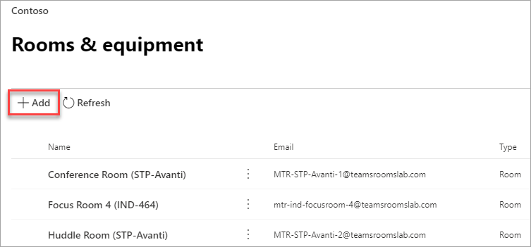
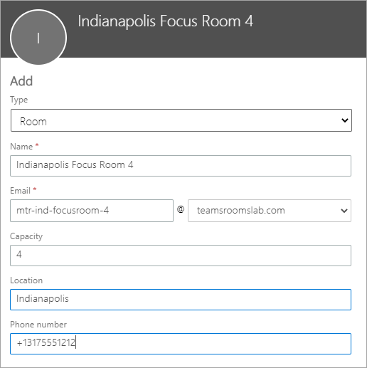
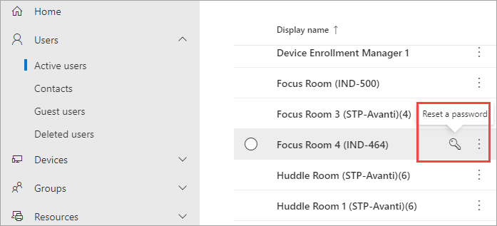
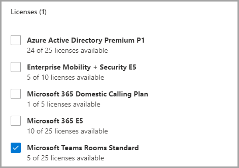

To create a new account using the Microsoft 365 admin center:

1. Navigate to **admin.microsoft.com** and sign in with an admin account. By default, you don't see the Resources tab. Click **Show all**, and the Resources option pops up.
1. Choose **Rooms & equipment**.

   

1. On the Rooms & equipment screen, click the **+Add** option to add a new resource account.

   

1. Make sure that Type is set to **Room**. Add a friendly name in the **Name** field. This is what users will see when scheduling the room via Outlook or Microsoft Teams. The Email address is automatically populated. Edit this as necessary to conform to your naming standard for Teams Rooms. Capacity, Location, and Phone number are all optional.

   

1. After the resource account has been created, you'll receive an acknowledgment that the Room mailbox is ready to use.

   

1. **Edit your account default values and options**. If you click on **Edit booking options**, you'll see the default values that are assigned to this account.

   

   - **Allow repeating meetings** or recurring appointments is enabled by default. You can schedule the room any time of day. This option says don't limit it to the work hours that are defined for this room. If you want to set the work hours for this resource account, sign in as the resource account into Outlook on the web to change the working hours.
   - **Automatically decline meetings outside of the limits** is enabled by default. The resource account won't accept meetings that are going to last longer than six months or that are scheduled six months in advance (180 days).

   > [!IMPORTANT]
   > The **auto-accept meeting requests** is set to **On**. You almost always will leave that set to On.  You would only disable it if a room needs to have human intervention to accept or decline meeting requests.

   If you refresh your room list, you can see that your new room has been added.

1. Back in Microsoft 365 admin center, go to **Users > Active users**, and find your new resource account. Click the **Key** to set the password.

   

1. On the *next* pane that appears, type in the new password into the Password field. Be sure to leave the **Require this user to  change their password when they first sign in** option unchecked. There's no way to force a password change interactively within the Teams Rooms app. 

1. Next you need to assign a license to this resource account. While still in Active users, click on the room's display name to bring up the **Properties** pane. From there, click on **Licenses and Apps**. You can now assign the proper license, such as Microsoft Teams Rooms Standard.
1. Finally, you need to set the password so that it never expires. Follow the guidance at [Set an individual user's password to never expire](/microsoft-365/admin/add-users/set-password-to-never-expire?azure-portal=true) for detailed steps.

   

## Learn more

- [Create a Microsoft 365 resource account using the Microsoft 365 admin center](/microsoftteams/devices/resource-account-ui?azure-portal=true)
- [Set an individual user's password to never expire](/microsoft-365/admin/add-users/set-password-to-never-expire?azure-portal=true)
