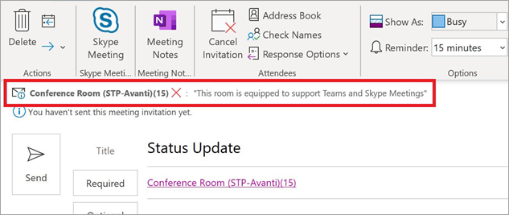
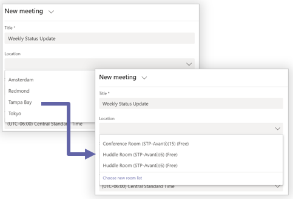
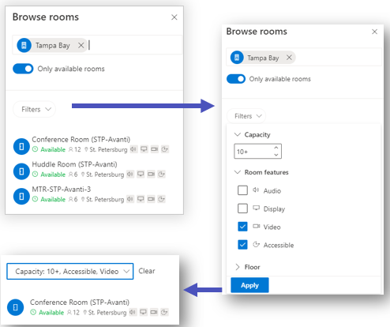

There are some additional options you can set for your resource accounts.

1. Open the Exchange admin center in Microsoft 365. 
1. Click on **recipients** > **resources**. 
1. Select the room to edit and click the **edit** icon (or double click the room name).

## Add a MailTip

Once inside the setting, you can add a *MailTip*. By adding a MailTip, when somebody enters this conference room name into Outlook, a tip pops up informing your users about this room. In this example, the MailTip is set to read: “This room is equipped to support Teams and Skype for Business meetings.”

You can also set the MailTip using PowerShell using the **Set-Mailbox cmdlet** and the MailTip parameter.


```powershell
Set-Mailbox -Identity $MailBoxAlias -MailTip "This room is equipped to support Teams and Skype Meetings"
```

 

When the resource account auto-accepts a meeting, it sends an e-mail back confirming that it accepted or rejected the meeting request.

By using HTML in the **booking options** setting, you can add graphics or links to videos, and then send a helpful message back such as a reminder to make this a Teams meeting. You could also add end-user training links or corporate logos to this response.


If you use additional responses, you can create a much more interesting e-mail back to the meeting organizer.

Here's how you can do this using PowerShell. The first thing to do is to create a variable that holds the HTML you want to put into the response. This sample shows only part of the HTML because it can get a bit lengthy, but you should get the idea how this gets done.


```html
$AdditionalResponse=@"
<hr style="font-family: Calibri, Arial, Helvetica, sans-serif; font-size: 12pt; color: rgb(0, 0, 0);"><p align="center">
"@
```

Now we can use the *$AdditionalResponse* variable with the **Set-CalendarProcssing** cmdlet to configure our custom additional response.


```powershell
Set-CalendarProcessing -Identity mtr-stp-avanti-1@contoso.com -AddAdditionalResponse $true -AdditionalResponse $AdditionalResponse
```


By default, only members of your domain can schedule a meeting room. If you are contoso.com, your Teams Rooms resource accounts will not accept a meeting invite from nwtraders.com. However, if you enable **ProcessExternalMeetingMessages**, that resource account will now accept meeting invites from external domains. 


> [!IMPORTANT]
> This value is required to be enabled if you want to use third party meetings with Teams Rooms (i.e. the ability of Teams Rooms to join meetings hosted by Cisco, Zoom, etc.)


```powershell
Set-CalendarProcessing -identity mtr-stp-avanti-1@contoso.com ‐ProcessExternalMeetingMessages $true
```

## Add some security mailbox settings

There are some mailbox settings you may want to enable to add some security. For example, there may be an agenda discussing sensitive information added to a meeting invite. You want to make sure the Exchange or Teams Rooms administrators cannot sign in to Outlook and read the agenda.

The following **Set-CalendarProcessing** command will remove sensitive information that is stored in the mailbox from being seen by those who shouldn’t have access to confidential information.


```powershell
Set-CalendarProcessing -identity $MailBoxAlias
‐ProcessExternalMeetingMessages $false
-DeleteSubject $true
-DeleteComments $true
‐RemovePrivateProperty $false
-DeleteNonCalendarItems $true
-RemoveForwardedMeetingNotifications $true
-RemoveOldMeetingMessages $true
```

- **ProcessExternalMeetingMessages**: Only permit internal users to schedule a meeting. Note: This must be enabled if you intend to join third party meetings.
- **DeleteSubject**: Remove the meeting subject. Now when the meeting appears on the console, it will only show the name of the organizer, not the topic of the meeting.
- **DeleteComments**: Remove the body of the e-mail. Note that this must be enabled if you want to join third party meetings.
- **RemovePrivateProperty**: The private flag for incoming meeting requests is preserved.
- **DeleteNonCalendarItems**: Any e-mails forwarded to the mailbox should be deleted. 
- **RemoveForwardedMeetingNotifications**: Processed forwarded meeting notifications are deleted (moved to the Deleted Items folder).
- **RemoveOldMeetingMessages**: Outdated and redundant meeting messages are deleted.

## What are Room Lists?

Room Lists help you organize all your meeting rooms. Instead of having a flat list of hundreds of meeting rooms, you can organize them by location. That location can be a building, a campus, a city, or even a country. It's up to you to decide the organization.

In this example, a room list has been created. If  Tampa Bay is clicked, it then filters and shows the three meeting rooms available in the Tampa Bay area.



How do you create room lists? It must be done via PowerShell, but it's pretty simple. Type **New-DistributionGroup** and give it a name.  Then make sure you flag it as a special distribution group called a **RoomList**.


```powershell
`New-DistributionGroup -Name "Tampa Bay" -Roomlist`
```

You then add members to that distribution group using the **Add-DistributionGroup** cmdlet.

In this example, resource accounts MTR-STP-Avanti-1 and MTR-STP-Avanti-2 are added to the Room List.


```powershell
Add-DistributionGroupMember -Identity "Tampa Bay" -Member "MTR-STP-Avanti-1"
Add-DistributionGroupMember -Identity "Tampa Bay" -Member "MTR-STP-Avanti-2"
```

## What is Places?

Instead of just naming the location of where rooms are, you can add additional criteria, such as wheelchair accessibility, room hardware, or the floor in a given building. This feature is called *Places*.

Here's an example of Places for Tampa Bay. When filtering on Tampa Bay, you can see there are three rooms that are available. Clicking **Filters** brings up a new menu. Now you can filter on rooms that have at least a 10-person capacity, that have a video camera, and are wheelchair accessible. Click the **Apply button** and you'll see one room that matches the criteria.



Creating Places must be done via PowerShell using the **Set-Place** cmdlet. In this example, the place is the meeting room MTR-STP-Avanti-1. This room will be listed as wheelchair accessible, with a 12-person capacity, and a video display.


```powershell
`Set-Place MTR-STP-Avanti-1  IsWheelChairAccessible $true  Capacity 12  DisplayDeviceName $True`
```


## Learn more

- [Create and manage Room mailboxes](/exchange/recipients-in-exchange-online/manage-room-mailboxes?azure-portal=true)
- [PowerShell module browser](/powershell/module/?azure-portal=true)
