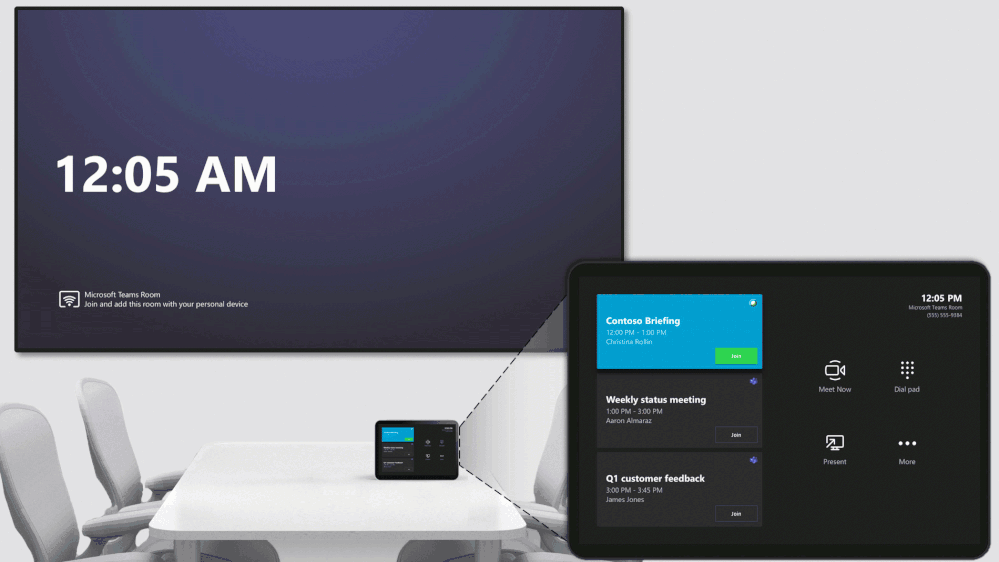

Proximity-based meeting joins let people invite meeting rooms simply by using their mobile device or PC. The Teams Rooms compute module sends a Bluetooth low energy beacon that can be picked up by your mobile device or PC. You can then quickly add the room from the Microsoft Teams meeting join screen on your device or PC.

Microsoft Teams Rooms can also support touching and inking. You can have a touch-enabled monitor in your Teams Rooms environment. Users can walk up to the screen and draw, document, and diagram directly on it. This is natively supported by Teams Rooms and is easy to configure if you have a touch display.

Content cameras and intelligent capture give you the ability to share a traditional analog whiteboard into a meeting.  A specific camera is used to capture the whiteboard and to optimize the view for remote participants. The content camera will center the whiteboard and then display it to the remote attendees. If a presenter walks in front of the whiteboard, remote attendees will still be able to see the full whiteboard.

Teams Rooms supports the Raise Hands feature. As remote attendees raise a hand, a banner is put up on the front of room display as well as on the console. Users inside the room can raise and lower their hand directly on the console.

Direct Guest Join lets Teams Rooms join meetings from other vendors, such as Cisco WebEx and Zoom. Using the WebRTC protocol, Microsoft has partnered to allow Teams Rooms to have a native meeting join experience. Not all Teams Rooms features work when joining meetings hosted by other vendors. For example, content camera only works when joining a Microsoft Teams meeting. Direct Guest Join is provided as a convenience that lets you use Teams Rooms for more than just Microsoft Teams meetings.

Call Analytics and Call Quality Dashboard are key analytics and diagnostic features of Microsoft Teams and can be used with Teams Rooms as well.

- Call Analytics is used to analyze a single attendee's call quality and to troubleshoot poor call quality. You can see all the relevant information from networking to which device they were using.
- Call Quality Dashboard aggregates Call Analytics data and gives you a high-level view of all your locations. You can filter on location, subnet, and other values to proactively discover trends and hotspots throughout your network. You can then take necessary actions like enabling proxy bypass to improve audio and video performance.
